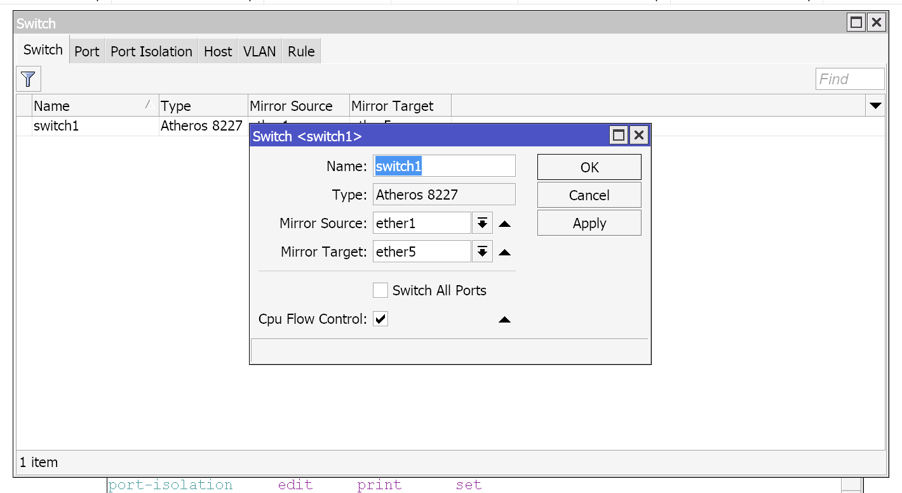
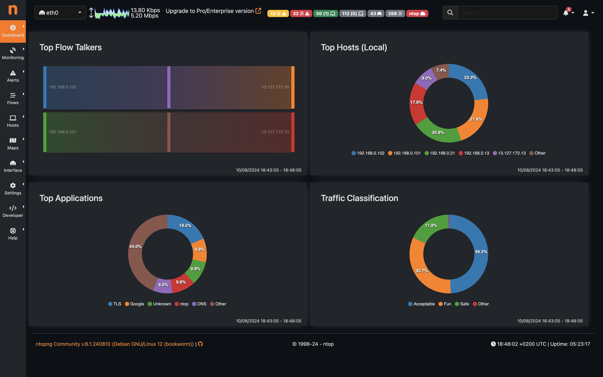
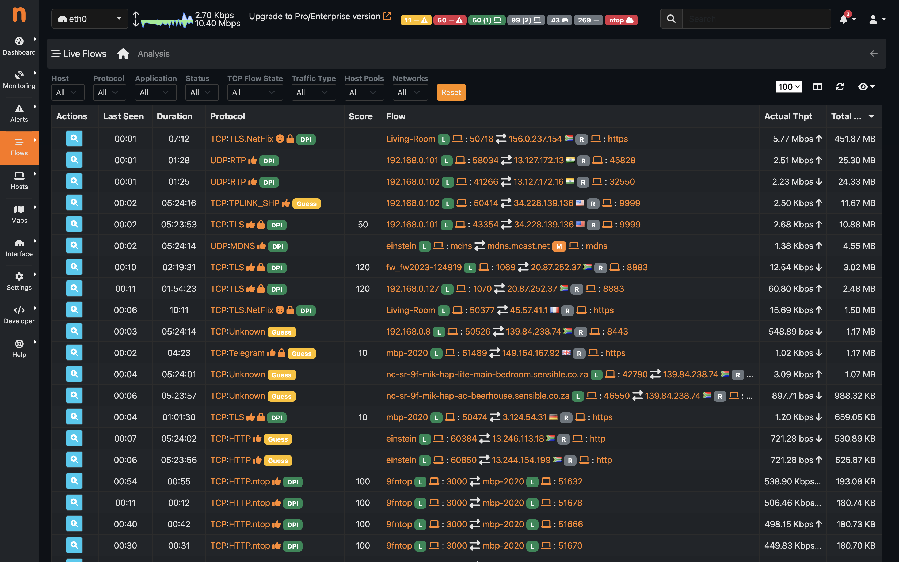

# Using `ntopng` to monitor traffic on a Mikrotik router

On a Raspberry pi running Raspbian connected to the local network via WiFi, install ntopng and connect the Ethernet interface to the Mikrotik router via a mirrored port.

Let's assume the Raspberry Pi connected via WiFi on 192.168.0.2, and the Mikrotik gateway is on 192.168.0.1 on `ether1`.

## Install `ntopng` on Rasbpian

Per [https://packages.ntop.org](https://packages.ntop.org):

```
wget https://packages.ntop.org/RaspberryPI/apt-ntop.deb
sudo dpkg -i apt-ntop.deb
sudo apt-get update

sudo apt-get install ntopng nprobe
```

## Configure `ntopng` to monitor `eth0`

`/etc/ntopng/ntopng.conf`:

```
-G=/var/run/ntopng.pid
-i=eth0
-m=192.168.0.0/24
```

See more [details](https://www.ntop.org/nprobe/network-monitoring-101-a-beginners-guide-to-understanding-ntop-tools/).

## Configure Mikrotik Switch to mirror ports

Assuming that `ether1` connects the router to the switches in the network, and we want to mirror `ether5` for `ntopng`, run the following in terminal:

```
/interface ethernet switch
/interface/ethernet/switch> set switch1 mirror-source=ether1 mirror-target=ether5
```



Note that a few Mikrotik products use switch chipsets that do not support port mirroring. See [details](https://help.mikrotik.com/docs/display/ROS/Switch+Chip+Features#SwitchChipFeatures-PortMirroring).

## Connect and monitor

1. Plug `eth0` on the rPi to `ether5` on the Mikrotik
2. Browse to the the web UI of `ntopng` at [http://192.168.0.2:3000](http://192.168.0.2:3000)
3. Monitor away!



