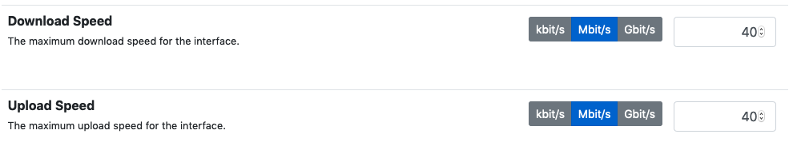
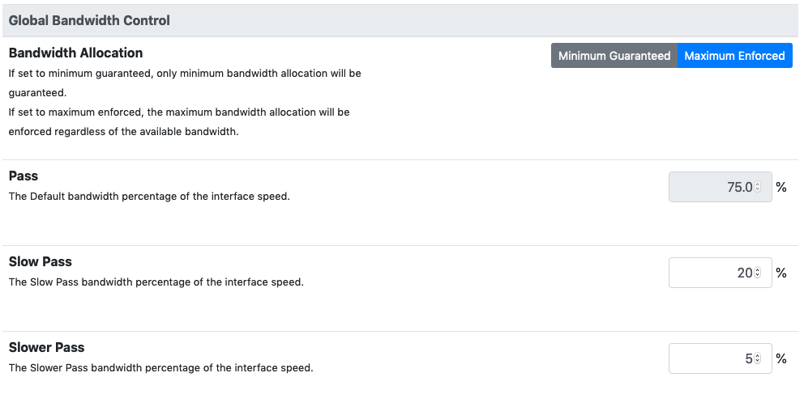
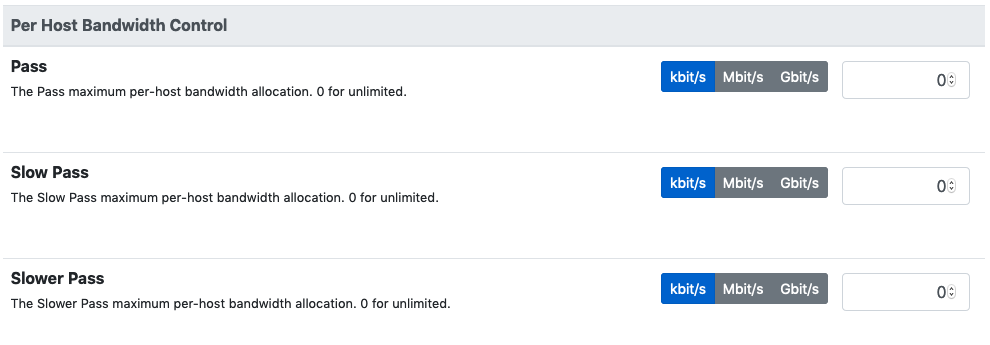

Bandwidth Control
#################

nEdge provides extensive per-user, per-protocol bandwidth control capabilities.
This is a brief overview of the available features:

- Limit the global available bandwidth
- Reserver bandwidth for a specific user
- Provide 3 different bandwidth classes: Default, Slow Pass, Slower Pass
- Limit the per-host bandwidth

A bandwidth class can be assigned to a specific user protocol/category through the
user policies.

Interface Speed
---------------

The global available bandwidth can be configured on a per-interface basis.
Into the `Interfaces Configuration` section the interface speed indicates what's
the globally available bandwidth for traffic flowing from/to the specified interface.

  Interface upload and download speed configuration

In the picture above, the traffic flowing through the interface will be limited
to 10 Mbit/s in both the upload and download directions. Usually the interface speed
should match the available internet bandwidth.

Global Bandwidth Control
------------------------

After configuring the interfaces speeds, it is possible to fine tune bandwidth
allocation by the means of the bandwidth classes. nEdge provides 3 configurable
bandwidth classes. The global bandwidth classes can be configured from the
`Global Bandwidth Control` settings.

  Global bandwidth classes configuration

A percentage rate can be specified for each available class. The percentage
is referred to the configured interfaces speed. For example, supposing the nEdge is
routing mode and with two configured WAN interfaces, one with 10 Mbit/s download speed and
another with 100 Mbit/s download speed, a 75% rate would limit the
clients download traffic to 7.5 Mbit/s when going out to the first interface,
and to 75 Mbit/s traffic when going out the 100 Mbit/s interface.

It is important to note that, by default, the global bandwidth classes do not limit the traffic
in advance but rather indicate an allocation share between the classes.
This means that a 75% class will guarantee a *minimum* 75% bandwidth allocation when the
network bandwidth demain is high, but it will not prevent the clients to gain 100%
bandwidth when such a bandwidth is available. This is the **Minimum Guaranteed** bandwidth
allocation policy.

In order to limit the clients bandwidth in advance the **Maximum Enforced** bandwidth
allocation policy can be used instead.

Per-Host Bandwidth Control
--------------------------

In nEdge is also possible to define a per-host maximum rate. This setting does not
depend on the configured interface speed, so an absolute rate is used.

  Per-host bandwidth classes configuration

As an example, by setting a 1 Mbit/s maximum rate on the *Default* class, the traffic of
each host with a *Default* class will be limited to 1 Mbit/s.

Fair Bandwidth
--------------

Within the same bandwidth class, nEdge will distribute the available bandwidth between the hosts
in a fair way. For example, when two different hosts belong to *Default* class,
they will be guaranteed a 50% minimum share of the *Default* class bandwidth. If the hosts
are three, then a 33% of the class bandwidth will be guaranteed, if they are four a 25%
and so on.

.. _users: users.html
