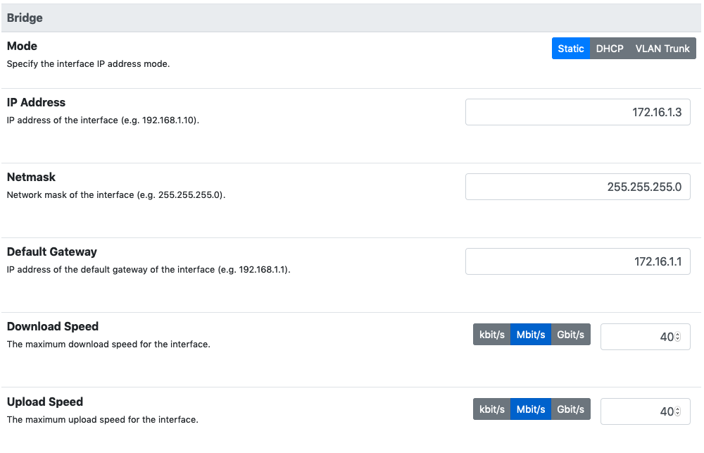

Bridge Mode
===========

Bridge mode is the simplest solution to integrate nEdge into an existing network.

Bridge mode requires two network interfaces to be specified:

 - The LAN interface is the interface which will face the clients to protect.

 - The WAN interface is the interface to the outside world, usually to the
   internet gateway.

This logical division allows nEdge to properly identify the clients to monitor
(on the LAN interface) without affecting the rest of the network (on the WAN).

  Bridge network configuration

nEdge can be either configured to automatically acquire an IP address in
DHCP client mode or a manually assigned IP address can be provided.
Usually a DHCP server is already available in the network so automatic configuration
can be applied.

VLAN Trunk Bridging
---------------------------------------------

nEdge can also bridge interfaces with VLAN-tagged traffic when it is
configured as a VLAN Trunk bridge.

When briging interfaces with VLAN-traffic, it may be necessary to
configure one extra interface for the management of the nEdge
device. This is necessary as the bridge per se is not aware of the
VLAN that should be used to do the actual management.

To configure a management interface simply edit file
`/etc/network/interfaces.d/nedge_mgmt.conf`. Following is an example
that creates an interface for traffic on VLAN 86 and assigns an ip
address and a netmask to that interface.

.. code:: bash

 $ cat /etc/network/interfaces.d/nedge_mgmt.conf
 # https://bugs.launchpad.net/ubuntu/+source/ifupdown/+bug/1643063
 # must specify the pre-up command and the vlan-raw-device

 auto br0.86
 iface br0.86 inet static
      pre-up /sbin/ip link add link br0 name br0.86 type vlan id 86
      vlan-raw-device br0
      address 10.10.10.1
      netmask 255.255.255.0

See management_ for a detailed description of how the network
configuration is handled by nEdge.

It may also me necessary to specify a list of local networks by
manyally editing file `/etc/ntopng/ntopng.conf`. The list of local
networks, specified with option `-m`, is necessary as the nEdge in
this mode as it cannot correctly guess the local network.

.. warning::

   Overlapping IP addresses across multiple VLANs are not handled. nedge will
   show them as a single host

   
.. warning::

   Neither the CaptivePortal nor the DNS enforcement is performed in this mode.

Full Transparent Mode
---------------------

In order to set up nEdge to be fully transparent, which means that it won't alter
network traffic but only provide a pass/drop verdict for client packets, some
care should be taken.

- Make sure the `Enforce Global DNS` is disabled from the DNS settings page.

- Disalbe the Captive Portal the can alter packets in order to perform devices authentication.

.. _management: management.html
