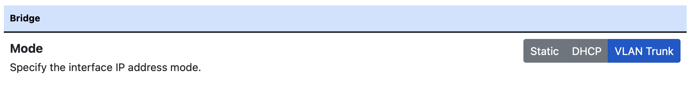

Bridge Mode
===========

Bridge mode is the simplest solution to integrate nEdge into an existing network.

Bridge mode requires two network interfaces to be specified:

 - The LAN interface is the interface which will face the clients to protect.

 - The WAN interface is the interface to the outside world, usually to the
   internet gateway.

This logical division allows nEdge to properly identify the clients to monitor
(on the LAN interface) without affecting the rest of the network (on the WAN).

.. figure:: img/bridge_network.png
  :align: center
  :alt: Bridge Network Configuration

  Bridge network configuration

nEdge can be either configured to automatically acquire an IP address in
DHCP client mode or a manually assigned IP address can be provided.
Usually a DHCP server is already available in the network so automatic configuration
can be applied.

VLAN Trunk Bridging
---------------------------------------------

nEdge can also bridge interfaces with VLAN-tagged traffic when it is
configured as a VLAN Trunk bridge.

  VLAN Trunk bridge network configuration

In VLAN Trunk mode, it's necessary to specify the list of local networks by manually editing the file
`/etc/ntopng/ntopng.conf` via the `-m` option. Policies will only be applied to local hosts, so
this is very important. See `the ntopng documentation`_ for more details.

In VLAN Trunk mode, it's also essential to set up a management address to
reach the device (this should be done before applying the VLAN Trunk mode settings
in order to avoid losing management access).
This usually is performed in one of the following ways:

- by using a dedicated network interface (this setup requires at least 3 network interfaces)
- by using a virtual network interface by configuring a VLAN (only 2 network interfaces required)

While the dedicated network interface case is trivial and does not require a specific configuration,
please find below instructions for configuring a virtual interface over a VLAN on top of the bridge
created by nedge.

On netplan-based Ubuntu systems the interfaces configuration is written by nedge in
the `/etc/netplan/30-nedge.yaml` file. It is possible to write an additional configuration file
`/etc/netplan/30-nedge-management.yaml` which contains the virtual interface configuration as below.
In this example we assume that the appliance should be visible on VLAN 15 with IP address 10.10.10.1.

.. code:: bash

   $ cat /etc/netplan/30-nedge-management.yaml
   network:
     version: 2
     vlans:
       br0.15:
         accept-ra: no
         id: 15
         link: br0
         address: [ "10.10.10.1/24" ]
         gateway4: 10.10.10.254
         nameservers:
             addresses: [8.8.8.8,8.8.4.4]

On Ubuntu 16 (deprecated), the management interface configuration should be written to the
`/etc/network/interfaces.d/nedge_mgmt.conf` configuration file. Here is an example:

.. code:: bash

 $ cat /etc/network/interfaces.d/nedge_mgmt.conf
 # https://bugs.launchpad.net/ubuntu/+source/ifupdown/+bug/1643063
 # must specify the pre-up command and the vlan-raw-device

 auto br0.15
 iface br0.15 inet static
      pre-up /sbin/ip link add link br0 name br0.15 type vlan id 15
      vlan-raw-device br0
      address 10.10.10.1
      netmask 255.255.255.0

The VLAN ID (15 in the example) should match one of the VLAN IDs flowing through
the VLAN trunk. Such virtual interface will be created after reboot. When the
VLAN Trunk mode is running on the nEdge device, the administrator can connect to the
management IP (10.10.10.1 in this example) by configuring a network interface on the same
network (10.10.10.0/24 in this example). For example:

.. code:: bash

   $ ifconfig eth0 10.10.10.99 netmask 255.255.255.0

The switch port connected to the administrator eth0 interface must be tagged with the same
VLAN ID configured in the `nedge_mgmt.conf` file (15 in this example) in order for
this to work.

.. warning::

   Due to an open issue (https://github.com/ntop/ntopng/issues/2117) users must be
   very cautious when configuring blocking policies in this mode as they will affect the
   management interface as well and possibly block management access.

See management_ for a detailed description of how the network
configuration is handled by nEdge.

.. warning::

   Overlapping IP addresses across multiple VLANs are not handled. nEdge will
   show them as a single host

.. warning::

   Neither the CaptivePortal nor the DNS enforcement is performed in this mode.

Full Transparent Mode
---------------------

In order to set up nEdge to be fully transparent, which means that it won't alter
network traffic but only provide a pass/drop verdict for client packets, some
care should be taken.

- Make sure the `Enforce Global DNS` is disabled from the DNS settings page.

- Disable the Captive Portal the can alter packets in order to perform devices authentication.

.. _management: management.html
.. _`the ntopng documentation`: https://www.ntop.org/guides/ntopng/basic_concepts/hosts.html#local-hosts

Supported Ethernet Protocols
----------------------------

While running in bridge mode, nEdge supports the following Ethernet protocols:

- ARP
- IPv4

Other Ethernet protocols (like PPPoE) are *blocked* as nEdge does not handle them.
