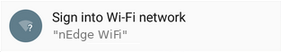
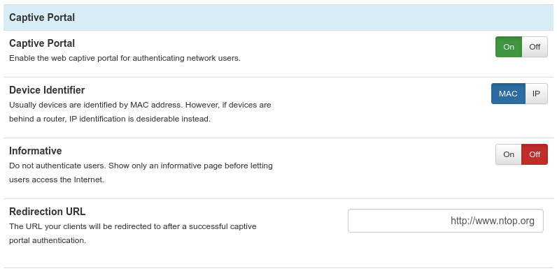
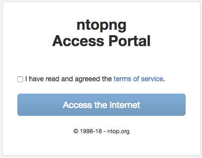

Captive Portal
==============

nEdge can provide a captive portal for devices authentication. Any device
connecting to the LAN network won't be able to access the rest of the network
unless it authenticates with a username and password via the web captive portal.

.. figure:: img/captive_portal.png
  :align: center
  :alt: Captive Portal

  nEdge captive portal login

The redirection to the captive portal usually happens automatically when the
device first connects to the network.

  Android captive portal login notification

.. warning::

   On Windows 10 hosts with chrome browser, captive portal is only detected while
   connected to a WiFi network.

The access credentials for the captive portal are the ones configured in the
users_ page. A device label is also required. Although this is a free field, the user is
expected to insert a string to describe its device, e.g. `Joe's Laptop`.

Upon successful authentication, the device will be redirected to the web. A
customized *redirection URL* can be set up to redirect the devices to a specific website.

  Captive portal settings

By leaving the field blank, the devices will be redirected to the original website
they were trying to visit before the captive portal login.

The captive portal can also operate in informative mode. No user
authentication is performed in informative mode. An informative page
is just shown to newely connected users, to present them the terms and
conditions of the Internet access that is being provided. Users will
be able to access the Internet upon acceptance of the presented terms
and conditions.

  Informative Captive Portal Page

Active users will be forced to renew their acceptance of the terms and
conditions every day. Inactive users will be presented with the
informative page as soon as they become active and try to access the
Internet again.

.. _users: users.html
