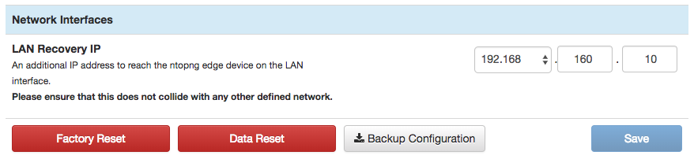

Data Management
###############

During its normal execution, nEdge stores persistent data to disk. This
data includes hosts and interfaces timeseries (for example, traffic
and Layer-7 application protocols), detected alerts, hosts counters,
etc. nEdge also keeps additional in-memory data to always have updated
monitored data.

Sometimes it is necessary to reset all this data to start with a
clean system, without any timeseries, known host, or any other kind of
data generated during the execution.

nEdge provides an handy button `Data Reset` that accomplishes the
aforementioned task. This button is available from the `System Setup`,
tab `Misc`.

  nEdge system setup page, tab Misc

A click on the `Data Reset` button will cause a confirmation dialog to
appear. Confirming the operation will cause nEdge to restart itself and perform all the
necessary data reset operations. The web GUI may become unavailable
for a few seconds during these operations.

One could also have performed a factory reset but that would have
reset also the configuration of the system. When the system setup is
ok and only the data generated during the execution needs to be reset,
using `Data Reset` is recommended.
