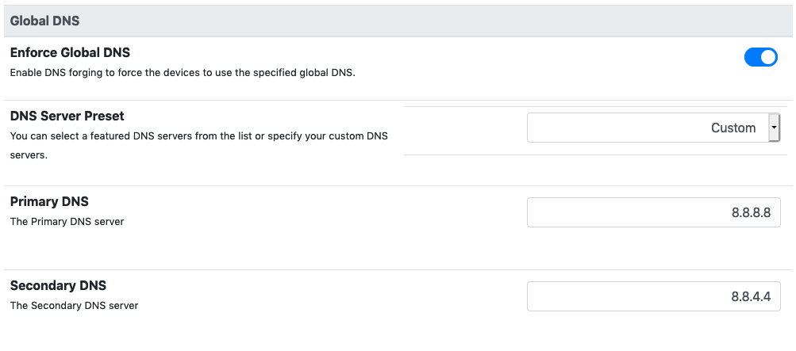
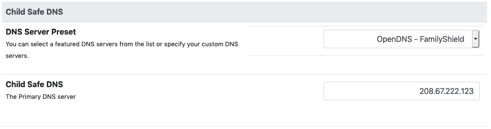

DNS
===

nEdge can enforce a specific DNS server to be used by the LAN devices.
nEdge ships with some preset of secure DNS servers, which provide an
additional security against malware sites.

Global DNS
----------

The `Global DNS` is the DNS server used in the following cases:

  - When the DHCP server is enabled in routing mode, it will configure the
    non child-safe clients to use these DNS servers
  - By the nEdge device for interfaces configured in static address mode

  Global DNS configuration

If the `Enforce Global DNS` option is set, nEdge will enforce the use of the
specified `Global DNS` even if the clients manually change their DNS servers.

Secure DNS servers can be chosen from the provided presets or be specified manually.

Child Safe
----------

The `Child Safe` DNS is the DNS used for users which are marked with the `Child Safe`
option.

  Child DNS configuration

Such DNS can protect the children from inappropriate adult content.

**Note**: nEdge will always enforce the use of such a DNS for all the child safe users,
even if they manually change their DNS servers.

DNS issue: 5 seconds delay
--------------------------

Due to a bug_ into the kernel, there is an issue with the DNS resolver of some versions of glibc,
which causes a client program to stuck for about 5 seconds when performing A and AAAA DNS requests
using the same socket. This can be verified with the following command:

`conntrack -S`

When the issue occurs, the command above will increase the `insert_failed` counter.
A temporary solution to the issue is to force glibc to use a different socket for the AAAA request.
On a linux client, this can be done by adding the following line to `/etc/resolv.conf`:

`options single-request-reopen`

.. _bug: https://patchwork.kernel.org/patch/9785641
