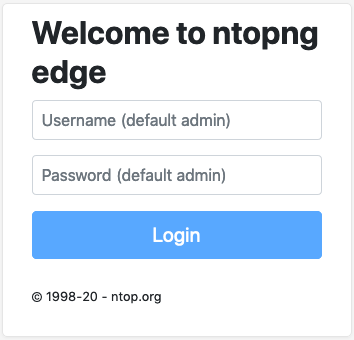
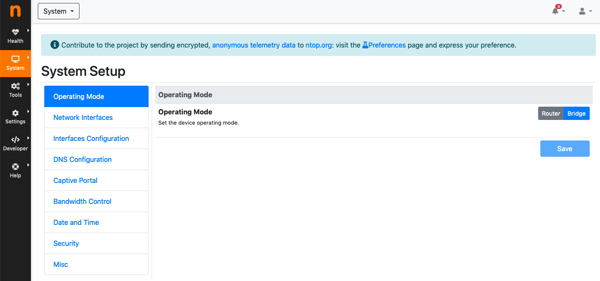
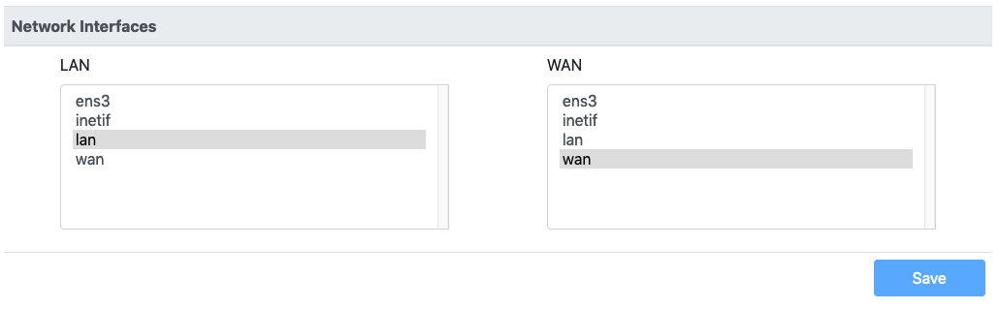
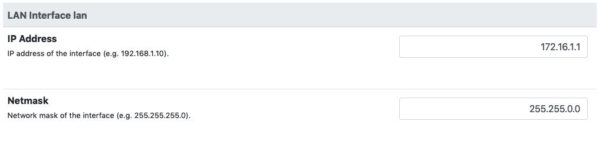
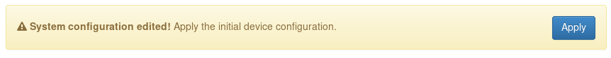

Getting Started
===============

nEdge requires at least **two wired network interfaces** in order to run.

.. warning::
   nEdge will change the system configuration of the device where it's installed.
   The original network configuration file is stored in `/etc/network/interfaces.old`.
   The nEdge package will force the removal of dnsmasq and network manager as they
   conflicts with the nEdge operation.

Before installing nEdge, it's necessary to add the ntop repo to the system, by following the
instructions at http://packages.ntop.org . After configuring the gateway, nEdge can be
installed with the commands:

`apt-get update`

`apt-get install nedge`

First Start
-----------

Any change in the configuration operated from
the gui requires explicit confirmation before being applied.
Some changes may require a device reboot.

After installing the package, nEdge will start automatically. The nEdge web gui
will be available on port 3000. For example, if the device has the IP address
192.168.1.10 the nEdge gui will be available at the URL http://192.168.1.10:3000.
Chrome, Firefox and Safari are the web browser officially supported.

  nEdge Login screen

The credentials for accessing the gui the first time are user **admin** and password **admin**.

After logging in into the gui for the first time, the nEdge system configuration page will
open. The first thing to look at is the `Operating Mode`. The following operating modes
are available:

  nEdge operating mode selection

- **Bridge Mode**: provides minimal configuration and easy integration with existing network
- **Router Mode**: provides advanced routing with multiple gateways

After choosing the operating mode, it's necessary to define which network interfaces
available in the system will be used as WAN or LAN interfaces. In case of `router`
mode, multiple WAN interfaces can be selected from the multiple choice list.

  Network interfaces roles selection

**NOTE:** the interfaces list available into nedge is based on the network interfaces
available in the system at the time of the first startup. After removing or adding
a new network interface to the system, **a factory reset is required** in order to make it
available into the nedge gui.

Based on the chosen setup, the `Network Configuration` will provide interfaces
configuration. For bridge mode, only LAN configuration is necessary. In router
mode, both LAN and WANs configurations are necessary. LAN and WAN network
addressess should not collide.

  LAN network configuration

It is important to remember the configured **LAN address**, as it will be necessary
to access the nEdge gui after the reboot. In case of bridge mode where the LAN is
set in DHCP client mode, it's necessary to view the DHCP server log or other
tools in order to figure out, after the reboot, the IP address assigned to the LAN.

After setting up the basic configuration, clicking the `apply` button will write
the system configuration to disk and reboot the device.

  Message with button to apply the configuration and reboot

After the reboot, the nEdge device will be available at the configured LAN address,
port 3000.

In case of troubles reaching the device, the nEdge device should still be reachable
via its recovery address as discussed in the device recovery_ section.

.. _recovery: recovery.html
.. _bridge: bridging.html
.. _router: routing.html
