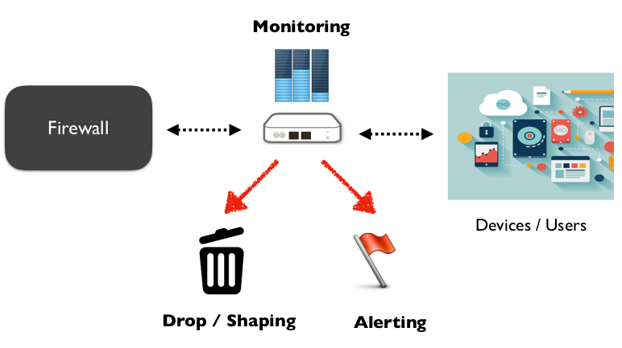
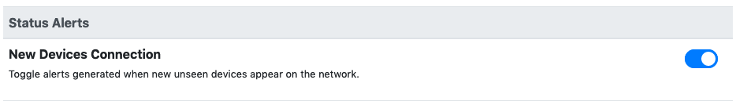
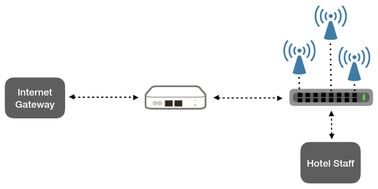
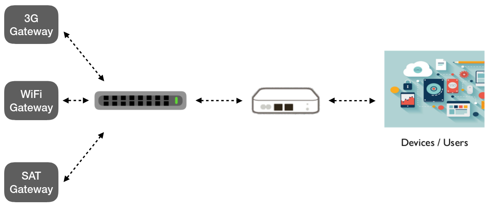

Overview
========

Securing devices is a challenging task in the current era, affecting large
enterprise network as well as small home network. In home networks, there is often
any knowledge on the devices connected to the network or how the network bandwidth is
being used. On the other end, security in enterprise networks is traditionally demanded to
firewall appliances, where it often ends up to the use of static rules targeting
some specific devices, which are difficult to manage in a constantly changing network.
Moreover, since the BYOD_ practice is becoming more and more widespread, it is important for
the network administrator to know what devices are currently connected to the network and
dynamically apply rules to them.

Regardless of the environment, the common requirements for network monitoring
are still the same:

- Discover and identify, in an accurate way, the devices connected to a
  network, along with the device type and block/alert new devices connection
- Get a visibility on network traffic to see which are the top talkers and
  how the bandwidth is being used
- Throttle/block bandwidth consuming protocols which degrade network performance
- Proactively identify possible threats and block the device/communication
  traffic and notify to the administrator

nEdge is the ntop response to the outlined problems.

Let's analyze how nEdge works with some use cases.

Small Business
--------------

Business environments are characterized by variegated network topologies and
appliances. A solution which requires a change in network topology can be
expensive and can create conflicts with existing devices.

By deploying nEdge in bridge_ mode, no topology change is required. Moreover,
nEdge does not interfere with other network appliances. It can be deployed in
different points of the network to provide visibility and protection on the
network segment of choice.

  nEdge integration in a small business environment

It is important to note that nEdge is intended to secure the devices at the
network edge. It does not replace firewalls, it merely complements them.

Some interesting nEdge features for a network administrator are the ability to
generate alerts when new devices connect to the network and to block possibly
dangerous protocols like file sharing protocols, SSL traffic with no certificate
and VPN tunnels.

To get a full visibility of the network, by enabling `Network Discovery`
it will also be possible to discover and correctly identify idle devices like printers
in an accurate way.

Hotel
-----

A medium size hotel usually has many access points that guests can use.
The access points are connected to the Internet gateway to provide Internet connectivity.

Usually the same Internet gateway is also being used by the hotel staff,
so it can become unresponsive when some guest abuses network bandwidth or when a
lot of clients are connected.

The problem can be easily solved by using nEdge in bridge_ mode as shown in the
picture.

  nEdge integration in a hotel

The following nEdge configuration will be used:

  - Captive portal is enabled
  - The `Default` bandwidth class guarantees 65% bandwidth
  - The `Slow Pass` bandwidth class guarantees 30% bandwidth
  - A user `Staff` is created with a `Default` class set a the fallback policy
  - A user `Guests` is created with a `Slow Pass` class set a the fallback policy

This setup will ensure that the staff will have a reserved 65% bandwidth to use
when needed, while still allow guests to run at full bandwidth when the staff is idle.

Moreover, with nEdge the guests bandwidth will be split in a fair way, so that a
single guest won't be able to monopolize the network. For further control,
some bandwidth consuming protocols like Bittorrent can also be disabled.

Connectivity Provider
---------------------

In this use case we will analyze some advanced functionalities of nEdge specifically
designed for a private Internet connectivity provider. This environment is
characterized by the presence of a number of Internet gateways with different
speeds and costs.

  Connecting nEdge with multiple gateways to provide Internet connectivity

As an example, let's suppose there are 3 different customers plans to manage:

- Basic User: can only use the WiFi gateway. A 500 Kbit rate limit will also applied.
- Normal User: uses WiFi gateway by default, but may also use the 3G is WiFi is not available.
- Gold User: can use any of the available gateways and it has a 70% of the available bandwidth reserved

The desired behaviour is that a user should always use the less expensive gateway available,
based on its plan. If such a gateway becomes unavailable, Normal/Gold users should use an
alternative gateway as long as it remains unavailable and then switch back to the less
expensive when available.

By deploying nEdge is in router_ mode, the above scenario can be configured as follows:

- The gateways `3G`, `WiFi`, and `SAT` are created and configured
- A routing policy `WiFi Only` is created and configured to only allow WiFi
- A routing policy `WiFi or 3G` is created and configured with WiFi as high priority,
  and 3G as low priority
- A routing policy `Any` is created, and configured with WiFi as high priority,
  3G as low priority, and SAT as lower priority
- The `Default` class rate is set to 70%
- The `Slower Pass` per-host class bandwidth is set to 500 Kbit/s
- A user `Basic` is created, with `Slower Pass` fallback policy
- A user `Normal` is created, with `Slow Pass` fallback policy
- A user `Gold` is created, with `Default` fallback policy

Customer devices can now be manually assigned to the created users based on their
plan. Multiple users could be created for more complex setups and automatically
assigned via `Captive Portal` authentication.

nEdge will take care of applying **failover** and **load balancing** rules according
to the specified priorities. It will monitor the gateways status and switch to
higher priority gateways (less expensive or more performant) when available.

The gateways can be either connected to a switch or directly to the nEdge device
if multiple network interfaces are available.

.. _bridge: bridging.html
.. _router: routing.html
.. _portal: captive_portal.html
.. _BYOD: https://en.wikipedia.org/wiki/Bring_your_own_device

Programmatic Configuration
--------------------------

ntopng can be configured programmatically without any GUI interaction.

This is particularly useful for those who wants to integrate ntopng
Edge in their own automatized solutions. Let's consider the following case as an example.

An Internet connectivity provider, say ACME ISP, is sells three Internet profiles:

- :code:`basic`
- :code:`gold`
- :code:`platinum`

The service provider wants to policy the profiles as follow:

- :code:`basic`: Provide Internet connectivity at a very slow rate and
  prevent YouTube streaming
- :code:`gold`: Provide Internet connectivity at a slow rate and
  throttle YouTube video streaming to a very slow rate
- :code:`platinum`: Provide Internet connectivity at the maximum speed
  without and constraint

ACME ISP sells Internet profiles to customers through its
platform. After a successful purchase, the platform associates the Mac
address of the customer's device that wants to access the Internet to
the purchased profile. So the associations can be something as:

- Mac address :code:`AA:BB:CC:DD:EE:11` has purchased a :code:`basic` profile
- Mac address :code:`AA:BB:CC:DD:EE:22` has purchased a :code:`gold` profile
- Mac address :code:`AA:BB:CC:DD:EE:33` has purchased a :code:`platinum` profile

At this point, ACME ISP wants to programmatically configure ntopng Edge to

1. Create the three policies basic, gold and platinum
2. Associate every Mac address seen to the right policy on the basis
   of the purchased profile.

Policies can be created programmatically by serving ntopng Edge a
configuration JSON via web. Upon startup, ntopng Edge will connect to
the  ACME ISP web server to fetch the configuration JSON.
ACME ISP will serve the following JSON to create the policies
described above

.. code:: json

   {
	  "users": {
		 "basic" : {
		       "full_name": "Basic Internet Profile",
		       "default_policy": "slower_pass",
		       "policies" : {
			     "YouTube": "drop"
		       }
		 },
		 "gold" : {
		       "full_name": "Gold Internet Profile",
		       "default_policy": "slow_pass",
		       "policies" : {
			     "YouTube": "slower_pass"
		       }
		 },
		 "platinum" : {
		       "full_name": "Platinum Internet Profile",
		       "default_policy": "pass",
		       "policies" : {
		       }
		 },
	  },
   }

After the startup, ntopng Edge is ready to associate the Mac addresses
it sees to the created policies. But how can ACME ISP tell ntopng Edge
such associations? It's pretty easy, ACME ISP has just to contact the
special ntopng Edge web page
:code:`/lua/admin/manage_pool_members.lua` and submit a JSON with the
associations using an HTTP POST.

A JSON that tells ntopng Edge the three associations exemplified above is the following:

.. code:: json

	  "associations" : {
		"AA:BB:CC:DD:EE:11"  : {"group" : "basic",    "connectivity" : "pass"},
		"AA:BB:CC:DD:EE:22"  : {"group" : "gold",     "connectivity" : "pass"},
		"AA:BB:CC:DD:EE:33"  : {"group" : "platinum", "connectivity" : "pass"},
	  }

From now on, ntopng Edge will be able to correctly associate the
traffic exchanged by any of the three Mac addresses above with the
right configured policy.

Every time a new customer does a purchase,
ACME ISP can send a new association JSON to ntopng Edge at runtime.

And what if a purchase has expired? What if :code:`AA:BB:CC:DD:EE:33`
is no longer entitled to access the Internet using the :code:`platinum`
profile? How can ACME ISP tell ntopng Edge to remove
:code:`AA:BB:CC:DD:EE:33` from the :code:`platinum` policy? Again, that is
pretty easy as the special ntopng Edge web page not only accept
associations, it also accepts disassociations. To disassociate a
member from a policy, ACME ISP, will only have to change to :code:`reject` the
:code:`connectivity` as follow.

.. code:: json

	  "associations" : {
		"AA:BB:CC:DD:EE:33"  : {"group" : "platinum", "connectivity" : "reject"},
	  }

An in-depth explanation on how to programmatically configure ntopng
Edge can be found at :ref:`programmatic_configuration`.

To understand how to configure slow and very slow rates to certain
given values, refer to :ref:`bandwidth_control`.

