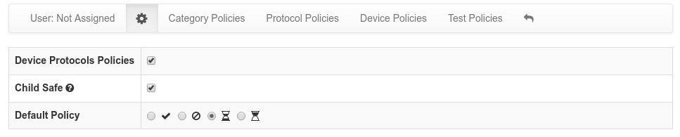

Policies
========

With nEdge policies is possible to set up customized rules to block or limit users traffic.

Policies are available with three granularities:

   - User protocol policy: provides rules on user protocols
   - User category policy: provides rules on user categories
   - User fallback policy: provides a default rule for the user

Protocol/Category Policy
------------------------

.. figure:: img/protocol_policies.png
  :align: center
  :alt: Protocol Policies

  User policies configuration page

A protocol or category policy has the following fields:

- The **policy**: it specifies if the protocol traffic should be limitited or blocked
- A **daily traffic quota**: a limit for the specified protocol daily traffic
- A **daily time quota**: a limit for the specified protocol daily time usage

Device Protocols Policies
-------------------------

nEdge supports defining per-device-type policies in a similar way as `ntopng does`_.

Such policies can be used to block possibly harmful device protocols, according to the
configured rules. Device Protocols Policies can be enabled from the user settings page:

  Enable Device Protocol Policies

It is important to note that such policies in nEdge only apply to
the *Not Assigned* devices. If a captive portal authentication is used, or the
administrator has manually assigned the device to a specific user, the device protocols
policies *will not* be applied. This also applies to Device Protocols alerts.

.. _`ntopng does`: https://www.ntop.org/guides/ntopng/advanced_features/device_protocols.html

Priority
--------

The policies are applied with the following priority:

- For *Not Assigned* devices, if a Device Protocol policy is defined as block, such policy is applied
- If a protocol policy is defined, the protocol policy is applied
- If the protocol protocol policy is set to `Default` and a category policy is defined,
  then the category policy is applied
- If both the protocol and category protocols are set to `Default`, then the `Fallback Policy` of
  the user is applied

As an example, supposing a `Social Network` policy is set to `Slow Pass`, and a `Facebook` policy
to drop, all the Facebook flow will be dropped, while other social networks like Twitter will
pass and they will be limited according to the `Slow Pass` bandwidth class.

There is an easy way to verify which policy would be applied to some protocol, the Policies Test page.

.. figure:: img/policies_test.png
  :align: center
  :alt: Policies Test

  Policies Test page

The image above shows that a computer device belonging to no user (*Not Assigned*),
connecting to Youtube would be rate limited according to the Slow Pass bandwith control because
there is a Protocol policy which states that.
