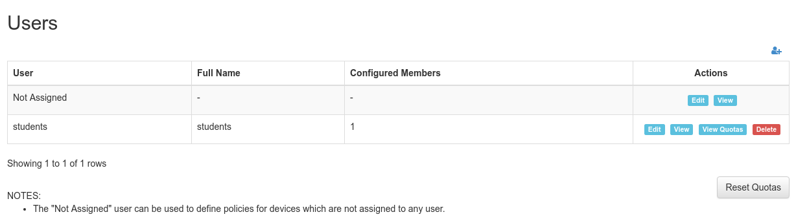
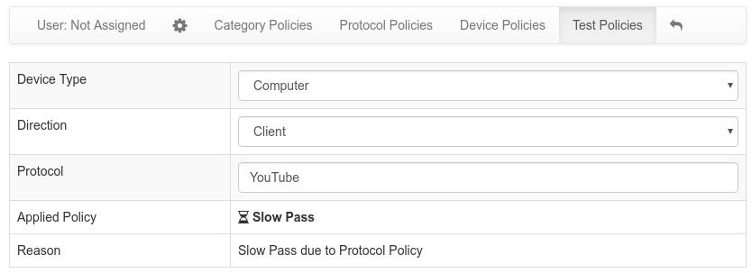

Policies
========

With nEdge policies is possible to set up customized rules to block or limit users traffic.

Policies are available with three granularities:

   - User application policy: provides rules on user applications
   - User category policy: provides rules on user categories
   - User fallback policy: provides a default rule for the user

Application/Category Policy
---------------------------

.. figure:: img/protocol_policies.png
  :align: center
  :alt: Application Policies

  User policies configuration page

A application or category policy has the following fields:

- The **policy**: it specifies if the application traffic should be limitited or blocked
- A **daily traffic quota**: a limit for the specified application daily traffic
- A **daily time quota**: a limit for the specified application daily time usage

Quotas
------

All the quotas are reset daily at midnight. Quotas cannot be applied to the "Not Assigned" user.

Active user quotas can be reviewed by clicking the "View Quotas" button for a user in the Users page.

A given application or category quota will be shown only if there has been some traffic for it since
midnight. It is possible to reset all the user quotas manually by clicking the "Reset Quotas" button.

Priority
--------

The policies are applied with the following priority:

- If a application policy is defined, the application policy is applied
- If the application policy is set to `Default` and a category policy is defined,
  then the category policy is applied
- If both the application and category are set to `Default`, then the `Fallback Policy` of
  the user is applied

As an example, supposing a `Social Network` policy is set to `Slow Pass`, and a `Facebook` policy
to drop, all the Facebook flow will be dropped, while other social networks like Twitter will
pass and they will be limited according to the `Slow Pass` bandwidth class.

There is an easy way to verify which policy would be applied to some application, the Policies Test page.

  Policies Test page

