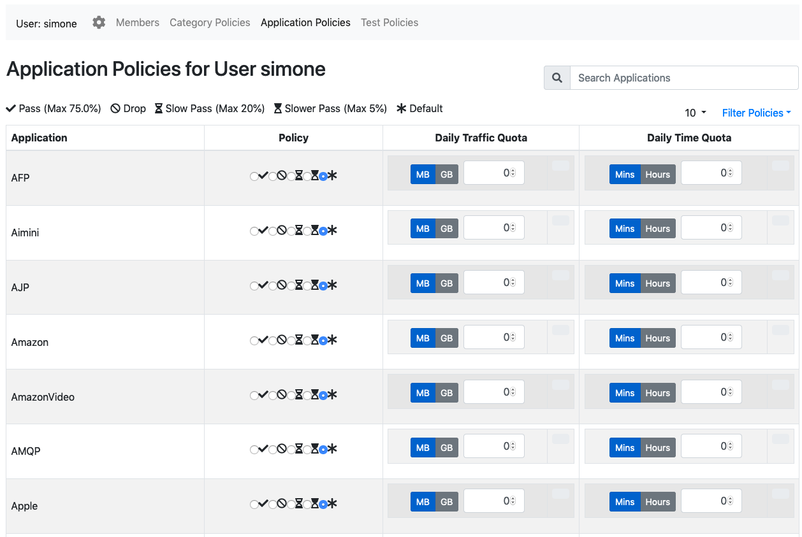

Policies
========

With nEdge policies is possible to set up customized rules to block or limit users traffic.

Policies are available with three granularities:

   - User protocol policy: provides rules on user protocols
   - User category policy: provides rules on user categories
   - User fallback policy: provides a default rule for the user

Protocol/Category Policy
------------------------

  User policies configuration page

A protocol or category policy has the following fields:

- The **policy**: it specifies if the protocol traffic should be limitited or blocked
- A **daily traffic quota**: a limit for the specified protocol daily traffic
- A **daily time quota**: a limit for the specified protocol daily time usage

Priority
--------

The policies are applied with the following priority:

- If a protocol policy is defined, the protocol policy is applied
- If the protocol protocol policy is set to `Default` and a category policy is defined,
  then the category policy is applied
- If both the protocol and category protocols are set to `Default`, then the `Fallback Policy` of
  the user is applied

As an example, supposing a `Social Network` policy is set to `Slow Pass`, and a `Facebook` policy
to drop, all the Facebook flow will be dropped, while other social networks like Twitter will
pass and they will be limited according to the `Slow Pass` bandwidth class.
