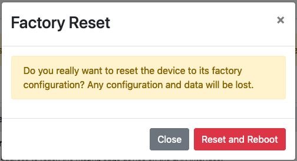

Device Recovery
###############

nEdge will reconfigure the device according to the specified configuration options.

If the device where nEdge is installed does not have video or keyboard access, it
can be still recovered in case of failure, by manually connecting to its
recover IP address. The default recover IP address is `192.168.160.10`.

Here are some instructions to connect to the device using the recovery IP:

1. Configure a static IP address on a wired network interface on your pc, with
   the following parameters:

    - IP: 192.168.160.1
    - Netmask: 255.255.255.0
    - Gateway/DNS: can left blank

   On Linux based distribution, this can be easily done with the command:
    `ifconfig eth0 192.168.160.1`, where eth0 is the wired interface name

2. Connect a cable from the wired interface of the PC to the LAN interface of
   the nEdge.

3. Verify the connection with the nEdge: `ping 192.168.160.10`. The device should
   respond with ping replies

4. Access the nEdge gui by visiting the following URL with a web browser:
   `http://192.168.160.10:3000`.

Factory Reset
-------------

After connecting to the nEdge gui, a factory reset can be performed to restore the
nEdge settings to the defaults. This will also **flush** all the nEdge historical
data.

From the `System Setup` menu, go into the `Misc` tab and click the `Factory Reset`
button.

  nEdge factory reset confirmation dialog

**Note**: the reboot won't change the system configuration yet. After the
reboot, nEdge will be restored to original settings. By logging in into the nEdge
gui it will be possible to perform the `first start` setup and permanently apply
the new settings.
