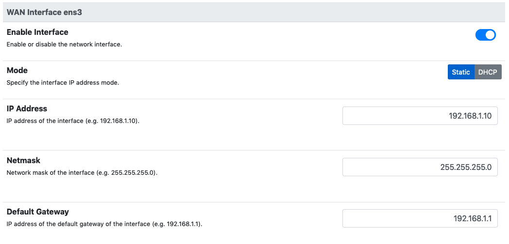
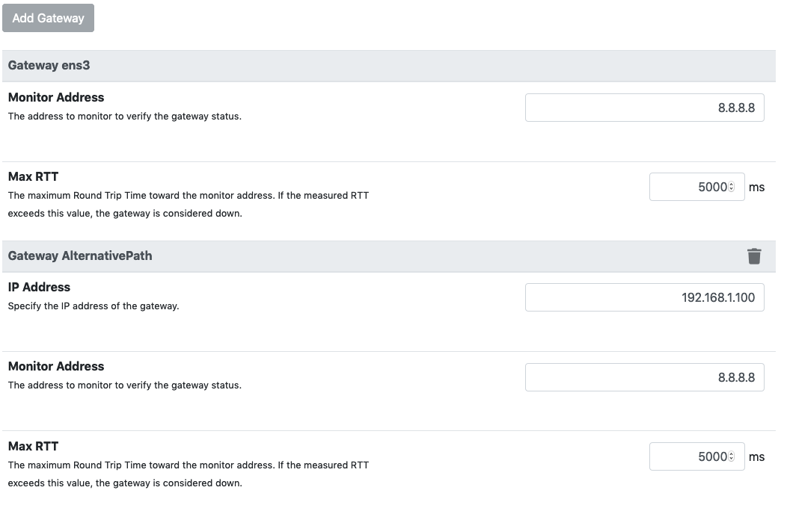
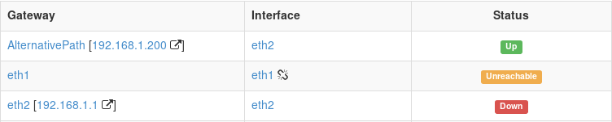
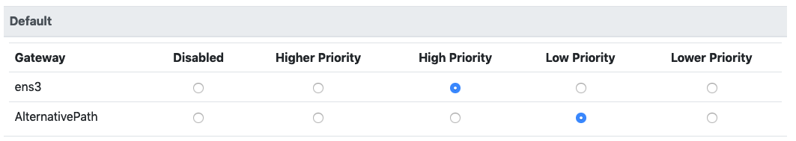
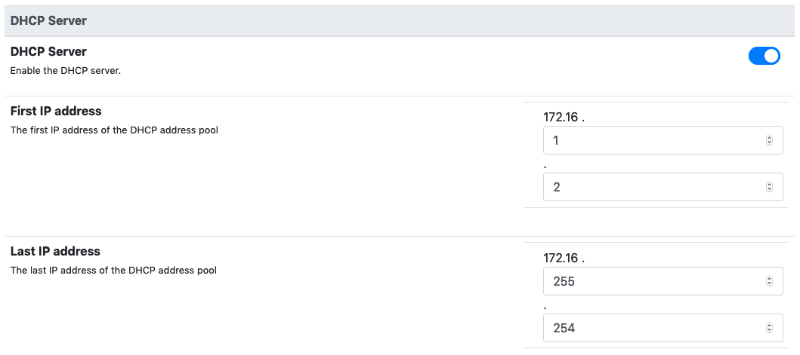
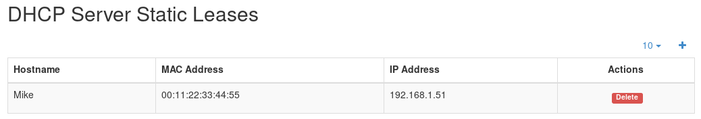

Router Mode
===========

When running in router mode, nEdge will route the traffic from the LAN interface
to one of the configured WAN interfaces. All the traffic going of a WAN interface
will be NATed with the interface address.

An important note about routing mode is that, by default, **it will block all the traffic**.
In order to actually enable traffic routing it is necessary to enable at least one gateway in the
routing policies as explained below.

A WAN interface can be configured with a static address configuration or in DHCP
client mode. A network interface can be selectively disabled to prevent any traffic
to go through it.

  WAN interface network configuration

nEdge implements dynamic multipath routing according to some user defined routing
policies. Routing policies work with gateways, so let's talk about gateway first.

Gateways
--------

Before setting up the routing policies, gateways setup is needed. A gateway
specifies the IP address to be used as the next hop for packet routing.
A gateway also has a *monitor address*, which is the IP address to be used to
verify if the gateway is currently up and running. nEdge will periodically send
PING packets to this address through the gateway to verify if the gateway can
correctly route the traffic.

  Gateways configuration

For every configured WAN interface, a gateway is automatically created. This
gateways is either bound to the manually specified WAN interface gateway, in case
of static configuration, or to the gateway the WAN interface will acquire dynamically,
if DHCP client mode is enabled for the interface.

Custom gateways can also be created at will. A typical example is the
use of a single WAN port to route the traffic through different gateways. All the
gateways and the nEdge WAN port itself are connected through a multiport swtich.
In this case, all the gateways must be on the same IP network in order for nEdge
to correctly route the traffic through them.

The current gateway state can be checked from the `Gateways and Users` page.

  Gateways status view

The table shows, for each gateway, what's the network interface it will use to
route the traffic along with its current status. A broken chain icon next to the
interface name indicates that the interface link is currently down.

The gateway status can be one:

  - **Up**, the gateway is currently up and it can correctly route the packets
    to the configured *monitor address*.

  - **Down**, the gateway is currently down or it cannot correctly route the packets
    to the configured *monitor address*.

  - **Unreachable**, if there is currently no way for nEdge to reach the
    gateway IP address. This can be caused by an interface link down or by a
    misconfigured gateway/interface network.

Routing Policies
----------------

A routing policy is a set of rules which define gateways priorities.
Routing policies must be associated to specific `users` through the `Routing Policy`
option into the user configuration. The routing policy will be then applied to all
the user devices. The `Default` routing policy is set by default on newly created users.

  Routing policy configuration

By tweaking gateways priorities, it's possbile to effectively implement the **load balacing**
and **failover** between multiple the gateways. In particular, when some gateways have the
same priority the traffic will be *load balanced* between them. When one gateway has lower
priority then another, the gateways will work in a *failover* fashion where the gateway
with lower priority will be used only if the one with higher priority is not in an `Up`
status. This is the case in the picture above, where the `AlternativePath` is in failover
with the `eth1` interface gateway.

It is important to note that load balancing cannot split the same flow between multiple
gateways as it will actually break the flow.

nEdge periodically monitors gateways status, so that when a change in gateways status
is detected it will dynamically update the gateway currently used by the clients to the
gateway in `Up` status with the highest priority. nEdge will also adapt to cables
**plug/unplug** events. When the WAN interfaces are configured in DHCP client mode,
the cables can even be swapped and nEdge will automatically detect the new gateways setup.

DHCP Server
-----------

When routing mode is enabled, the DHCP server can be enabled or disabled at will
on the configured LAN interface. Normally it should be enabled.

  DHCP server configuration

A custom IP address range for the DHCP server can also be configured.
Moreover, when the DHCP server is enabled, from the `DHCP Leases` page it's
possible to set static IP to MAC address mappings.

  DHCP static leases configuration
