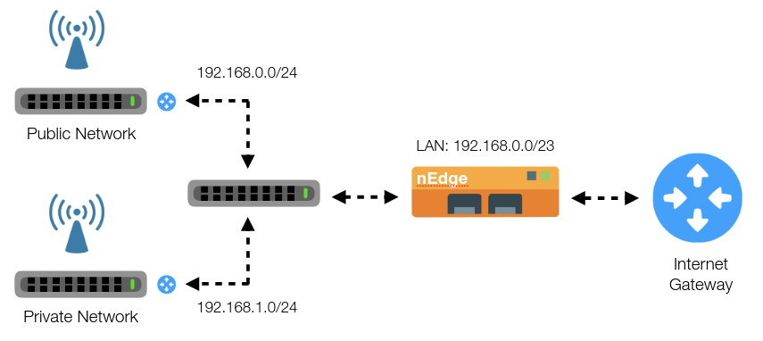
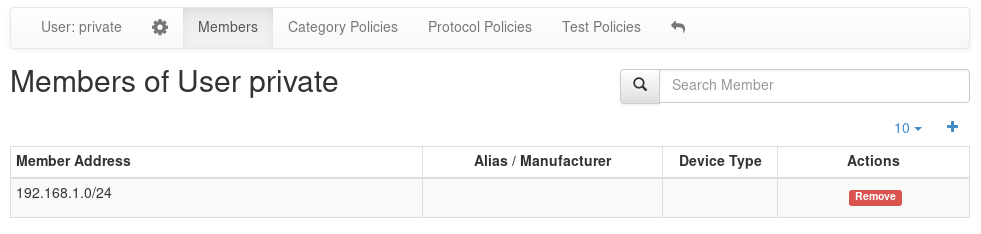

Users
=====

nEdge uses the concept of `users` to group devices together.

.. figure:: img/users.png
  :align: center
  :alt: Users View

  User configuration page

Depending on the specific context, the user can be used to either represent an
actual person or a group of people. In an home environment, for example, a user
"mike" could be created to represent a real person. In this case the user will
group Mike's devices together. In a corporate network, however, a user "employee"
would be more appropriate, to group all employees' devices.

In nEdge, the `Not Assigned` user is a special user that groups together all the new devices.
It can be used to define "default" policies to be applied, for example, on unknown devices. This
only works if the captive portal is disabled, otherwise the unassigned devices traffic will
blocked until proper authentication.

User Configuration
------------------

A user configuration includes the following information:

  - A flag which indicates if `Child Safe` is enabled on the user
  - The user policy configuration (fallback policy, total quotas)
  - Per-protocol and per category policies
  - The user routing policy (router mode only)

.. figure:: img/user_config.png
  :align: center
  :alt: User Configuration

  User configuration page

The `Child Safe` option enables child protection for the specified user by blocking
adult web sites. More information about policies can be found on the policies_ section.

Assigning Devices to a User
---------------------------

When creating a user, the *user* and *password* fields will be used as the access
credentials for the captive portal user authentication. After a successful authentication,
the device will be added to the specified user.

.. figure:: img/add_user.png
  :align: center
  :alt: Add a New User

  Add a new user

A device can also be manually assigned to a specific user by entering the device
page in nEdge and selecting a user from the users dropdown.

.. figure:: img/device_assign.png
  :align: center
  :alt: Device Configuration

  Manually assign a device to a user

It is also possible to kick a device out of the captive portal and force a new
authentication by assigning the device to the "Not Assigned" user.

.. _policies: policies.html

.. _programmatic_configuration:

Segmenting the Network
----------------------

Applying policies to individual devices can be difficult on a large or dynamic network.
This could be solved by enabling a `captive portal`_ and enforcing the devices authentication
through it. However, in some cases it is desirable to avoid displaying the captive portal
at all for example for an internal network. In this case, the LAN network should be segmented
by the means of routers and nEdge configured properly to include all the LAN segments via a
network CIDR. Here is an example.

  Segmenting LAN Network

In this example, all the devices connected to the Private access point should be able
to access the internet without captive portal authentication, whereas the devices connecting
to the Public access point must be authenticated. By using two routers to segment
the LAN network, it's now possible to identify the devices groups by their network address.
In particular, the private network is identified by the CIDR `192.168.1.0/24` whereas
the public network by `192.168.0.0/24`. From the users management page is now possible to
create a user "private" and then to add the network `192.168.1.0/24` to its members.

  Binding the private LAN to a user

All the devices with an IP address inside the `192.168.1.0/24` will now be part of the
"simone" user, so no captive portal will be shown for them.

.. note::
  The LAN network now consists of two subnets. In order to correctly identify both
  subnets as local in nEdge, it's necessary to set an appropriate CIDR into the LAN
  network configuration to include both subnets (`/23` in this case).

.. _`captive portal`: captive_portal.html

Programmatic Configuration
--------------------------

Configuration of users, policies, and device-to-user associations/disassociations can also
be done programmatically.

Users and Policies Configuration
~~~~~~~~~~~~~~~~~~~~~~~~~~~~~~~~

Users and policies can be configured programmatically by serving
ntopng Edge a configuration JSON.

The configuration JSON has the following structure

.. code:: json

   {
	  "users": {...},
	  "associations": {...},
   }

There are two keys at the outermost level of the hierarchy, namely,
:code:`users` and :code:`associations`. The former key is used to
create users and specify their policies, whereas the latter is used to
associate devices to the created users.

:code:`users`

The value of this key must be a JSON object with zero or more
key-value pairs:

- Keys are the usernames chosen for the users
- Values are other objects each one carrying the configuration for the user indicated in the key

The following snippet highlights, with an example, a key-value pair
with the configuration for a user named *maina* 

.. code:: json

        "maina" : {
            "full_name": "Maina Bar",
            "password": "ntop0101",
            "default_policy": "pass",
            "policies" : {
	       10 : "slow_pass",
               "Facebook": "slower_pass",
               "MyCustomProtocol": "drop",
               "YouTube": "drop"
	     }
	}

The user configuration is a JSON object that must contain the
following keys:

- :code:`full_name`: The full name (e.g., first and last name) of the
  user.
- :code:`password:`: The password the user will have to submit to the
  captive portal in order to access the Internet. This field is not
  used when the captive portal is off.
- :code:`default_policy`: A policy to be used as last resort, that is,
  when no other policy in :code:`policies` matches.
- :code:`policies`: A JSON object containing zero or more key-value
  pairs with applications as keys and policies as
  values. An application key can be specified either using its string
  name as well as using its integer id.

Policies are in a one-to-one relation with the bandwidth classes
explained in bandwidth control. There is also an extra
:code:`drop` policy to block the matching traffic. The four policies available are:

- :code:`pass`
- :code:`slow_pass`
- :code:`slower_pass`
- :code:`drop`

:code:`associations`

The value of this key must be a JSON object with zero or more
key-value pairs:

- Keys are the Mac addresses of the devices that have to be associated
- Values are other objects each one carrying the username the device will
  be associated to.

An example of the associations JSON object is the following

.. code:: json

	  "associations" : { 
	        "DE:AD:BE:EE:FF:FF"  : {"group" : "maina" , "connectivity" : "pass"},
		"11:22:33:44:55:66"  : {"group" : "maina" , "connectivity" : "pass"}
	  }

Here, :code:`group` indicates the username and :code:`connectivity` is
not used and must stay at :code:`pass`. :code:`connectivity` will
become meaningful when creating associations at runtime
as shown in `Runtime Associations Configuration`_.

A full example of a JSON configuration can be found at https://github.com/ntop/ntopng/blob/dev/tools/serve_bridge_config.py

Serving the Configuration
~~~~~~~~~~~~~~~~~~~~~~~~~

The configuration JSON must be served to ntopng Edge using a web
server. ntopng Edge, early during startup, will connect to the webserver to
read the JSON and apply the configuration.

An example of a web server that serves ntopng Edge the JSON configuration
is available at https://github.com/ntop/ntopng/blob/dev/tools/serve_bridge_config.py

.. note::

   To instruct ntopng Edge to fetch the configuration JSON, variable
   :code:`http_bridge_conf_utils.HTTP_BRIDGE_CONFIGURATION_URL` in
   file :code:`http_bridge_conf_utils.lua` must be manually edited to
   specify the server address and port.

   For example, to connect to a server on :code:`localhost` listening
   for connections on port :code:`8000`, the variable has to be
   changed to :code:`http_bridge_conf_utils.HTTP_BRIDGE_CONFIGURATION_URL = "localhost:8000"`.

.. warning::

   During startup, right before applying the JSON configuration, ntopng Edge flushes all the
   existing configured users, their policies, and all the defined applications.

   
Runtime Associations Configuration
~~~~~~~~~~~~~~~~~~~~~~~~~~~~~~~~~~

Associating members to their host pools is done at runtime using the
ntopng Edge endpoint :code:`/lua/admin/manage_pool_members.lua`.

A valid JSON must be :code:`POST` ed to this endpoint. The JSON is
exactly an :code:`associations` object described in detail above.

For example, using curl, one can associate/disassociate devices to users as follow:

.. code:: bash

	  curl -H "Content-Type: application/json" -X POST -d '{"associations" : { "DE:AD:BE:EE:FF:FF"  : {"group" : "maina" ,  "connectivity" : "pass"}, "AA:BB:CC:DD:EE:FF"  : {"group" : "simon" ,  "connectivity" : "reject"}}}' "http://devel:3000/lua/admin/manage_pool_members.lua"

This time, :code:`connectivity` can take two values:

- :code:`pass` associates a Mac address to the user specified in :code:`group`.
- :code:`reject` disassociates a Mac address from the user specified in :code:`group`.

The endpoint responds with a status for each configured association.
The status can be used to determine if the association/disassociation
has completed successfully.

