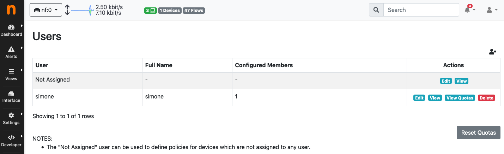
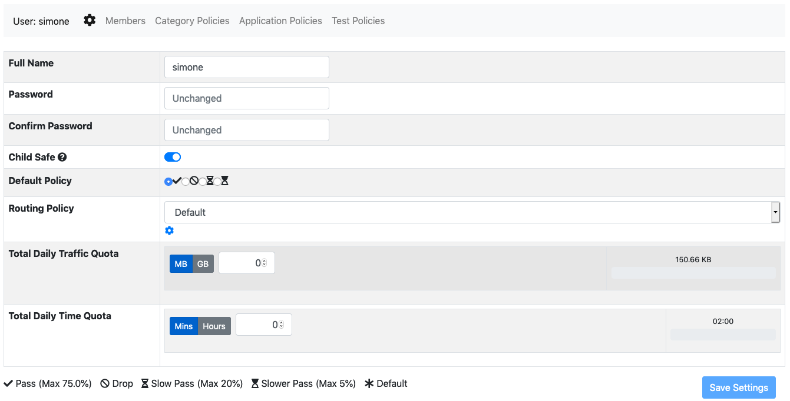
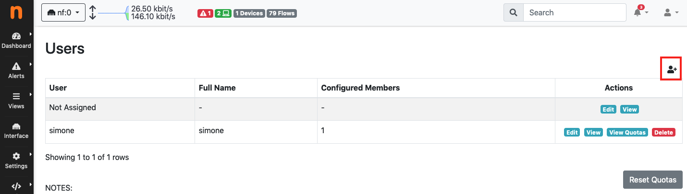
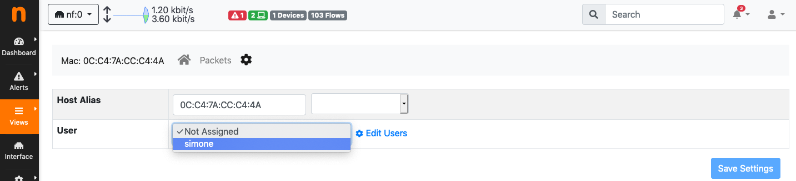

Users
=====

nEdge uses the concept of `users` to group devices together.

  User configuration page

Depending on the specific context, the user can be used to either represent an
actual person or a group of people. In an home environment, for example, a user
"mike" could be created to represent a real person. In this case the user will
group Mike's devices together. In a corporate network, however, a user "employeed"
would be more appropriate, to group all the employeed devices.

In nEdge, the `Not Assigned` user is a special user that groups together all the new devices.
It can be used to define "default" policies to be applied, for example, on unknown devices. This
only works if the captive portal is disabled, otherwise the unassigned devices traffic will
blocked until proper authentication.

User Configuration
------------------

A user configuration includes the following information:

  - A flag which indicates if `Child Safe` is enabled on the user
  - The user policy configuration (fallback policy, total quotas)
  - Per-protocol and per category policies
  - The user routing policy (router mode only)

  User configuration page

The `Child Safe` option enables child protection for the specified user by blocking
adult web sites. More information about policies can be found on the policies_ section.

Assigning Devices to a User
---------------------------

When creating a user, the *user* and *password* fields will be used as the access
credentials for the captive portal user authentication. After a successfull authentication,
the device will the added to the specified user.

  Add a new user

A device can also be manually assigned to a specific user by entering the device
page in nEdge and selecting a user from the users dropdown.

  Manually assign a device to a user

It is also possible to kick a device out of the captive portal and force a new
authentication by assigning the device to the "Not Assigned" user.

.. _policies: policies.html
