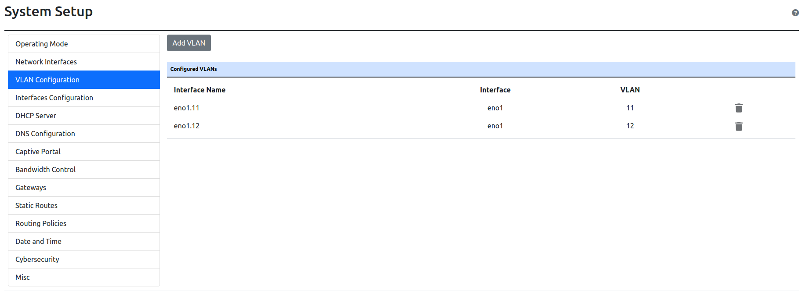
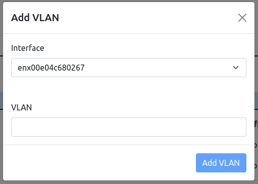

VLAN
====

In nEdge it's possible to add VLANs on the current selected Network Interfaces.

  VLAN configuration

After configuring the Network Interfaces that nEdge is going to use as LAN and as WAN,
it's possible to create VLANs on those Interfaces, by clicking the `Add VLAN` button.

  Add VLAN

Select the Interface on which a VLAN has to be added and then enter the VLAN ID, after that click on the `Add VLAN` button,
save the configuration and restart the system.
After the reboot a new VLAN should be available.
