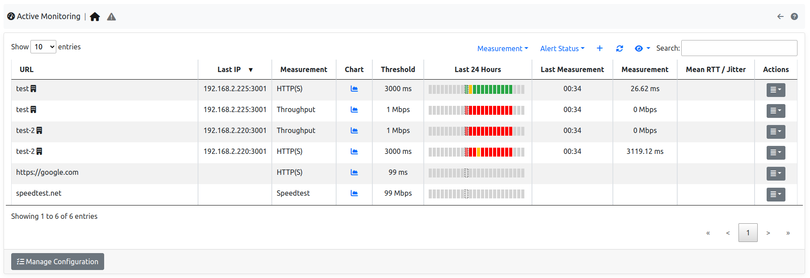
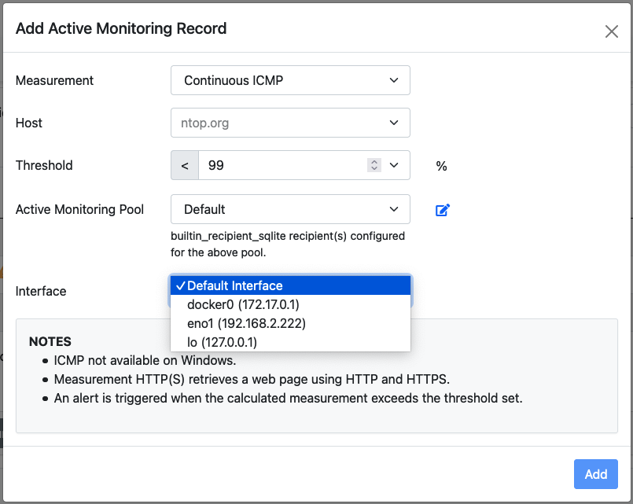
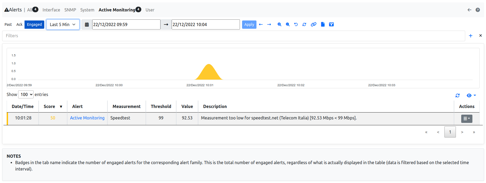
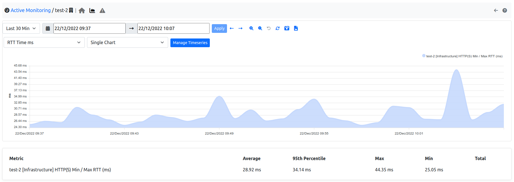

.. _Active Monitor:

Active Monitor
==============

Active Monitor is available under the :ref:`BasicConceptSystemInterface`. The Active monitor probes configured hosts on a minute-by-minute basis to check:

- IP reachability.
- Functionality of certain services.

Some checks measure the RTT, that is, the time it takes to reach a certain host and receive a response from it. Other checks measure the bandwith. The following checks are currently supported:

- ICMP and ICMPv6: to check host IP reachability.
- HTTP and HTTPS: to check functionalities of possible host web servers.
- Speedtest: to check for Internet bandwidth.

All the monitored hosts are shown in a table.

  The Active Monitor Table

The table has the following columns:

- :code:`URL`: The full URL of the monitored host. The URL is the concatenation of the host name or IP address with a prefix which indicates the type of probe, namely one of:

  - :code:`icmp`
  - :code:`icmpv6`
  - :code:`http`
  - :code:`https`
  - :code:`speedtest`

- :code:`Chart`: A link to the measure chart, present when :ref:`Measure Timeseries` are enabled.
- :code:`Threshold`: A threshold used to trigger :ref:`Measure Alerts`.
- :code:`Last Measurement`: The time of the last measurement performed.
- :code:`Last IP`: The latest IP address resolved for the host name indicated in the URL.
- :code:`Measurement`: The value of the latest measure.
- :code:`Actions`: Buttons to delete or edit the configured host.

Hosts can be added to the active monitor using the :code:`plus` sign in the top-right corner of the table.

  The RTT Add Record Pane

Four fields need to be input when adding a host:

- :code:`measurement`: The type of check.
- :code:`host`: The host name or the IP address of the host which needs to be monitored.
- :code:`periodicity`: How often to perform the check.
- :code:`rtt threshold`: A threshold used to trigger :ref:`Measure Alerts`.

.. _Measure Alerts:

Measure Alerts
--------------

Alerts are triggered when the measured value is above the configured threshold, or when the host is unreachable. Configuring a threshold is contextual to the addition of an host among those monitored. Alerts are shown under the triangle entry of the Active Monitor menu bar.

  The Measure Alerts

Alerts can either be engaged, for currently ongoing issues, or past, for issues occurred in the past.

.. _Measure Timeseries:

Measure Timeseries
------------------

Measure timeseries are written automatically by default for any of the monitored hosts. For example, the image below shows the RTT timeseries written for host :code:`http://ntop.org`.

  The RTT Timeseries of a Monitored Host

Timeseries can be disabled from the :ref:`ntopngPreferences`, tab *Timeseries->System Probes*.

.. figure:: ../img/active_monitor_timeseries_conf.png
  :align: center
  :alt: The Measure Timeseries Configuration

  The Measure Timeseries Configuration

In case of HTTP monitoring, the "HTTP Stats" timeseries show additional insights on the HTTP traffic:

- :code:`Name Lookup`: time spent resolving the host name
- :code:`App Connect`: time spent in the SSL handshake
- :code:`Other`: remaining time for the HTTP request and response
