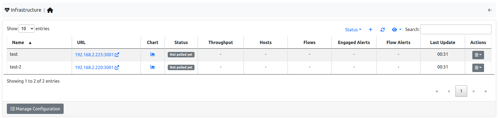

.. _InfrastructureMonitoring:

Infrastructure Monitoring
=========================

ntopng (Enterprise) has the capability to monitor other ntopng instances, being them in the same local LAN or physically/geographically distributed. This capability, also referred to as *infrastructure monitoring*, provides live visibility of ntopng instances' status, as well as of the network interconnecting them.

Using this capability it is possible to obtain full visibility of an infrastucture with multiple running instances, having multiple ntopng instances continuously monitoring each other as if they were a mesh.

For example, the following image shows the monitoring of an infrastructure with three instances, in Milan, Rome and Paris, respectively.

.. figure:: ../img/infrastructure_mesh.png
  :align: center
  :alt: Infrastructure Monitoring

  Infrastructure Monitoring

To view the health and status of other ntopng instances, jump to `System -> Monitoring -> Infrastructure`. In this page is possible to check the currently monitored instractures and add new ntopng instances to monitor.

  Infrastructure Monitoring

When monitoring an other ntopng instace, ntopng shows users various info about the remote instance:

- Status: Represents the status of the remote instance (Up or Down)-
- Throughput: Represents the throughput of the remote instance.
- Hosts: Represents the number of Hosts currently active on the remote instance.
- Flows: Represents the number of Flows currently active on the remote instance.
- Enaged Alerts: Represents the number of currently enganged alerts on the remote instance.
- Flow Alerts: Represents the number of flow alerts currently on the remote instance.

It's possible to monitor an ntopng by clicking the `+` symbol above the table.

.. note::

  users need the User Authentication Token of the remote ntopng to monitor the remote instance, check `here <https://www.ntop.org/guides/ntopng/advanced_features/authentication.html?highlight=token#token-based-authentication>`_.

This `blog post <https://www.ntop.org/ntopng/infrastructure-monitoring-observing-the-health-and-status-of-multiple-ntopng-instances//>`_ describes in detail this capability.
