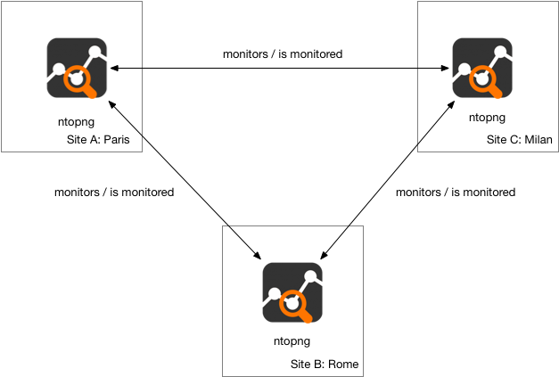

.. _InfrastructureMonitoring:

Infrastructure Monitoring
=========================

ntopng (Enterprise) has the capability to monitor other ntopng instances, being them in the same local LAN or physically/geographically distributed. This capability, also referred to as *infrastructure monitoring*, provides live visibility of ntopng instances' status, as well as of the network interconnecting them.

Using this capability it is possible to obtain full visibility of an infrastucture with multiple running instances, having multiple ntopng instances continuously monitoring each other as if they were a mesh.

For example, the following image shows the monitoring of an infrastructure with three instances, in Milan, Rome and Paris, respectively.

  Infrastructure Monitoring

This `blog post <https://www.ntop.org/ntopng/infrastructure-monitoring-observing-the-health-and-status-of-multiple-ntopng-instances//>`_ describes in detail this capability.
