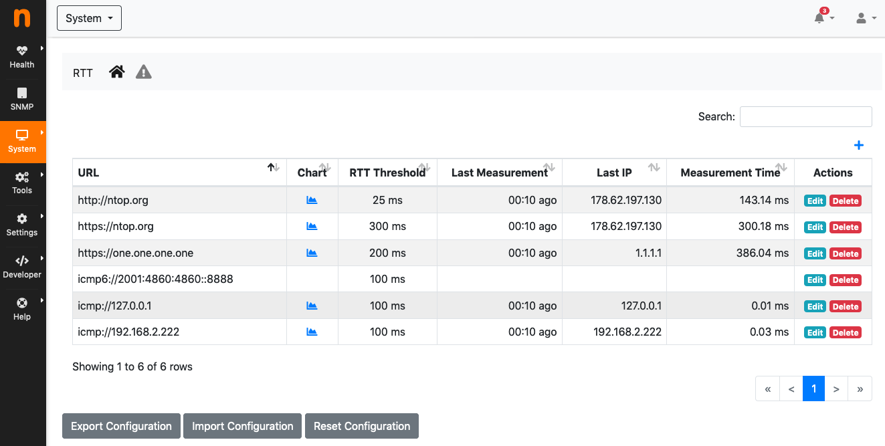
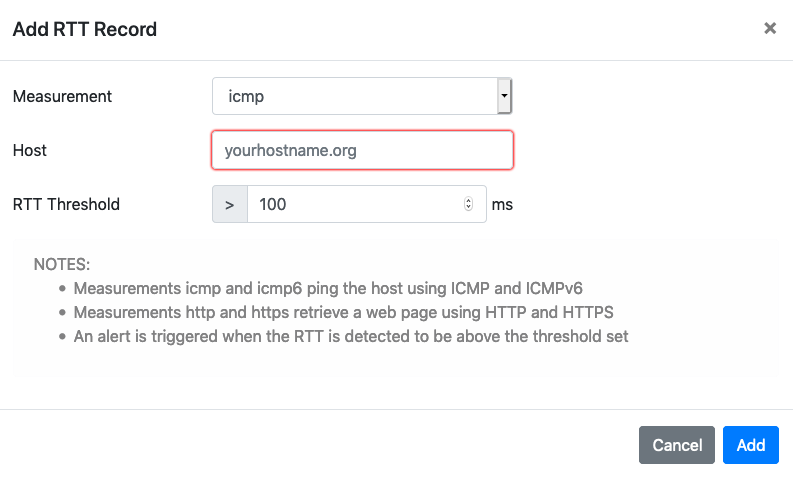
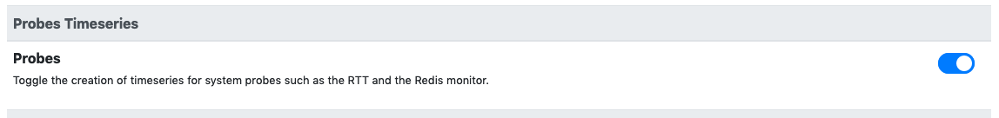

.. _RTT Monitor:

RTT Monitor
===========

The Round Trip Time (RTT) Monitor is available under the :ref:`BasicConceptSystemInterface`. The RTT monitor probes configured hosts on a minute-by-minute basis to check:

- IP reachability.
- Functionality of certain services.

Checks account for the RTT, that is, the time it takes to reach a certain host and receive a response from it. The following probes can be used to measure the RTT:

- ICMP and ICMPv6: to check host IP reachability.
- HTTP and HTTPS: to check functionalities of possible host web servers.

All the RTT-monitored hosts are shown in a table.

  The RTT Monitor Table

The table has the following columns:

- :code:`URL`: The full URL of the monitored host. The URL is the concatenation of the host name or IP address with a prefix which indicates the type of probe, namely one of :code:`icmp`, :code:`icmpv6`, :code:`http` or :code:`https`.
- :code:`chart`: A link to the RTT chart, present when :ref:`RTT Timeseries` are enabled.
- :code:`RTT Threshold`: A threshold, expressed in milliseconds, used to trigger :ref:`RTT Alerts`.
- :code:`Last Measurement`: The time of the last measurement performed.
- :code:`Last IP`: The latest IP address resolved for the host name indicated in the URL.
- :code:`Measurement Time`: The value, in milliseconds, of the latest measured RTT.
- :code:`Actions`: Buttons to delete or edit the configured host.

Hosts can be added to the RTT monitor using the :code:`plus` sign in the top-right corner of the table.

  The RTT Add Record Pane

Three fields need to be input when adding a host:

- :code:`measurement`: The type of probe.
- :code:`host`: The host name or the IP address of the host which needs to be monitored
- :code:`rtt threshold`: A threshold, expressed in milliseconds, used to trigger :ref:`RTT Alerts`.

.. _RTT Alerts:

RTT Alerts
----------

Alerts are triggered when the measured RTT is above the configured threshold, or when the host is unreachable. Configuring a threshold is contextual to the addition of an host among those monitored. Alerts are shown under the triangle entry of the RTT menu bar.

.. figure:: ../img/rtt_monitor_alerts.png
  :align: center
  :alt: The RTT Alerts

  The RTT Alerts

Alerts can either be engaged, for currently ongoing issues, or past, for issues occurred in the past.

.. _RTT Timeseries:

RTT Timeseries
--------------

RTT timeseries are written automatically by default for any of the RTT-monitored hosts.

.. figure:: ../img/rtt_monitor_timeseries.png
  :align: center
  :alt: The RTT Timeseries of a Monitored Host

  The RTT Timeseries of a Monitored Host

Timeseries can be disabled from the :ref:`ntopngPreferences`, tab *Timeseries->System Probes*.

  The RTT Timeseries Configuration

In case of HTTP monitoring, the "HTTP Stats" timeseries show more insights on the HTTP traffic:

- Name Lookup: time spent resolving the host name
- App Connect: time spent in the SSL handshake
- Other: remaining time for the HTTP request and response
