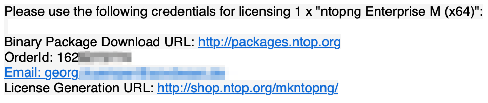
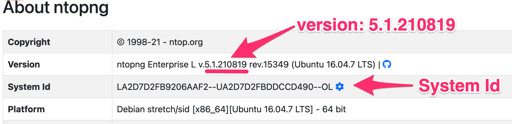
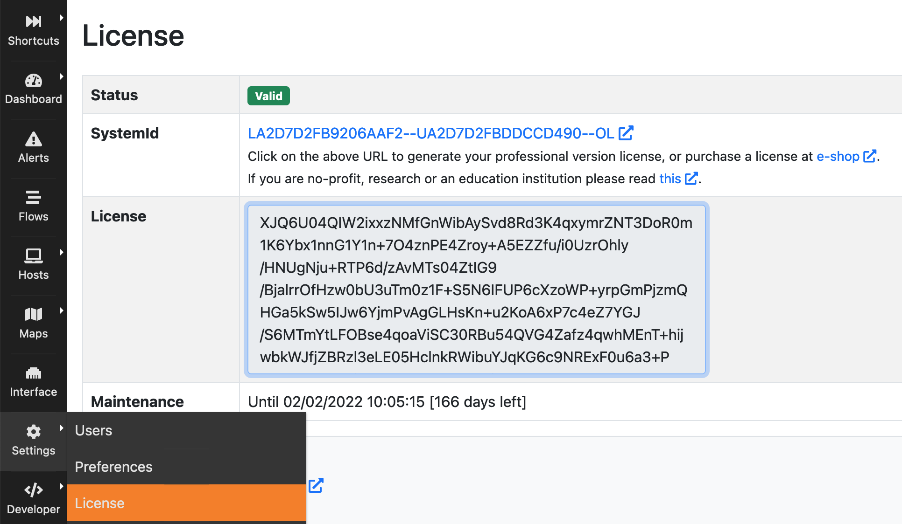
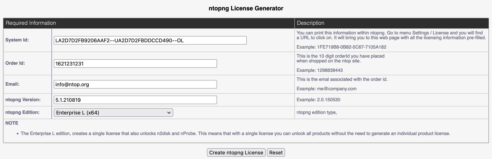
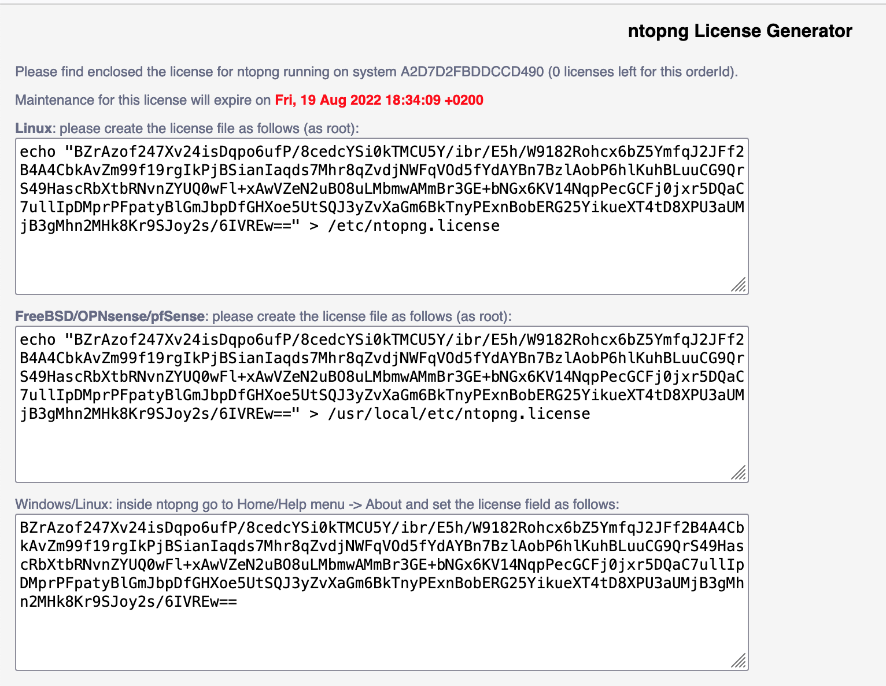

Adding a License
################

ntopng is available in multiple versions (see :ref:`AvailableVersions`). Some versions require a license key. This section describes how to obtain and add a license key to ntopng.

.. _PurchasingALicense:

Purchasing a License
====================

The first step is to purchase a license. Licenses can be purchased online at https://shop.ntop.org. For bulk purchases, reseller discounts, or any other special requirement related to the purchase of licenses you can `contact ntop <https://www.ntop.org/support/need-help-2/contact-us/>`_ directly.

The Order Id
------------

Once the purchase has been completed successfully, you will receive an `Order Id`.

  The Order Id

The `Order Id` is a numeric identifier associated to the purchase. Along with the `Order Id` you'll also find the `email` indicated during the purchase procedure. Both `Order Id` and the `email` are necessary to generate the license key.

Generating the License Key
==========================

License keys are generated at https://shop.ntop.org/mkntopng/. To generate the license key, you need:

- The `Order Id` received after the purchase and the `email` indicated during the purchase procedure (see :ref:`PurchasingALicense`).
- The `System Id`, that is, an identifier associated to the host running ntopng
- The ntopng `version`, that is, a string representing the version of the installed ntopng (e.g., `5.1.210819`).

Section :ref:`PurchasingALicense` describes how to obtain the `Order Id` and the associated `email`. Here it is shown how to get the `System Id` and the `version`.

Obtaining The `System Id` And The `version`
------------------------------------------

.. note::
  The `System Id` and the `version` can only be obtained after ntopng has been installed successfully. If you have not yet installed it, follow the installation procedure indicated at https://packages.ntop.org/ before moving forward with the license key generation.

The `System Id` and the `version` can be always obtained from the ntopng UI, page `"Help -> About"`

  `System Id` and `version` from the UI

On Linux, FreeBSD and other unix-based systems, the `System Id` and the `version` can also be obtained from the command line simply with an :code:`ntopng --version`

.. code:: bash

   $ ntopng --version
   Version: 5.1.210819 [Enterprise/Professional build]
   GIT rev: dev:065742705143bd1af06cf99fb2f35505ee349bb3:20210819
   Pro rev: r4187
   Built on:   Ubuntu 16.04.7 LTS
   System Id:  LA2D7D2FB9206AAF2--UA2D7D2FBDDCCD490--OL
   Platform:   x86_64
   Edition: Enterprise L (Bundle)
   License Type:  Time-Limited [Empty license file]
   Validity:   Until Thu Aug 19 18:23:03 2021

On Windows, `System Id` and the `version` can be printed from the command interpreter with a :code:`ntopng.exe /c --version` inside the ntopng installation directory :code:`C:\Program Files\ntopng`.

Generating The Key
------------------

To generate the license visit https://shop.ntop.org/mkntopng/ and fill the form using all the information indicated above.

.. warning::
   You must also pick the right version from the dropdown `ntopng Edition:`. Make sure this version matches with the version you've purchased or the license generation will fail.

Installing The Key
------------------

Upon successful generation, the license key will be printed in the browser. At this point you have two options:

You can copy the license key in a plain text file :code:`/etc/ntopng.license`, e.g., 

.. code:: bash

   # echo "XJQ6U04QIW2ixxzNMfGnWibAySvd8Rd3K4qxymrZNT3DoR0m1K6Ybx1nnG1Y1n+7O4znPE4Zroy+A5EZZfu/i0UzrOhly/HNUgNju+RTP6d/zAvMTs04ZtIG9/BjalrrOfHzw0bU3uTm0z1F+S5N6IFUP6cXzoWP+yrpGmPjzmQHGa5kSw5IJw6YjmPvAgGLHsKn+u2KoA6xP7c4eZ7YGJ/S6MTmYtLFOBse4qoaViSC30RBu54QVG4Zafz4qwhMEnT+hijwbkWJfjZBRzl3eLE05HclnkRWibuYJqKG6c9NRExF0u6a3+P/+ouB7PcczDf8G4O22MWgr2cTNjsmRA==" > /etc/ntopng.license

Alternatively, you can paste the license key straight into the ntopng UI, page `"Settings -> License"`

  Installing the ntopng License Key

It is recommended to place the license key in the plain text file.

.. note::

   A restart of ntopng is required after license installation to make sure all the licensed features will be properly unlocked.

Example
=======

Let's say that we've purchased an ntopng Enterprise L license for:

.. code:: bash

   $ ntopng --version
   Version: 5.1.210819 [Enterprise/Professional build]
   [...]
   System Id:  LA2D7D2FB9206AAF2--UA2D7D2FBDDCCD490--OL

The `Order Id` received after the purchase is 1621231231 and the email indicated during the purchase procedure is info@ntop.org.

The form at https://shop.ntop.org/mkntopng/ will be filled as follow

  License Generation Example

Upon successful generation, the license key will be printed in the browser:

  The Obtained License Key

At this point the license can be installed as described above or simply by following the instructions indicated in the resulting page.

