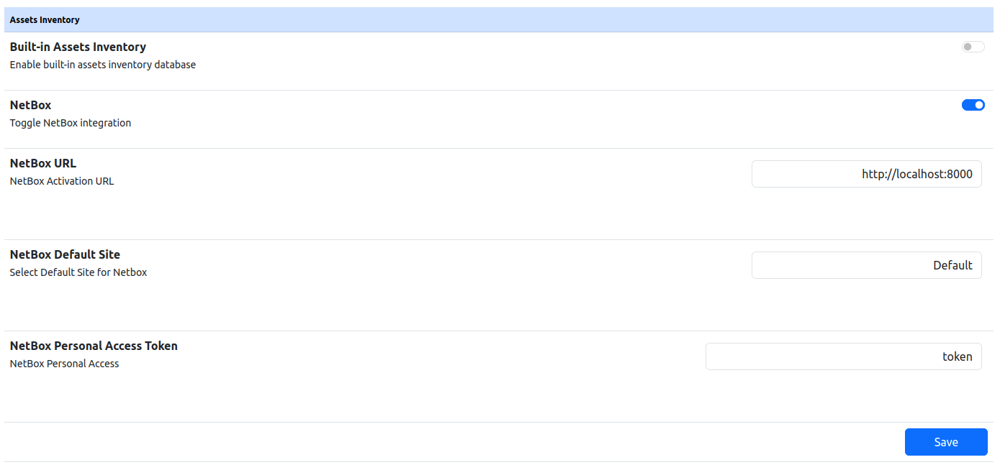

Asset Inventory
===============

NetBox
######

`NetBox <https://netboxlabs.com>`_ is an open-source IP address management (IPAM) and data center infrastructure management (DCIM) tool. 
It is designed to help manage and document networks, including IP addresses, devices, racks, and connections.

For the installation, follow the `Official documentation <https://netboxlabs.com/docs/netbox/en/stable/installation/>`_.
The bare minimum to make it work are the firts three sections:

- `PostgressSQL <https://netboxlabs.com/docs/netbox/en/stable/installation/1-postgresql/>`_

- `Redis <https://netboxlabs.com/docs/netbox/en/stable/installation/2-redis/>`_

- `Netbox <https://netboxlabs.com/docs/netbox/en/stable/installation/3-netbox/>`_.

ntopng can be configured to send information collected from network regarding
active hosts to NetBox.

Enabling NetBox
---------------

The use of NetBox can be enabled in the ntopng settings as shown in the figure below.
To configure the integration correctly, the following information is required: 

  - NetBox Activation URL: The URL of the running NetBox instance, for example, 
    `http://netbox.example.com`. This is specified during installation, within
    :code:`netbox/netbox/netbox/configuration.py` in the :code:`ALLOWED_HOSTS` parameter.

  - NetBox Default Site: The physical location, genrally a building, where the 
    devices to be inserted are located.

  - NetBox Personal Access Token: The personal access token generated inside NetBox.
    This token allows ntopng to authenticate with NetBox to perform API operations

  ntopng NetBox Enable

Using Netbox: What to expect
----------------------------

Once the integration is configured, ntopng will be able to send information about network 
devices directly to NetBox. This ensures that the NetBox database is kept up to date with the 
data collected by ntopng, improving the visibility and management of the network infrastructure.

In particular, when ntopng detect a new device, either through a mac address or through an ipv4 or ipv6 
address, this will be added via a POST request to NetBox, in case not present in the database yet. 
The information saved directly into netbox includes the `MAC` address of the device, as well as the associated 
`IP addresses`. The `manufacturer`, if ntopng detect one associated with his MAC address, and a `role`. 
The last one is based on the ntopng device types and allows tou to distinguish, for example, a laptop from a switch.

For the device `name`, ntopng will try to extract a name from the associated address. If it doen't succeed, 
the MAC address or the Ipv4/IPv6 address is used, depending on how the device was identified.

In addition to basic information, in every device can be found some custom fields. These include, for example,
the first and last time that device wa seen. It is possible to see also the switch the device is connected to
in case it is found using SNMP.
Custom fields provide additional context and details about each device, enhancing the inventory and 
management capabilities provided by NetBox.

Troubleshooting
---------------

When NetBox is used for the first time, it is a good practice to have it completelly empty. This will avoid
possible conflicts between  devices entered manually and devices discovered via ntopng.

If NetBox initialization failed at the startup, 

1. Verify that the personal access token is correct and has not expired.

2. Verify that ntopng can reach NetBox instance over the network.
