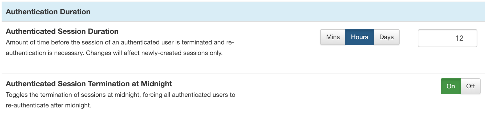
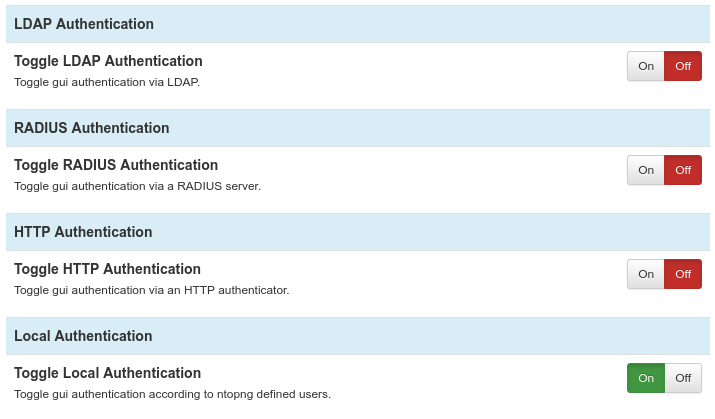
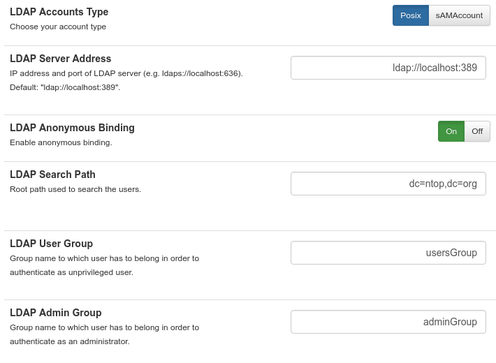
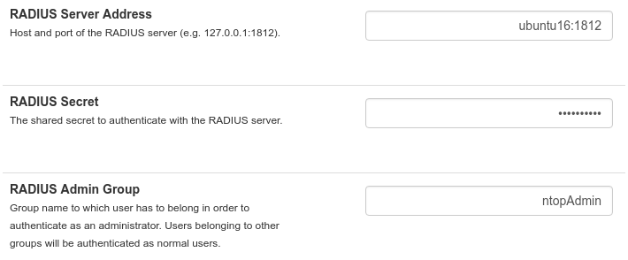
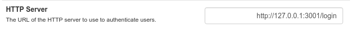

User Authentication
===================

Only authenticated users can access the ntopng web GUI. After a
successful authentication, ntopng creates an authenticated session and
send it to the web user inside an HTTP cookie. From that point on, the
web user will be able to transmit the received session back to ntopng
inside another HTTP cookie along with every request made. ntopng, upon
seeing the session, will recognize the user and consider he/she as
authenticated.

Session handling is generally done automatically by the web browser of
the user. This means that cookie handling and session transmission
will be transparent to the web user and handled behind the scenes.

Authenticated sessions have a duration. After an amount of time equal
to the session duration, the session is terminated and ntopng will no
longer recognize it, requiring the web user to re-authenticate again.

The session duration is configurable as shown in the following picture
and can go from 1 minute up to 7 days. The shorter the session
duration, the more secure the ntopng accesses are. Indeed, a
compromised session could be used by an attacker for the whole
duration time. It is up to the administrator to choose a duration that
can guarantee enough security, depending on the environment of the
operations. The administrator can also decide to terminate all
the active sessions at midnight, simply by toggling the preference
shown in the figure. This will force all the web users to
re-authenticate again, regardless of their residual session duration.

  ntopng Authentication Duration

ntopng supports multiple methods to authenticate users into the ntopng gui. Individual methods
can be enabled from the ntopng "User Authentication" preferences.

  ntopng Authentication Methods

It is possible to enabled more than one method at once. In this case, when a user
tries to authenticate, the enabled authentication methods will be tried in the same
top-down order as they are listed in the preferences. If at least one of the authentication
methods succeds, then the user is allowed to access the web gui.

Local Authentication
####################

This is the authentication method enabled by default when ntopng is installed.
It will use the users credentials configured_ via the ntopng gui to authenticate new users.

.. _`configured`: ../web_gui/settings.html#manage-users

LDAP Authentication
###################

An LDAP server can be used to authenticate users.

  LDAP Autentication Settings

Here is an overview of the different parameters:

  - LDAP Accounts Type: can be used to choose for the Posix based accounts or the
    sAMAccount accounts.

  - LDAP Server Address: the address of the LDAP server. Ports 389 and 636 are the
    default ports for ldap and ldaps, respectively.

  - LDAP Anonymous Binding: based on the LDAP server configuration, performing
    an LDAP binding request (needed to communicate with the LDAP server) may or
    may not require authentication. If anonymous binding is disabled, then explicit
    credentials must be supplied.

  - LDAP Search Path: this indicates the root path where users and groups information
    are located and is used by ntopng during the login.

  - LDAP User Group: the value for the "memberOf" user attribute used to identify
    normal users (without privileges). See the readme at the end of this section
    for more information.

  - LDAP Admin Group: the value for the "memberOf" user attribute used to identify
    admin users (with privileges). See the readme at the end of this section
    for more information.

On a Linux client, it is possible to test the connection to the LDAP server with the following commands.

If anonymous binding is enabled:

.. code:: bash

  ldapsearch -x -h ldap_server_ip -b 'dc=mydomain,dc=org' -s sub "(objectclass=*)"

otherwise:

.. code:: bash

  ldapsearch -h ldap_server_ip -D 'cn=binding_user,dc=mydomain,dc=org' -w binding_password -b"dc=mydomain,dc=org" -s sub "(objectclass=*)"

The parameters above should be modified according to the actual configuration in use.
It is important to configure the LDAP server properly in order to correctly expose the necessary
group metadata to ntopng, otherwise authentication will not work properly. The following
link contains recommendations to be applied to an OpenLDAP server for ntopng communication:
https://github.com/ntop/ntopng/blob/dev/doc/README.LDAP.

A detailed blog post that discusses LDAP authentication and shows how
to configure an LDAP server can be found at:
https://www.ntop.org/ntopng/remote-ntopng-authentication-with-radius-and-ldap/

RADIUS Authentication
#####################

  RADIUS Autentication Settings

These are the required options to setup the connection with a RADIUS authenticator:

- RADIUS Server Address: the address (IP/hostname) and port of a radius server.
  The default RADIUS port is 1812.

- RADIUS Secret: the secret to authenticate with the server.

- RADIUS Admin Group: the name of the admin group to be returned by radius as
  the value of the `Filter-Id`_ attribute to be used to identify admin users. All
  the other users are considered unprivileged by default.

.. _`Filter-Id`: https://tools.ietf.org/html/rfc2865#section-5.11

On a Linux system, RADIUS authentication can be tested with the following command:

.. code:: bash

  radtest testuser Password123 127.0.0.1 0 testing123

where:

  - `testuser` is the username to authenticate
  - `Password123` is the user password
  - `127.0.0.1` is the RADIUS server address
  - `testing123` is the RADIUS secret

Upon a successfully authentication, the command above should return the following output:

.. code:: bash

  rad_recv: Access-Accept packet from host 127.0.0.1 port 1812, id=4, length=20

The following link provides more information on the RADIUS setup for ntopng:
https://github.com/ntop/ntopng/blob/dev/doc/README.RADIUS.

A detailed blog post that discusses RADIUS authentication in ntopng,
and shows how to set up a RADIUS server can be found at:
https://www.ntop.org/ntopng/remote-ntopng-authentication-with-radius-and-ldap/

HTTP Authentication
###################

Ntopng also supports authentication via HTTP POST requests. In this case,
and JSON data

  HTTP Autentication Settings

The only needed parameter is HTTP Server URL. Here is a description of the API:

  1. when a user tries to authenticate, ntopng will send a POST request to the above URL
     with JSON data with two fields: `user`, the username to authenticate, `password` its password

  2. the authenticator will respond with the HTTP code `200` if the authentication is successfully,
     otherwise another (unspecified) code is returned.

  3. in case `200` is returned, JSON data will be sent back to the ntopng server. If this
     data contains a `admin` = True pair, then the given user is authenticated as admin. Otherwise,
     it is authenticated as a normal unprivileged user.

On a Linux system, it's possible to test an HTTP authenticator implementation with the curl command:

.. code:: bash

  curl --header "Content-Type: application/json" --request POST --data '{"user":"test-user","password":"test-password"}' -v http://localhost:3001

This will try to authenticate a user called `test-user` with a password `test-password` on a local http authenticator
running on port 3001.

The following link provides some information on how to setup a simple HTTP authenticator to
work with ntopng: https://github.com/ntop/ntopng/blob/dev/doc/README.HTTP_AUTHENTICATOR .

Unable to Login
###############

Instructions on how to recover after being locked out of the ntopng gui can be found
in the `FAQ page`_.

.. _`FAQ page`: ../faq.html#cannot-login-into-the-gui
