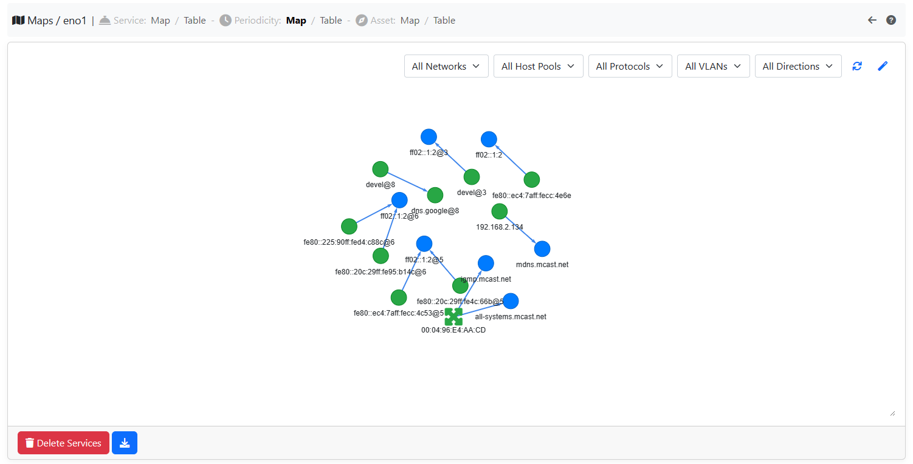
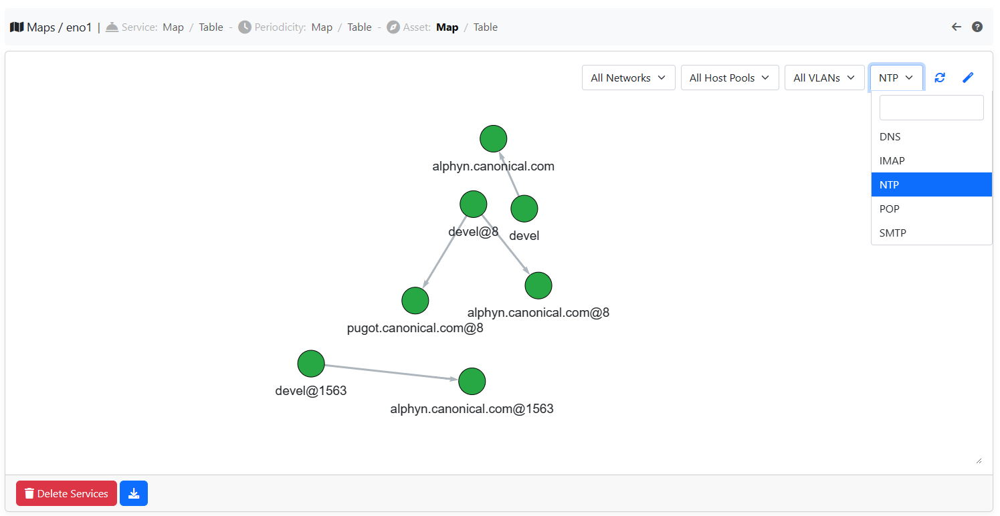

.. _Behavior Analysis:

Behavior Analysis
=================

ntopng has the ability to monitor periodic flows and services inside a network.
The Service Map is a map containing all the services inside a Local Network.

.. figure:: ../img/advanced_features_service_map_graph.png
  :align: center
  :alt: Service Map

  Service Map

Both of them have a graph and a table view. Regarding the Service Map, it is possible to set a learning period (changeable by preferences) and decide the default status (Allowed, Unknown or Denied) for the flows that show up before and after the learning period ended. 

.. figure:: ../img/advanced_features_service_map_table.png
  :align: center
  :alt: Service Map

  The Service Map table view 

If the `Lateral Movement` alert is enabled and the status of a service is Denied, when a new flow belonging to that service shows up, then an alert is going to be triggered.

The Periodicity Map, instead, contains the periodic flows inside a Network, their frequency, number of contacts, ...

  The Periodicity Map

Lastly the Asset Map is used to monitor the asset of a network (NTP, IMAP, POP, SMTP, DNS servers) and to understand who is contactacting them. 

  The Asset Map