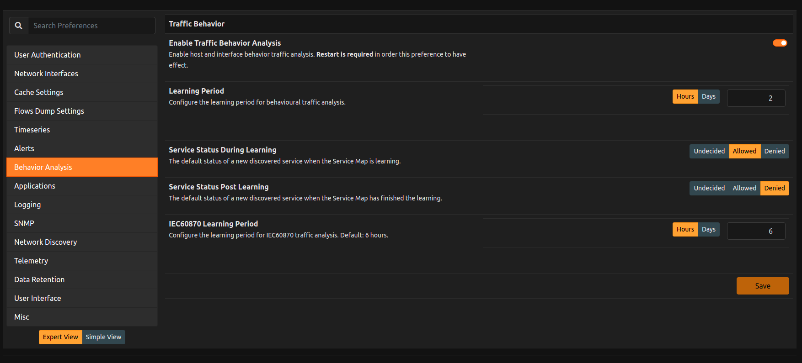
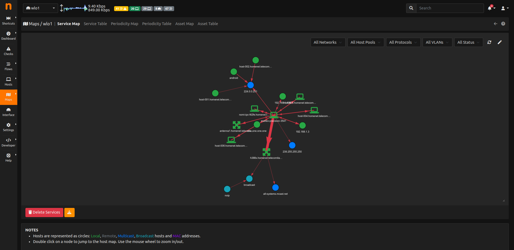
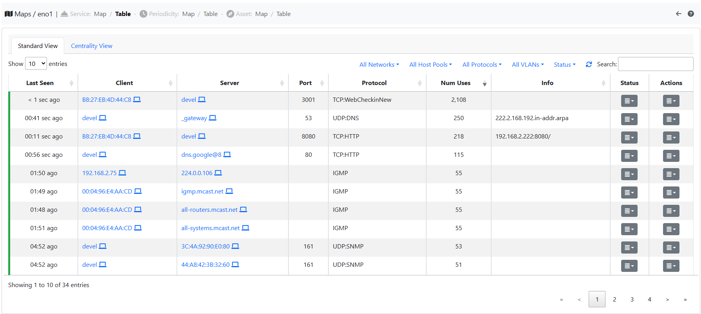

.. _Behavior Analysis:

Behavior Analysis
=================

ntopng has the ability to monitor periodic flows and services inside a network.
To achive this, first enable the Behavior Analysis from the preferences available into the Expert View.

.. note::   
  Behavior Analysis is available only with ntopng Enterprise L license.

  The Behavior Analysis preferences

By enabling this preference and restarting ntopng, two new maps are going to be available: the Service Map and the Periodicity Map.
The Service Map is a map containing all the services inside a Local Network, instead the Periodicity Map contains the periodic flows inside a Network.

  The Device Protocols Configuration Page

Both of them have a graph and a table view. Regarding the Service Map, it is possible to set a learning period and decide the default status (Allowed, Unknown or Denied) for the flows that show up before and after the learning period ended. 

  The Service Map table view 

If the `Lateral Movement` alert is enabled and the status of a service is Denied, when a new flow belonging to that service shows up, then an alert is going to be triggered.
