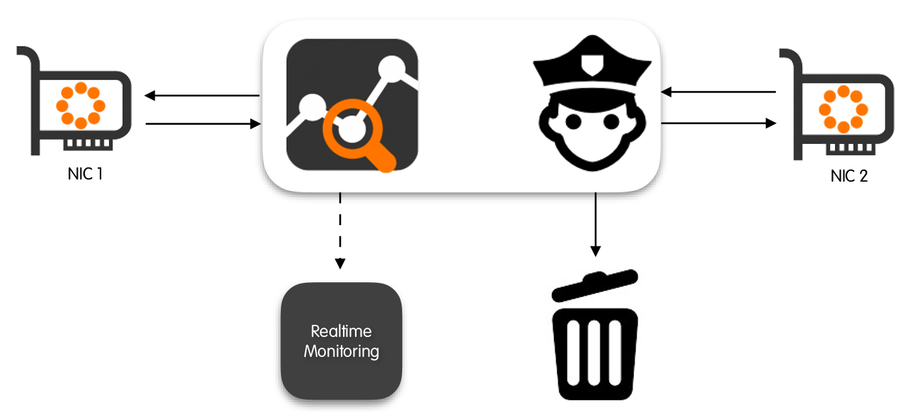
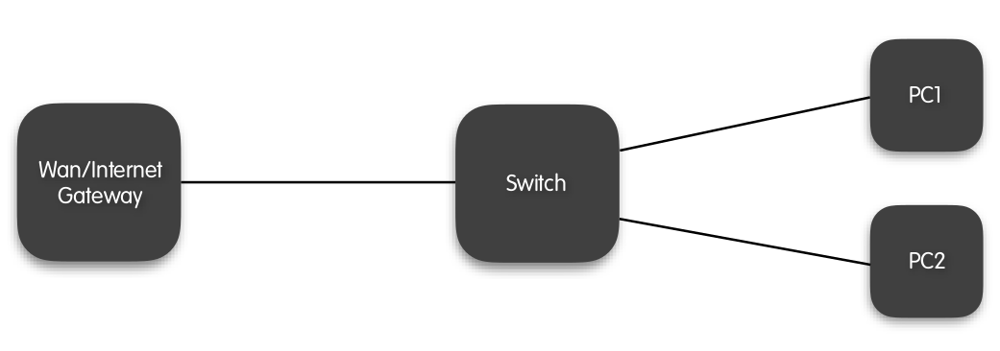
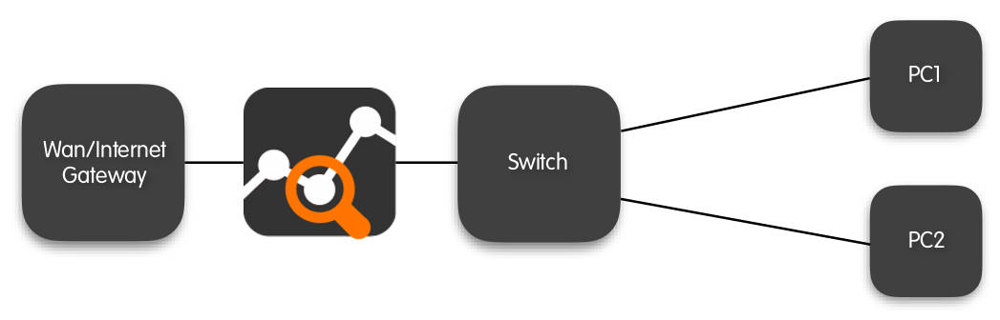
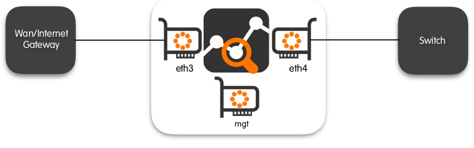
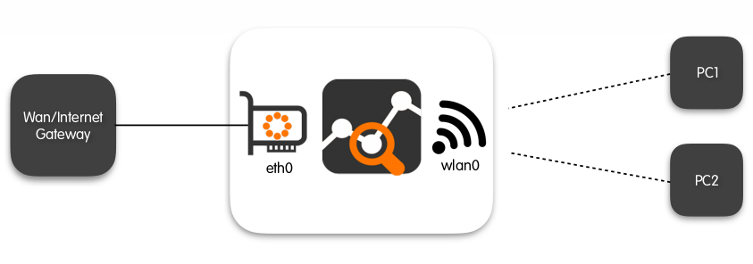
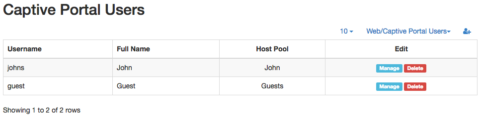
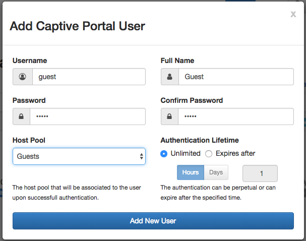
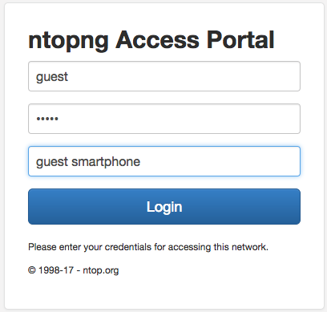

Bridging and Traffic Policing
#############################

The Professional version of ntopng can operate as an active traffic monitor. In this mode, ntopng is not
only able to see what is flowing in the network, it is also able to shape and apply filtering policies to traffic
flows. Policies can be applied to limit the bandwidth of logical groups of hosts named Host Pools. The
bandwidth is limited by means of rules that can be defined for every Layer 7 Application protocol (e.g.,
block WhatsApp and YouTube) as well as for every Layer 7 Application category (e.g., limit Peer-2-Peer to 1
Mbps maximum).

Host pools are described in detail in the “Hosts” section of this document. In the remainder of this section it
is discussed how to properly use ntopng in bridge mode, and how to set policies and apply them to host
pools.

When used inline ntopng becomes totally transparent. For this reason there is no need to set particular IP
addresses or change any other network setup such as the DNS address or the gateway IP. In this mode,
ntopng bridges the traffic of two network interfaces.

Let’s assume the network layout is the following:

In order to policy the traffic ntopng must be placed between the Wan/Internet gateway and the Switch as
depicted below.

Specifically, there are two possible setups for the use of ntopng inline when operating in the configuration
described above, namely:

- 1+1 where a NIC is used to reach the ntopng host and 1 NIC is used to reach the Internet.
- 2+1 where two NICs are used to connect the Switch to the internet gateway and a third NIC is used for
  the management of the ntopng host.

2+1 Bridging Mode
-----------------

In this setup one management NIC is used to access the ntopng host, and two additional interfaces are
use for bridging traffic. In other words, three separate NICs are used, one to manage ntopng, and two to
create a Bump-In-The-Wire between the Switch and the Internet gateway.

Let’s assume that a bridge has to be created between the Switch and the Internet gateway using
interfaces `eth3` and `eth4`, and ntopng can be reached from a third management (`mgt`) interface that is
neither `eth3` nor `eth4`.

The proper way to start ntopng in this case is:

.. code:: bash

    ntopng -i bridge:eth3,eth4

1+1 Bridging Mode
-----------------

In this setup the management of the ntopng host is done through one of the interfaces that actually bridge
the traffic between the Internet gateway and the Switch. A third interface is not required in this setup.
However, some initial configuration is required before starting ntopng.

Specifically, one of the two interfaces must be associated to a Linux bridge (that should not be confused
with the bridge operated by ntopng).

Let’s assume that ntopng has to operate inline between interfaces eth0 and wlan0, so that eth0 is
connected towards a Switch or an Internet gateway, and clients connect to the network through interface
wlan0. this is the typical case of a Raspberry PI but, more in general, the configuration apply to any
device that has at most two interfaces available for bridging.

To properly operate in 1+1 mode, `eth0` must be added to a linux bridge before firing up ntopng. This is
accomplished by editing file `/etc/network/interfaces` as follows:

.. code:: bash

  # cat /etc/network/interfaces
  auto eth0
  iface eth0 inet manual
  up ifconfig eth0 up

  auto br0
    iface br0 inet dhcp
    bridge_ports eth0
    bridge stp off
    bridge_maxwait 0
    bridge_fd 0

  allow-hotplug wlan0
  iface wlan0 inet manual
    wpa-conf /etc/wpa_supplicant/wpa_supplicant.conf

Once the networking service has been restated and the configuration specified has taken effect, one can
start ntopng by specifying br0 as one of the interfaces:

.. code:: bash

    ntopng -i bridge:br0,wlan0

The Bridge Details Page
-----------------------

Upon successful startup, regardless of the chosen bridge mode, ntopng will show bridging status and
information in the bridged Interface Details page, reachable from the ‘Interfaces’ top toolbar menu.

Bridge information is given for each direction at the bottom of the page. An additional entry “Traffic
Policing” to configure the bridge policies will appear in the contextual interface menu.

.. figure:: ../img/advanced_features_bridging_interface.png
  :align: center
  :alt: Bridged Interface

  The Bridged Interface Page

Traffic Policing
----------------

Once ntopng operates inline, it is ready to enforce policies. As anticipated above, policies apply
independently to every defined Host Pool. A policy is a pair of rules that can be specified for single Layer 7
application protocols as well as for aggregated Layer 7 application protocol categories:

- The first rule controls the traffic that originates from the Host Pool.
- The second rule controls the traffic that is destined to the Host Pool.

A rule, that can also be referred to as a shaper, is just a rate that poses an upper bound to the volume of
traffic per second. Two default shapers exists and are immutable, namely:

- **No Limit**: that doesn’t cap the volume of traffic per second;
- **Drop All Traffic**: that doesn’t allow any volume of traffic to flow.

Custom shapers can be set from the “Bandwidth Manager” tab of the “Traffic Policing” Interface page. For
example, in the picture below there is a custom 2 Mbps shaper defined in addition to the “No Limit” and
“Drop All Traffic” shapers. The column “Applied To”, next to the “Max Rate” one, lists all the Host Pools that
are currently using each shaper. A shaper can be shared between multiple Host Pools. In that case, also
the cap will be enforced globally among all the pools that are sharing it. In the picture, the “No Limit”
shaper with Id 0 is shared between pools “Guests” and “Office”, and is also used by any other host that
has no host pool associated. The “Drop All Traffic” shaper is used only by pool “Guests” as well as the 2
Mbps shaper identified with id 2.

.. figure:: ../img/advanced_features_bridging_bandwidth_manager.png
  :align: center
  :alt: Bandwidth Manager

  The Traffic Policing “Bandwidth Manager” tab of the bridged Interface Details Page

Once the shapers are defined, they can be actually applied as policies to the Host Pools from the tab
“Manage Policies”. In the picture below, Host Pool “Guests” has policies defined for:

- A Layer 7 application protocol category “Media”;
- A Layer 7 application protocol category “SSH”.

.. figure:: ../img/advanced_features_bridging_manage_policies.png
  :align: center
  :alt: Manage Policies

  The Traffic Policing “Manage Policies” tab of the bridged Interface Details Page

Application category “Media” groups together 32 different application protocols (including YouTube and
many other common audio/video streaming protocols), whereas application protocol “SSH” only apply to
Secured Shell traffic.

“Media” category is subject to the “Drop All Traffic” shaper both for the traffic that is destined to hosts in the
pool and for the traffic that originates from the pool. In other words, no “Media” application protocol can
be done by the pool “Guests”. Similarly, “SSH” protocol is subject to the 2 Mbps shaper in both the
directions, i.e., from hosts the pool and to hosts in the pool. This means that there is an overall limit to
2Mbps for the SSH traffic of the pool.

When the traffic of the pool is neither “SSH” nor it falls in the “Media” category, then it is subject to the
“Default” policy, which has the “No Limit” shaper in both direction. Therefore, hosts in the pool “Guests” are
free to use the network without limit provided that they do application protocols that are not in the “Media”
category and are not “SSH”.

Captive Portal
--------------

When operating inline, ntopng can also provide a Captive Portal functionality. This feature, only available
in the Enterprise Version, is used to authenticate legitimate users and bind them to the correct Host Pool.
The authentication takes place directly on the users’ devices by means of a login page that is prompted
right after the user has joined the network.

To enable the Captive Portal, ntopng must be started in inline according to one of the two configurations
described above. In addition, an extra option -w port1,port2 must be used to tell ntopng to use
port1 and port2 to authenticate Captive Portal users and to administer ntopng, respectively. If both the
conditions are satisfied, ntopng will show an entry in the “Preferences page” that can be used to enable
the captive portal.

.. figure:: ../img/advanced_features_bridging_captive_portal_toggle.png
  :align: center
  :alt: Captive Portal Toggle

  The Traffic Bridging Captive Portal toggle in the Preferences Page

When the captive portal is enabled, traffic will be bridged only for “known” hosts, i.e, for hosts whose
users successfully authenticated to the portal using their Captive Portal credentials.

Captive Portal users and their credentials must be created by an ntopng administrator. Captive Portal
users are different from standard ntopng users as they are not meant to be used for accessing the ntopng
web interface but just for authenticating on the captive portal and using the network. The idea is to create
a Captive Portal user for a human, or create generic users such as guest or anonymous.

The creation of Captive Portal users is done using the “Manage Users” menu entry of the Settings menu.
An extra dropdown “Web/Captive portal users” appear on the right of the page and allows an ntopng
administrator to browse, manage, and create both Web and Captive Portal users. To create a Captive
Portal user, an ntopng administrator has to select the corresponding entry from the dropdown menu.

.. figure:: ../img/advanced_features_bridging_captive_portal_users_dropdown.png
  :align: center
  :alt: Captive Portal Users Dropdown

  The Captive Portal Users dropdown menu

This will bring the administrator to the list of currently defined Captive Portal Users.

  The Captive Portal Users list

The Captive Portal user creation form is accessible by clicking on the icon |add_user_icon|
and has the following fields:

- **Username**: the name that will be used during the Captive Portal login
- **Password and Confirm Password**: to authenticate, along with the username, to the Captive Portal
- **Full Name**: an optional string that can be associated to the current user to better identify it
- **Host Pool**: the host pool that will be automatically bound to any device that authenticates with the
  current user
- **Authentication Lifetime**: The amount of time a user can stay logged in before having to re-
  authenticate to the Captive Portal. Lifetime can be unlimited or can expire after a specified amount of
  time. Expiration is intended to be per-device, that is, if multiple logins occur from separate devices
  (think to multiple users that authenticate with the same “guest” account at different points in time), then
  each device will have its own expiration independently from the other.

Following is a picture that demonstrates how to create a “guest” Captive Portal user so that devices that
authenticate with “guest” will be automatically and perpetually associated to pool “Guests”.

  The Captive Portal User creation form

Once the Captive Portal is enabled and users are created, new devices that join the network will be
presented with a login screen so that users having valid credential will be able to authenticate and obtain
network access.

Authenticating to the captive portal is not used just to enable network access, but to bind assets to people.
For example if John owns a phone, a tablet and a laptop, if he authenticates to the Captive Portal using
his credentials, any device he is using will be automatically bound to John. The glue that makes possible
this binging is the Captive Portal user that is the same, as John is always the same person, regardless of
which device he is using. In this way it is possible to forget identifying computers and start thinking in
terms of humans.

  The Captive Portal Network Access Page

.. |add_user_icon| image:: ../img/add_user_icon.png

The list of active, successfully authenticated devices is available from the “Host Pools” entry of the “Hosts”
menu, as if they were normal, manually added pool members. The label specified in the network access
page will be shown as well.
