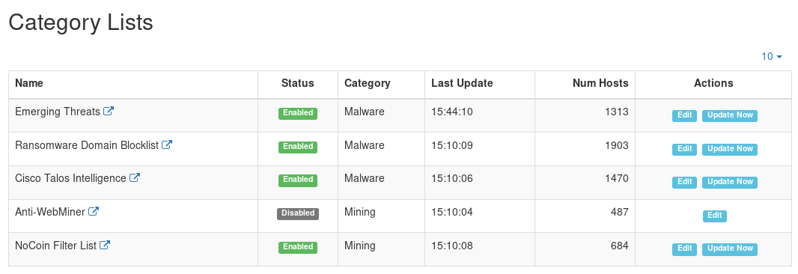
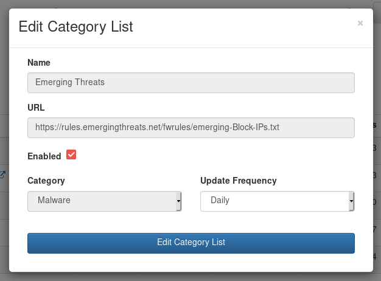

.. _Category Lists:

Category Lists / Blacklists
===========================

ntopng uses third party IP/domain lists to detect malicious hosts, the Category Lists.
Each list contains a list of hosts which are associated to a particular `protocol category`_.

Examples of Category Lists are the malware and mining hosts blacklists, which are used by
ntopng to detect malicious hosts and generate `alerts`_.

.. note::

  Check out the `Custom Category Hosts docs`_ for a way to assign custom hosts to the ntopng categories.

  The Category Lists Configuration Page

Right now only some built-in lists are supported by user defined lists could be added in the
future. Lists are updated periodically based on the configured *Update Frequency*.
By clicking on the *Update Now* button it's possible to force the list update.
The *Num Hosts* column indicates the number of hosts loaded from the specified list.
The *Status* column indicates the list current status:

- *Enabled*: the list is enabled and will be used by ntopng
- *Disabled*: the list is disabled and will be ignore by ntopng
- *Error*: there was an error while downloading the list. Check out the ntopng log for details.

By clicking on the *Edit* button it's possible to edit the list update frequency and
to disable the list.

  Customize Category List options

When a list is disabled, it will not be updated anymore.

.. _`protocol category`: ../web_gui/categories.html
.. _`Custom Category Hosts docs`: ../web_gui/categories.html#custom-category-hosts
.. _`alerts`: ../web_gui/alerts.html

Custom Blacklists
-----------------

In addition to the bundled list of categories, you can add your own custom category list.

Under `/usr/share/ntopng/httpdocs/misc/lists/builtin` you can find the blacklist files that come with ntopng. Below you can find an example of the expected syntax:

.. code:: bash
	  
   $:/usr/share/ntopng/httpdocs/misc/lists/builtin# cat abuse_ch.list
   {"name":"Abuse.ch URLhaus","format":"hosts","enabled":true,"update_interval":86400,"url":"https://urlhaus.abuse.ch/downloads/hostfile/","category":"malware"}

There are various formats supported (field "format" in the list configuration file) including:

  - ip: each line contains a numeric IPv4 address
  - hosts: each line contains a symbolic hostname

Please have a look at the configuration files that ship with ntopng to see an example.

In order not to mix custom configuration files with the built-in ones, ntopng expects them to be stored in `/usr/share/ntopng/httpdocs/misc/lists/custom`

If the file format is correct, ntopng will download lists at startup or periodically according to the specified configutation.
