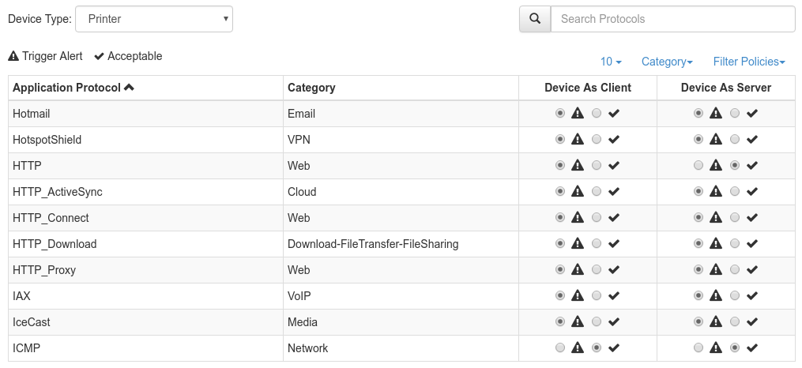

Device Applications
===================

ntopng implements different techniques to automatically identify the device type
of the devices connected to a network. This includes printers, IoT and phone devices.

For each device type, ntopng provides a configurable set of policies to determine
which applications are acceptable for the specific device type. When a non-acceptable
application is detected, ntopng generates an alert. ntopng provides some built-in policies which should suit most environments.
The `Device Application Not Allowed` flow check be enabled in order to generate alerts.

Policies can be reviewed and customized in the `Device Applications` page.

  The Device Protocols Configuration Page

Each policy is split into client and server configuration. For example, in the
picture above a *Printer* can act as an HTTP server but not as an HTTP client.

When alerting is not enough, nEdge can be used to `block the new devices protocols`_
according to the configured Device Protocols policies.

.. _`block the new devices protocols`: https://www.ntop.org/guides/nedge/policies.html#device-protocols-policies
