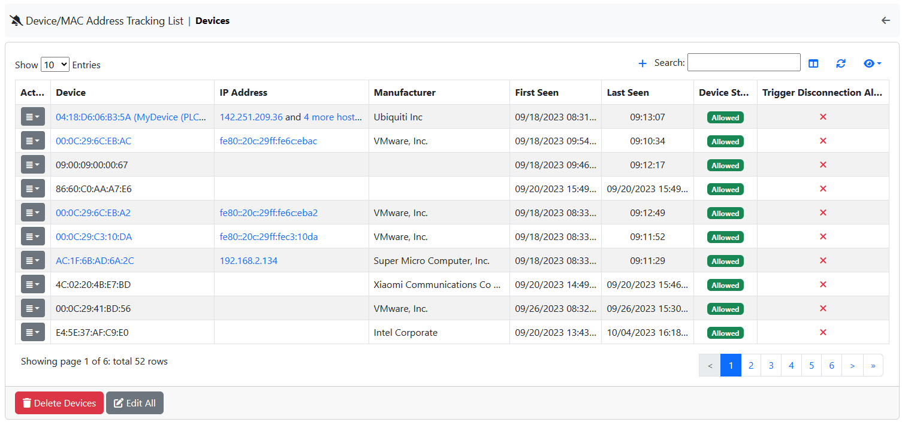
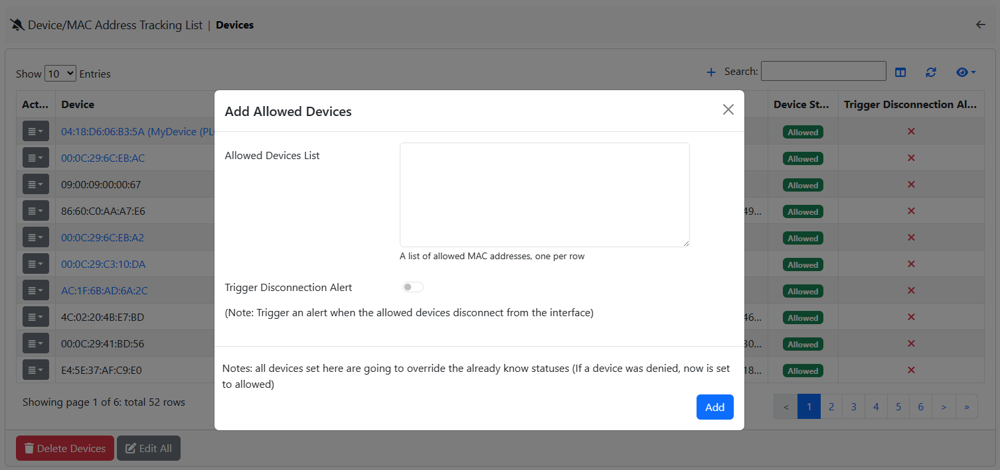

Device/MAC Address Tracking
===========================

ntopng is able to detect devices (identified with MAC addresses) that connect to a network. On closed networks, only certain devices can connect, and a whenever a MAC address other than those allowed explicitly is considered a threat. This in particular holds on networks such as a datacenterr or industrial IoT.

The `Unexpected Device Connected/Disconnected` alert (check `here <../alerts/interface_checks.html#unexpected-device-connected-disconnected>`_ for additional information) triggers and alert whenever an unknown MAC is detected.

.. note::

  This feature is available with at least Pro License.

As described below in this page, you can add a list of MAC addresses that are allowed on your network, and instruct ntopng to trigger alerts whenever:

  - An unknown MAC (i.e. a device) connects to the network
  - (Optionally) A MAC (i.e. a device) disconnects from the network

  Devices Exclusion

In this page, users can handle allowed and denied MAC addresses. Whenever a denied (or not accounted in the list) MAC address appears in the Interface, the corresponding alert is going to be triggered; instead it's going to not be triggered (or released) when an allowed MAC address is going to appear.

.. figure:: ../img/devices_exclusion_alert.png
  :align: center
  :alt: Devices Exclusion Alert

  Devices Exclusion Alert

Moreover, it is possible to configure the ability to trigger an alert when an allowed MAC address disappears from the Interface by editing the specific entry or when adding the MAC address, by enabling the `Trigger Disconnection Alert` option.

  Devices Exclusion Add Modal

Other then that, when adding a new allowed MAC address, it is possible to add a list of MAC addresses (one per row) and if an already seen MAC address is added, then, that device, is going to be set to allowed.

.. note::

  All newly added MAC addresses, using the modal, are going to be set automatically to allowed.

