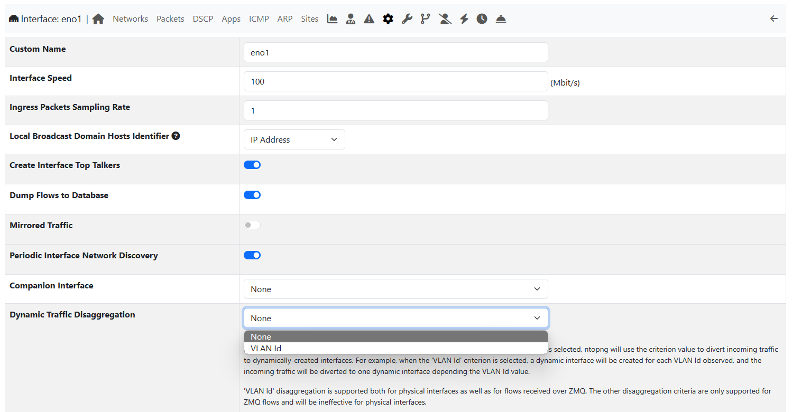
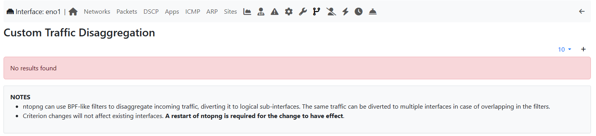
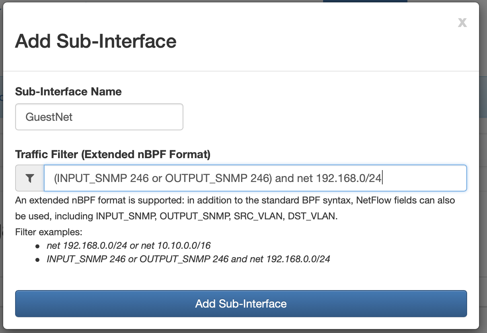

Interfaces Disaggregation
=========================

ntopng can split and visualize the traffic into virtual sub-interfaces based on a specified criterion.
This comes handy, for example, when a single nProbe instance is capturing flows from multiple
NetFlow/sFLow exporters. By default, ntopng would aggregate all the exporters traffic together
into one `tcp://...` interface, whereas by enabling the disaggregation by "Probe IP" ntopng
will also create as many virtual interfaces as the exporters, for example
`tcp://...192.168.0.1` and `tcp://...192.168.2.20`.

Dynamic Disaggregation
----------------------

Dynamic Interfaces Disaggregation can be enabled from the network interface configuration tab
as depicted in the picture below.

  Disaggregation Settings

Here is a summary of the available disaggregation criterion:

- `None`: do not disaggregate
- `VLAN Id`: create a virtual interface for each VLAN
- `Probe IP`: on ZMQ, create a virtual interface for each %EXPORTER_IPV4_ADDRESS
- `Interface`: on ZMQ, create a virtual interface for %INPUT_SNMP and another for %OUTPUT_SNMP.
  A single flow will be *duplicated* on two virtual interfaces.
- `Ingress Interface`: on ZMQ, create a virtual interface for each %INPUT_SNMP
- `VRF Id`: on ZMQ, create a virtual interface for each %INGRESS_VRFID

Most of them only work in ZMQ mode and require the relevant template field to be
added to the nprobe options as explained in the `nprobe section`_.

Custom Disaggregation
---------------------

In addition to the dynamic disaggregation, it is also possible to use custom BPF-like filters to 
disaggregate incoming traffic and divert it to logical sub-interfaces. This can be achieved by
disabling Dynamic Traffic Disaggregation (setting it to 'None') and creating new rules in the 
Custom Traffic Disaggregation tab. Alternatively you can use both disaggregation methods at the
same time, by selecting a Dynamic disaggregation criteria and configuring custom rules at the 
same time. Custom rules have higher priority: traffic matching custom rules will not be
processed by the dynamic disaggregation.

  Custom DIsaggregation Settings

An extended nBPF format is supported when defining sub-interfaces, in fact in addition to the 
standard BPF primitives, NetFlow fields can also be used, including INPUT_SNMP, OUTPUT_SNMP, 
SRC_VLAN, DST_VLAN.  
Note that in this case the same traffic can be diverted to multiple interfaces in case of 
overlapping filters.

  Custom Disaggregation Dialog

.. note::

   Changes will take effect only after a ntopng restart

.. _`nprobe section`: ../using_with_nprobe.html#exported-flow-fields
