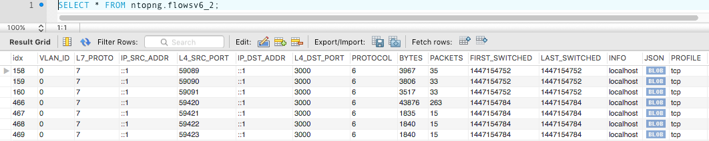

Flows Dump
##########

Ntopng can dump expired flow information either to a MySQL database or ElasticSearch. Ntopng is
instructed to dump expired flows to MySQL via the -F startup modifier.

MySQL
-----

To dump expired flows to MySQL ntopng requires the -F modifier followed by a string in the following
format:

.. code:: bash

    mysql;<host|socket>;<dbname>;<table name>;<user>;<pw>

The string has 6 semi-colon separated fields:

- mysql tells ntopng to dump flows to MySQL
- `<host|socket>` is the host (or the socket) of a running MySQL instance that will receive expired
  flows
- `<dbname>` specify the name of the MySQL database to use. If the database does not exist, ntopng
  will create it.
- `<table name>` specify the prefix of MySQL table names to use. Presently the prefix is always
  defaulted to flows.
- `<user>;<pw>` are the credential of a MySQL user that has privileges to create, select and update
  tables on `<dbname>`.

Ntopng creates two database tables. Tables are named flowsv4 and flowsv6 that are used to store
IPv4 and IPv6 flows, respectively.

  A MySQL Table with Dumped Flows

ElasticSearch
-------------

Elasticsearch is an Open-Source real-time search and analytics engine with a powerful RESTful API built on
top of Apache Lucene. Ntopng can connect to an external Elasticsearch cluster as client using the Bulk
insert API for JSON mapped indexing.

Elasticsearch is designed for quickly and dynamically analyzing or searching through large amounts of
data and thus is ideal for flows generated by ntopng, enabling users and integrators to create a virtually
infinite number and variety of statistics using Kibana.

To learn more about Elasticsearch visit: https://www.elastic.co/guide.

To dump expired flows to Elasticsearch ntopng requires the -F modifier followed by a string in the
following format:

.. code:: bash

  es;<idx type>;<idx name>;<es URL>;<http auth>

The string has 5 semi-colon separated fields

- `es` instructs ntopng to dump flows to Elasticsearch
- `<idx type>` “_type” to use in exported documents
- `<idx name>` index to use for exported documents [ accepts strftime() format ]
- `<es URL>` URL of Elasticsearch Bulk API [ ie: http://127.0.0.1:9200/bulk]
- `<http auth>` Basic HTTP Authentication [ username:password ]

Example:

.. code:: bash

  es;ntopng;ntopng-%Y.%m.%d;http://localhost:9200/_bulk;

Definitions:

Indexes are like ‘databases’ in a RDBMS terms. An index is a logical namespace which maps to one or
more primary shards and can have zero or more replica shards distributed across nodes of a cluster.
Index mapping defines the multiple supported types.

Mapping is required for Elasticsearch to correctly interpret all fields produced by ntopng, specifically those
containing IP and Geo Location data. This is achieved by using a mapping template for ntop types,
automatically inserted by the application at startup. Note this action requires full admin rights on the
cluster in order to be performed successfully.

Ntopng will create Indexes and Mapping automatically on startup with no action required.
Each time the index name changes, a new Index is created. By default, ntopng creates one daily index
(i.e.: ntopng-2015.11.21). Index types can be used to differentiate instances.

Data Rotation:

The official Curator tool from Elastic can be used to manage and rotate Indexes created by ntopng
according to the user preferences and requirements.

Logstash
--------

Logstash is an open source, server-side data processing pipeline that ingests data from a multitude of
sources simultaneously, transforms it, and then sends it to a downstream 'stash' such as ElasticSearch.
Ntopng can connect to a Logstash instance and send monitored flows to that instance.

To dump expired flows to Logstash ntopng requires the -F modifier followed by a string in the following
format:

.. code:: bash

  logstash;<host>;<proto>;<port>

The string has 4 semi-colon separated fields
- `logstash` instructs ntopng to dump flows to Logstash
- `<host>` contains the name or IP address of the host that is running Logstash
- `<proto>` specifies the protocol (e.g., tcp) to be used for the flow export
- `<port>` indicates the port on which the Logstash process is listening

Example:

.. code:: bash

  logstash;localhost;tcp;5510

An handy video-tutorial that shows how to send monitored flows to Logstash is available at
https://youtu.be/tluAUEeqkCk.
