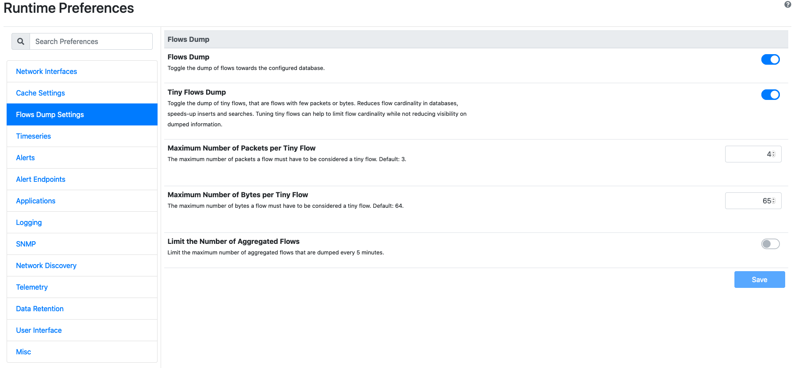
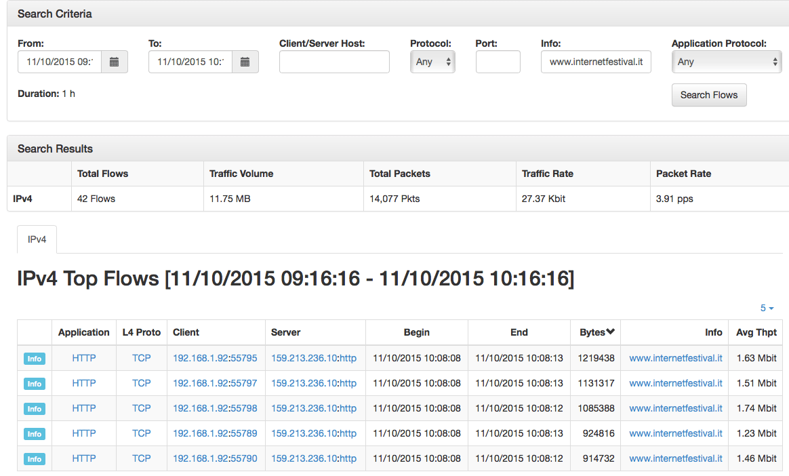
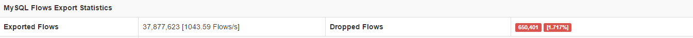

.. _Flows Dump:

Flows Dump
==========

Ntopng supports flows dump towards multiple downstream databases, namely MySQL, Elasticsearch, Logstash and nIndex. Flows dump is enabled using option :code:`-F`.

When flows dump is enabled, a new `Flow Dump Settings` tab appears in the preferences.

  Flows Dump Settings

`Flow Dump Settings` entries are:

- `Flows Dump`: to toggle the dump of flows during the execution of ntopng. Flows dump can be turned on or off using this toggle. Turning flows dump off may be useful when the destination downstream database is running out of space, for debug purposes, or when the user only wants alerts stored in :ref:`ElasticsearchAlerts`.
- `Tiny Flows Dump`: to toggle the dump of tiny flows. Tiny flows are small flows, that is, flows totaling less than a certain configurable number of packets or bytes. Excluding tiny flows from the dump is an effective strategy to reduce the number of dumped flows. This reduction is mostly effective when dumped flows are used to do analyses based on the volume. It is not recommended to use this option when dumped flows are used for security analyses.
- `Maximum Number of Packets per Tiny Flow`: is used to configure the maximum number of packets a flow must have to be considered tiny.
- `Maximum Number of Bytes per Tiny Flow`: is used to configure the maximum number of bytes a flow must have to be considered tiny.
- `Limit the Number of Aggregated Flows`: allows to cap the number of aggregated flows dumped periodically when using nIndex or MySQL. MySQL and nIndex aggregate flows at 5-minute intervals to make certain queries faster. Reducing the number of aggregated flows may be useful to reduce the total number of exports performed and thus, the number of aggregated flows in the database.
- `Maximum Number of Aggregated Flows Dumped Every 5 Minutes`: is used to specify the maximum number of aggregated flows dumped every 5-minutes.

These settings are effective for all databases. The reminder of this section describes the peculiarities of MySQL, Elasticsearch and Logstash, whereas nIndex flows dump is described in detail in :ref:`Historical Flows`.

MySQL
-----

In order to dump flows to MySQL ntopng requires the -F modifier followed by a string in the following format:

.. code:: bash

    mysql;<host|socket>;<dbname>;<table name>;<user>;<pw>

The string has 6 semi-colon separated fields:

- mysql tells ntopng to dump flows to MySQL
- `<host|socket>` is the host (or the socket) of a running MySQL instance that will receive expired
  flows
- `<dbname>` specify the name of the MySQL database to use. If the database does not exist, ntopng
  will create it.
- `<table name>` specify the prefix of MySQL table names to use. Presently the prefix is always
  defaulted to flows.
- `<user>;<pw>` are the credential of a MySQL user that has privileges to create, select and update
  tables on `<dbname>`.

Ntopng creates two database tables. Tables are named flowsv4 and flowsv6 that are used to store
IPv4 and IPv6 flows, respectively.

.. figure:: ../img/advanced_features_bridging_flows_dump_mysql.png
  :align: center
  :alt: MySQL flows dump

  A MySQL Table with Dumped Flows

.. note::

	MySQL flow explorer is non supported in community edition. We suggest you to use nIndex for high cardinality flow instances.

By enabling MySQL integration, it's also possible to inspect the past flows via
the ntopng Historical Explorer, which provides many filters and drillown capabilities.

  Historical Explorer

For a complete discussion on the explorer capabilities check out the following URLs:

- https://www.ntop.org/ntopng/exploring-historical-data-using-ntopng/
- https://www.ntop.org/ntopng/exploring-historical-data-using-ntopng-part-2/

.. warning::

   MySQL 5.7+ default authentication mechanism has changed. In case
   ntopng fails to authenticate, check out
   `this document
   <https://github.com/ntop/ntopng/blob/dev/doc/README.mysql.5.7%2B.md>`_.

MySQL Performance
-----------------

Tuning MySQL parameters is an essential task to avoid dropped flows. The dropped
flows percentage is shown into the Network Interface overview page.

  MySQL Export Statistics

Here are some tips to tune MySQL:

  - key_buffer_size: typically, this is set to 30-40% of the available RAM memory.
    Ideally, the sum of the sizes of all the .MYI files should be smaller than key_buffer_size
    but this is not always doable nor practical. Default size is just 8M so an increase would definitely be beneficial.

  - sort_buffer_size: this can have positive effects on the search queries rather
    than on the insertion. The status variable sort_message_passes is the only one
    that uses sort_buffer_size. You should check the sort_message_passes and if it is
    a large number then an increase in the sort_buffer_size will have a positive effect.

To improve performance, it's also important to set an appropriate retention time on data, because the more data
MySQL has, the more it slows down. This can be configured from the :ref:`Data Retention` setting.

The followings are the expected MySQL flow export rates with ntopng, assuming a fast disk and CPU are used:

  - ~2k flows/sec (ntopng community, professional)
  - ~10k flows/sec (ntopng enterprise)

.. _FlowDumpElasticsearch:

ElasticSearch
-------------

Elasticsearch is an Open-Source real-time search and analytics engine with a powerful RESTful API built on
top of Apache Lucene. Ntopng can connect to an external Elasticsearch cluster as client using the Bulk
insert API for JSON mapped indexing.

Elasticsearch is designed for quickly and dynamically analyzing or searching through large amounts of
data and thus is ideal for flows generated by ntopng, enabling users and integrators to create a virtually
infinite number and variety of statistics using Kibana.

To learn more about Elasticsearch visit: https://www.elastic.co/guide.

To dump expired flows to Elasticsearch ntopng requires the -F modifier followed by a string in the
following format:

.. code:: bash

  es;<idx type>;<idx name>;<es URL>;<http auth>

The string has 5 semi-colon separated fields

- `es` instructs ntopng to dump flows to Elasticsearch
- `<idx type>` “_type” to use in exported documents
- `<idx name>` index to use for exported documents [ accepts strftime() format ]
- `<es URL>` URL of Elasticsearch Bulk API [ ie: http://127.0.0.1:9200/bulk]
- `<http auth>` Basic HTTP Authentication [ username:password ]

Example:

.. code:: bash

  es;ntopng;ntopng-%Y.%m.%d;http://localhost:9200/_bulk;

Definitions:

Indexes are like ‘databases’ in a RDBMS terms. An index is a logical namespace which maps to one or
more primary shards and can have zero or more replica shards distributed across nodes of a cluster.
Index mapping defines the multiple supported types.

Mapping is required for Elasticsearch to correctly interpret all fields produced by ntopng, specifically those
containing IP and Geo Location data. This is achieved by using a mapping template for ntop types,
automatically inserted by the application at startup. Note this action requires full admin rights on the
cluster in order to be performed successfully.

Ntopng will create Indexes and Mapping automatically on startup with no action required.
Each time the index name changes, a new Index is created. By default, ntopng creates one daily index
(i.e.: ntopng-2015.11.21). Index types can be used to differentiate instances.

Data Rotation:

The official Curator tool from Elastic can be used to manage and rotate Indexes created by ntopng
according to the user preferences and requirements.

Logstash
--------

Logstash is an open source, server-side data processing pipeline that ingests data from a multitude of
sources simultaneously, transforms it, and then sends it to a downstream 'stash' such as ElasticSearch.
Ntopng can connect to a Logstash instance and send monitored flows to that instance.

To dump expired flows to Logstash ntopng requires the -F modifier followed by a string in the following
format:

.. code:: bash

  logstash;<host>;<proto>;<port>

The string has 4 semi-colon separated fields
- `logstash` instructs ntopng to dump flows to Logstash
- `<host>` contains the name or IP address of the host that is running Logstash
- `<proto>` specifies the protocol (e.g., tcp) to be used for the flow export
- `<port>` indicates the port on which the Logstash process is listening

Example:

.. code:: bash

  logstash;localhost;tcp;5510

An handy video-tutorial that shows how to send monitored flows to Logstash is available at
https://youtu.be/tluAUEeqkCk.
