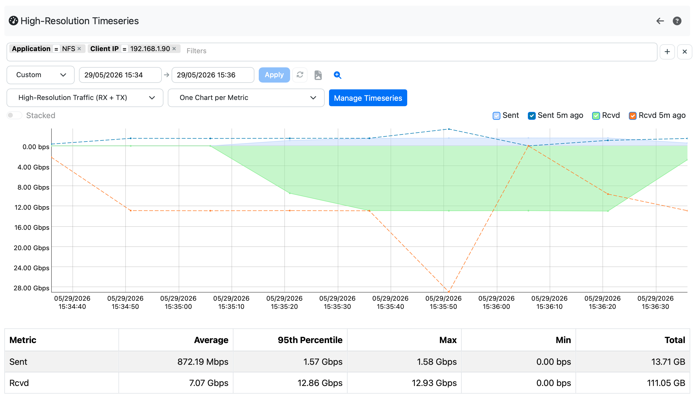

.. _HighResolutionTimeseries:

Observability
#############

Overview
--------

Standard flow records summarise all traffic for the lifetime of a connection into a pair of byte
and packet counters. This is sufficient for long-term trend analysis, but it hides short-lived
spikes and makes it impossible to plot throughput at sub-minute granularity.

ntopng features an Observability dashboard which is able to chart traffic information with
High-Resolution (HR) timeseries. HR timeseries are based on metrics (e.g. byte counts) recorded
by means of **15-second slots** for every active flow. When this is enabled, each completed flow 
stored in ClickHouse carries an embedded timeline of its own throughput history, enabling charts 
at 15-second granularity without a separate timeseries database.

.. note::

   High-Resolution timeseries require:

   - An **ntopng Enterprise M** (or better) license.
   - **ClickHouse** configured as the flow dump backend (``-F clickhouse``). See :ref:`ClickHouse`.
   - **nProbe** with HR counters support.

Data Flow
---------

.. code-block:: text

   Physical/virtual interface
          │
          ▼
      nProbe (live capture)
          │  exports @NTOPNG@ template
          │  + HR_SRC_TO_DST_BYTES (array of 15s byte buckets)
          │  + HR_DST_TO_SRC_BYTES (array of 15s byte buckets)
          │  via ZMQ
          ▼
      ntopng (ZMQ collector)
          │  auto-detects HR fields
          │  writes consolidated flow record
          ▼
      ClickHouse flows table
          HR_SRC2DST_BYTES  Array(UInt64)
          HR_DST2SRC_BYTES  Array(UInt64)
          │
          ▼
      Grafana dashboard
          per-flow bidirectional throughput at 15-second resolution

nProbe Configuration
--------------------

To enable HR timeseries, add the two HR information elements to the nProbe export template.
No other nProbe option is required:

.. code-block:: bash

   nprobe -i enp1s0 -n none --zmq "tcp://*:5556" -T "@NTOPNG@ %HR_DST_TO_SRC_BYTES %HR_SRC_TO_DST_BYTES"

ntopng Configuration
--------------------

No ntopng configuration change is required. ntopng **automatically detects** the presence of HR counters
in the incoming ZMQ flow records and writes consolidated data to the corresponding ClickHouse columns.

ntopng must be configured to use ClickHouse as the flow dump backend:

.. code-block:: bash

   ntopng -i "tcp://127.0.0.1:5556" -F clickhouse

See :ref:`ClickHouse` for full ClickHouse setup instructions.

ClickHouse Schema
-----------------

When HR data is present, ntopng stores it in additional columns of the ``flows`` table. Example:

.. list-table::
   :header-rows: 1
   :widths: 25 20 55

   * - Column
     - Type
     - Description
   * - ``HR_SRC2DST_BYTES``
     - ``Array(UInt64)``
     - 15-second delta byte counters, source-to-destination direction. Element *i* covers the
       interval ``[FIRST_SEEN + (i·15s), FIRST_SEEN + ((i+1)·15s))``.
   * - ``HR_DST2SRC_BYTES``
     - ``Array(UInt64)``
     - 15-second delta byte counters, destination-to-source direction.

Those columns are empty arrays (``[]``) for flows that were not captured by nProbe with HR
counters enabled. Existing deployments without HR support are therefore unaffected.

Sample ClickHouse query to read the per-slot throughput of a specific flow:

.. code-block:: sql

   SELECT
       FLOW_ID,
       arrayEnumerate(HR_SRC2DST_BYTES) AS slot,
       arrayElement(HR_SRC2DST_BYTES, slot) AS src2dst_bytes,
       arrayElement(HR_DST2SRC_BYTES, slot) AS dst2src_bytes
   FROM flows
   ARRAY JOIN HR_SRC2DST_BYTES
   WHERE FLOW_ID = <flow_id>
   ORDER BY slot;

Visualizing HR Timeseries in ntopng
------------------------------------

Once HR data is collected and dumped to ClickHouse, ntopng provides charts
drawing this data at different aggregation levels, at different pages in the UI:
the interface historical chart, the host historical chart, the historical flow 
details (from the Historical Flows explorer). Furthermore, a dedicated page is
available for building any custom chart by selecting the aggregation filter/criteria.

Interface-Level HR Chart
~~~~~~~~~~~~~~~~~~~~~~~~

The HR throughput chart is available on the **Interface Statistics** page
(*Dashboard → Interface*) for any interface that has received at least one flow
with HR counters. The chart aggregates all HR slots across every flow seen on
that interface, producing a 15-second-resolution view of total interface
throughput in both directions. This gives operators an immediate, high-fidelity
picture of traffic bursts and micro-spikes that would otherwise be invisible in
minute-resolution RRD charts. This is useful for correlating short-lived congestion
events with application-layer anomalies. Just look for metric names starting
with "High-Resolution" in the dropdown.

Host-Level HR Chart
~~~~~~~~~~~~~~~~~~~

The same 15-second resolution is available on the **Host Details** page
(*Hosts → Host Details → Charts*) for any host involved in HR-enabled flows.
The chart shows the host's per-direction throughput at HR granularity,
aggregating all flows where the host appears as client or server. Visibility at
this level is valuable for identifying which endpoints are responsible for
traffic spikes detected at the interface level, and for confirming whether a
specific host is the source or target of a sudden bandwidth surge.

Historical Flow HR Chart
~~~~~~~~~~~~~~~~~~~~~~~~

When inspecting a **specific historical flow** through the flow details page
(*Flows → Historical Flows → Flow Details → HR Charts* tab), a dedicated
per-flow HR chart is shown. This chart plots the exact bidirectional throughput
profile of that single connection at 15-second resolution, annotated with the
flow 5-tuple. 

This per-flow view is particularly powerful for observability: it makes it
possible to answer questions such as "was the traffic bursty or flat?", "did the
throughput drop midway through the connection?", or "which direction dominated?",
all at a granularity that standard flow records cannot provide.

Observability Page
~~~~~~~~~~~~~~~~~~

The **Observability** page (*Dashboard → Observability*) brings
together filtering and aggregation in a single interactive view.

The page includes a **filter** bar that lets the user narrow the dataset by any flow
field supported by the historical flow search (e.g. source IP, destination IP,
source port, destination port, L4 protocol, L7 application protocol, VLAN,
ASN, etc.)

A **high-resolution chart** aggregates the HR counters of all flows matching the active filters.

Because the filter bar exposes the complete set of flow fields, operators can
ask highly specific questions directly from the ntopng UI without writing SQL:

- *"Show me the total throughput of all HTTPS flows from this subnet over the
  last hour at 15-second resolution."*
- *"How much traffic did this autonomous system generate in the past 30 minutes,
  broken down by direction?"*
- *"Did traffic to this server port spike during the maintenance window?"*

Applying a filter causes the chart to reload immediately with the matching
dataset. Removing a tag reverts to the broader aggregate.

From an **observability** standpoint, the Observability page fills a gap that
neither per-flow details nor minute-resolution interface charts cover. It
surfaces the temporal shape of traffic for an arbitrary subset of flows without
requiring the operator to identify individual connections in advance, making it
directly applicable to incident investigation, capacity planning, and
application-behaviour analysis.

Grafana Dashboard
-----------------

Sample Grafana dashboards are also available, for those who are used to this UI
and want to build a custom dashboard.

.. code-block:: text

   https://github.com/ntop/ntopng/tree/dev/httpdocs/misc/grafana

The **ntopng High-Resolution Charts** sample dashboard (hr-flow-throughput-dashboard.json)
is a simple example demonstrating how to use High-Resolution timeseries in Grafana.

The dashboard provides two panels:

- **Service Flow Throughput** — bidirectional throughput for a specific flow, filtered by
  source IP, destination IP, and destination port. Each data point represents one 15-second slot.
- **Application Protocol Throughput (All Traffic)** — aggregate throughput broken down by
  application protocol across all flows in the selected time window.

.. figure:: ../img/hr_timeseries_grafana.png

To import the dashboard into Grafana:

1. In Grafana, go to **Dashboards → Import**.
2. Upload ``hr-flow-throughput-dashboard.json`` or paste its contents.
3. When prompted, select the ClickHouse datasource that points to the ntopng database.

The dashboard requires the `Grafana ClickHouse plugin
<https://grafana.com/grafana/plugins/grafana-clickhouse-datasource/>`_. See
:ref:`GrafanaIntegration` for general Grafana integration instructions.

