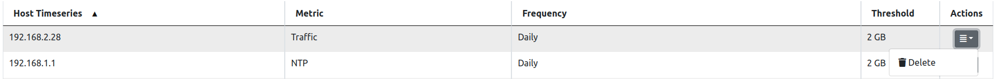

Local Hosts Traffic Volume Rules
================================

ntopng can trigger customizable alerts, based on a local host traffic timeseries (or all local hosts if '*' is specified). This is useful to identify hosts that trigger too much traffic on a specified tmeframe

.. note::

  This feature is available only from Enterprise M license or superior.

  Local Host Traffic Volume Rules Page

Here some example of rules:
- The daily traffic of 192.168.2.28 does not have to exceed 2 GB in total;
- The NTP daily traffic of 192.168.1.1 does not have to exceed 2 GB in total;
- The 1kxun traffic every 5 minutes of 1.1.1.1 does not have to exceed 1 GB in total;
- The traffic every 5 minutes of 1.1.1.1 does not have to exceed 1 Mbps;

Whenever a condition is met, ntopng is going to trigger an alert.

To add a new rule, click the '+' symbol above the table

.. figure:: ./../img/add_host_rule.png
  :align: center
  :alt: Add an Local Host Traffic Volume Rule

  Add an Local Host Traffic Volume Rule

At this point, fill the fields with the correct informations:
- Host Timeseries: insert the IP of a Local Host to be analyzed or a * (meaning that all Local Hosts has to be analyzed)
- Metric: select the metric to be analyzed (e.g. DNS -> the DNS traffic)
- Frequency: select the frequency of the analysis (e.g. 5 Min -> analyzed every 5 minutes)
- Threshold: select the type of threshold (Volume or Throughput) and the threshold that, if exceeded, is going to trigger an alert

.. figure:: ./../img/add_host_rule_modal.png
  :align: center
  :alt: Add an Local Host Traffic Volume Rule

  Add an Local Host Traffic Volume Rule

From now on, a new entry with the configured fields is going to be added to the table and whenever the threshold is exceeded a new alert is going to be triggered.

  Remove an Local Host Traffic Volume Rule

Instead, in order to remove an entry, click on the action button of the row to delete and from there the rule can be deleted.

.. note::
   
   Traffic rules are evaluated according to the rule frequency specified. For instance Daily rules are evaluated every midnight considering the traffic of the previous day.

