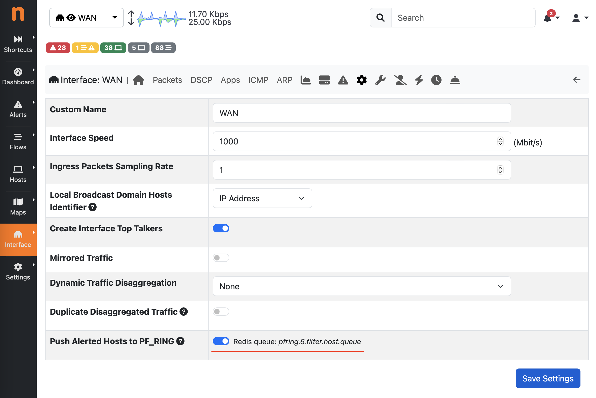

IDS Acceleration
================

IDS/IPS systems, like Suricata and Zeek, are well known to be CPU bound and
require quite some resources for signature-matching and other type of analysis.

The `PF_RING <https://www.ntop.org/guides/pf_ring/>`_ framework
can be used to accelerate the packet capture and make more CPU cycles available 
to those tools as described in the `IDS/IPS Integration <https://www.ntop.org/guides/pf_ring/thirdparty/>`_
section of the `PF_RING documentation <https://www.ntop.org/guides/pf_ring/>`_. 
It can also be used to reduce the input by (statically) defining filtering 
policies from Layer 2 up to Layer 7 dramatically improving the performance 
of the tools as described in the `PF_RING FT acceleration <https://www.ntop.org/guides/pf_ring/thirdparty/suricata.html#pf-ring-ft-acceleration>`_
section.

ntopng provides an additional technique for accelerating IDS/IPS systems,
whose idea is similar to the `Smart Recording acceleration <https://www.ntop.org/guides/ntopng/using_with_other_tools/n2disk.html#smart-recording>`_
used by n2disk.
In fact ntopng implements Behavioural Checks to detect when a host is misbehaving
and can be configured to push information about those hosts to external tools for
further analysing their traffic.
This can be configured from the *Interface* > *Details* > *Settings* menu,
where it is possible to toggle the *Push Alerted Hosts to PF_RING* flag.

  Push Alerted Hosts to PF_RING

With this setting enabled, ntopng notifies hosts for which there is an *engaged*
alert to PF_RING, triggering the divertion of the traffic matching those hosts 
to an IDS/IPS (or any other application running on top of PF_RING), which is
otherwise discarded by default.

The IP addresses to be monitored are notified to PF_RING by means of a Redis queue,
whose name is pfring.*INTERFACE_ID*.filter.host.queue as reported by the GUI. 
Please also read the `PF_RING Runtime Filtering <https://www.ntop.org/guides/pf_ring/filtering/runtime.html>`_ 
section for configuring the IDS/IPS.
