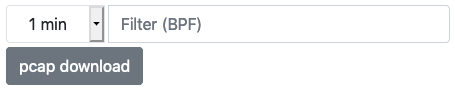

Live Pcap Download
##################

A pcap file containing packets matching a certain host can be generated on-the-fly by ntopng and streamed 
via web using a browser or by directly requesting endpoint `live_traffic.lua`. 

In order to download the pcap using the web GUI, click on the `pcap` hyperlink available on every host page and device
page. You can control the pcap duration and set an optional BPF filter for further filtering packets.

  Link for downloading the pcap file

The pcap file can also be downloaded directly through http, using a command line tool such as `wget` or `curl`.
The direct url for downloading the pcap is :code:`http://<ntopng IP>:3000/lua/live_traffic.lua?ifid=<interface index>&host=<host IP>`.

Please note that you should use cookies for authentication, as explained in the documentation. For example with `curl` you can specify
username and password with :code:`--cookie "user=<user>; password=<password>"`

Command line tools are useful for example to read a pcap stream and pipe it to an analysis tool such as `tcpdump` or `tshark`/`wireshark`. 
For example, to process the traffic matching host `192.168.2.1` with `wireshark`, it is possible to use `curl` as in the example below:

.. code:: bash
	  
   curl -s --cookie "user=admin; password=admin" "http://192.168.1.1:3000/lua/live_traffic.lua?ifid=12&host=192.168.2.1" | wireshark -k -i -

Similarly, the traffic of the whole interface with id `0` can be sent to `tshark` with

.. code:: bash

  curl --cookie "user=admin; password=admin1"  "http://devel:3000/lua/live_traffic.lua?ifid=0&duration=600&bpf_filter=" | tshark  -i -

