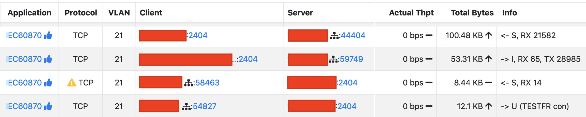
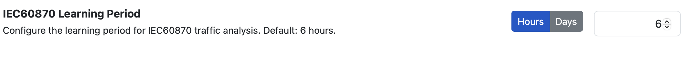
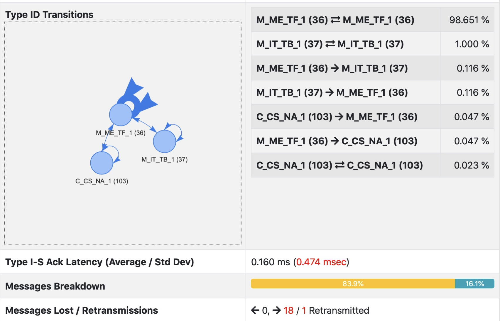

OT, ICS, Scada
==============

Operational Technology (OT) refers to computing systems that are used to manage industrial operations. ntopng supports some Industrial control systems (ICS) often managed via a Supervisory Control and Data Acquisition (SCADA) systems. Via nDPI it can detect protocols such as Modbus, IEC 60780 and BACnet. In addition to this, ntopng has extensive for some protocols.

Basic Principles
----------------

ntopng is a monitoring tool able to detect "generic" and behavioural issues that can distupt an OT network. They include (but are not limited to):

- New device detection and invalid MAC/IP combinations
- Device traffic behavioural analysis (e.e. traffic misbehaving, peaks in traffic)
- New protocols and services: detect when a devices changes in provided services (i.e. a HTTPS server is spawn) or a new protocol s used as client

In addition to the above services, specific protocols are supported in detail.

IEC 60870-5-104
---------------
`IEC 60870-5-104 <https://en.wikipedia.org/wiki/IEC_60870-5>`_ is a protocol used mostly in electrical engineering and power system automation. This protocol is detected by ntopng and dissected overtime by detecting changes in behaviour for each network flow.

For each IEC flow, ntopng dissects flow communications

and reports in realtime traffic statistics. In addition to this, ntopng learns the protocol transitions as configured in preferences, this as each IEC flow has different peculiarities and transitions for which a model is created.

For the specified duration, ntopng builds a model for each flow in order to understand how it behaves overtime. When the learning period for a flow is over, ntopng matches the traffic agains the model and triggers an alert whenever

- An unexpected transition is detected
- The trsnsitions number is invalid (C-C > 10 and M-M/M-C/C-< == 0)

You can read more `her <https://www.ntop.org/ntopconf2022/pdf/Scheu.pdf>`_ for more information,

