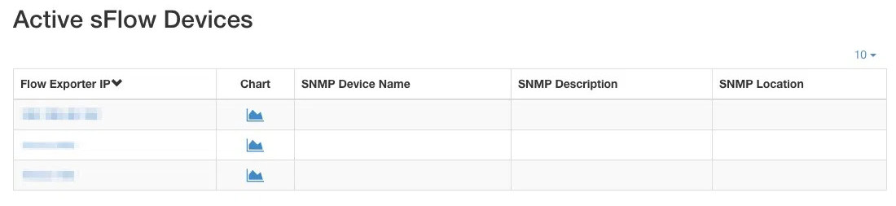
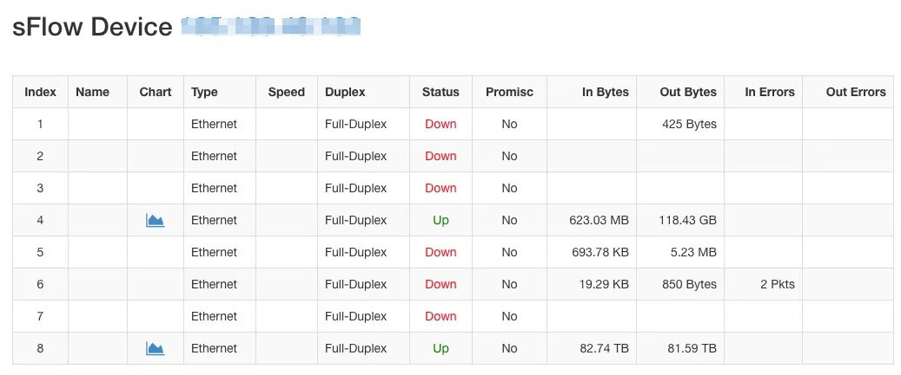

sFlow/NetFlow Collection
========================

ntopng, in combination with nProbe, can be used to collect
sFlow/NetFlow. The use of ntopng in combination with nProbe is
described in Section :ref:`UsingNtopngWithNprobe`.

sFlow Collection
----------------

An introduction to sFlow and its collection in ntopng is provided
in this blog post:
https://www.ntop.org/nprobe/sflow-collection-and-analysis-with-nprobe-and-ntopng

Supposing that there are sFlow devices - or agents, in the sFlow parlance - exporting sFlow on port 6343 of the host
where ntopng is running, in order to collect such data it's necessary to configure
nProbe to collect flows on port 6343 and ntopng to talk with nProbe:

.. code:: bash

  nprobe -i none -n none --collector-port 6343 --zmq tcp://127.0.0.1:5556
  ntopng -i tcp://127.0.0.1:5556

The ntopng web dashboard will shortly populate with collected data, including top
senders and top destinations, as well as the top layer-7 application protocols
detected from the traffic. Similarly, all the other ntopng pages will populate with data.

sFlow Devices
-------------

When capturing sFlow traffic, ntopng displays aggregated information regarding the
sFlow devices and their ports. This information is accessible from the `Collectors` menu, `sFlow Devices` entry:

  List of the Remote sFlow Devices

Each row shows a single sFlow device. If the device is also configured as an
`SNMP device`_, ntopng will show its name, description and location information.
A chart of the device traffic is shown provided that the "Flow Devices" timeseries
are enabled from the ntopng preferences. By clicking on the sFlow device IP address
it's possible to inspect the per-interface statistics of the SNMP device.

  List of the Remote sFlow Device Interfaces

For each interface, ntopng shows the following information:

  - :code:`Index`: the interface numeric index
  - :code:`Name`: the interface name
  - :code:`Chart`: the interface traffic chart, if the "Flow Devices" timeseries
    are enabled
  - :code:`Speed`: the interface speed
  - :code:`Duplex`: interface duplex information, half or full duplex
  - :code:`Status`: the current interface status
  - :code:`Promisc`: if the interface is in the promiscuous mode
  - :code:`In Bytes`: ingress bytes counter of the interface
  - :code:`Out Bytes`: egress bytes counter of the interface
  - :code:`In Errors`: ingress errors packets counter of the interface
  - :code:`Out Errors`: ingress errors packets counter of the interface
  - :code:`Counters/SNMP Ratio`: the ratio between the sFlow counters by the total traffic read via SNMP

NetFlow Devices
---------------

How the Flow/SNMP Ratio is calculated?
~~~~~~~~~~~~~~~~~~~~~~~~~~~~~~~~~~~~~~

The :code:`Flow/SNMP` Ratio column is calculated by dividing the total interface traffic obtained using flows,
by the total traffic of the same interface read via SNMP. As in flow-based analysis non-IP and layer 2 headers are not accounted,
typical ratio values are between 0.8 and 0.9 (i.e. 0.9 means that 90%% of the received traffic as observed via SNMP has been reported in flows).
Ratio is computed using the traffic over the latest 5 minutes, as periodic SNMP walks are performed at 5-minute intervals.
Ratio is only computed when the following conditions are met:

- Flow Device and SNMP timeseries are enabled
- The device selected must support SNMP and must be configured in the SNMP devices page

.. _`SNMP device`: ../active_monitoring/snmp.html
