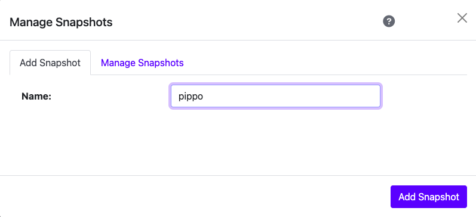
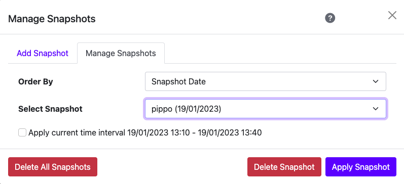

Manage Snapshot
===============

ntopng can save and manage one or many snapshots of charts filters.

.. note::

  This feature is available only from Enterprise M license or superior.

It is possible to use the Manage Snapshot feature on the Alerts and Historical charts.

  ntopng Add Snapshot

With the Manage Snapshot feature it's possible to save the actual filter setted up using a customizable name.

  ntopng Manage Snapshots
  
With the Manage Snapshot feature on the "Manage Snapshots" tab it's possible to restore one of the many snapshots created. 
It's possible to choose the time interval to apply on the snapshot. 
If the "Apply current time interval XX/XX/XXXX XX:XX - YY/YY/YYYY YY:YY" flag isn't setted up, ntopng will restore filter with the timeseries selected at the saving moment. Otherwise the ntopng applies the filter of the snapshot on the actual last 30 minutes.
Finally with the Manage Snapshot feature is possible to delete one or all of the snapshots saved.
