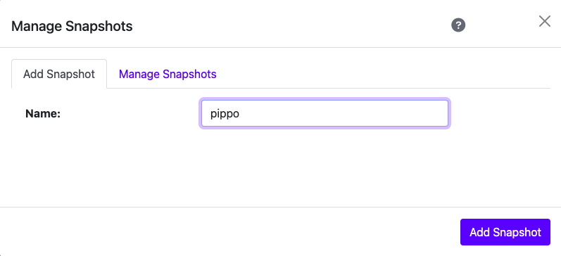
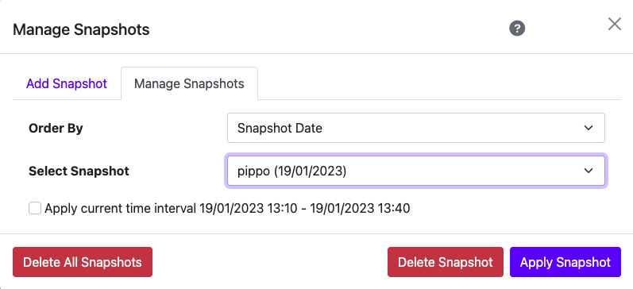

Snapshots
=========

ntopng can save and manage one or many snapshots of charts filters.

.. note::

  This feature is available only from Enterprise M license.

It is possible to use the Snapshot feature on the Alerts and Historical charts.

To access the Snapshots feature, users have to click on the corresponding icon usually available on the filter bar, close to the selectable timeframe.

  Snapshot icon

After clicking on it, a manage Snapshots modal is going to pop up.

  ntopng Add Snapshot

With the Add Snapshot it's possible to save the current filter set, using a customizable name.

  ntopng Manage Snapshots
  
With the Snapshot feature on the "Manage Snapshots" tab it's possible to restore one of the many snapshots created. 
It's possible to choose the time interval to be applied to the snapshot. 
If the "Apply current time interval XX/XX/XXXX XX:XX - YY/YY/YYYY YY:YY" flag isn't set, ntopng is going to restore filters using the same time interval set when the snapshot was created. Otherwise ntopng applies the filters of the snapshot on the current time interval selected.
Finally with the Snapshot feature is possible to delete one or all of the snapshots saved.
