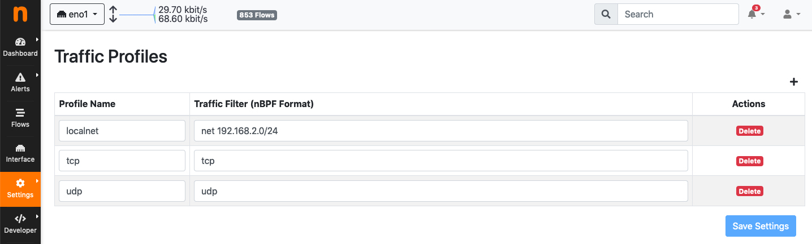
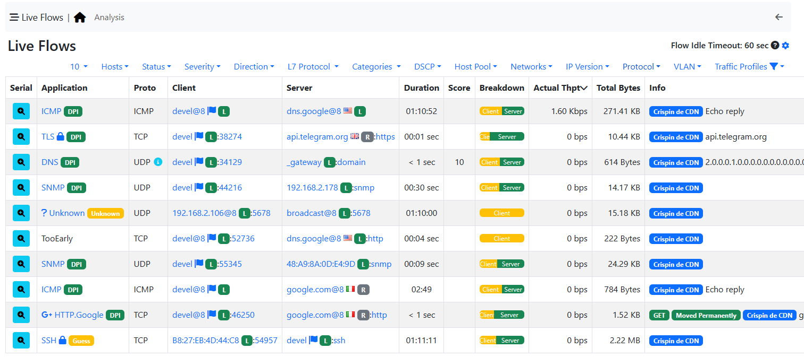
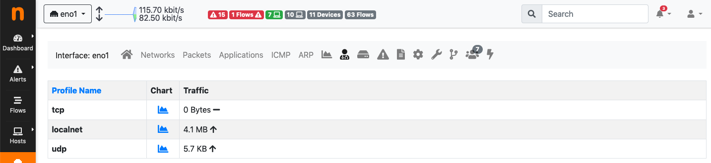
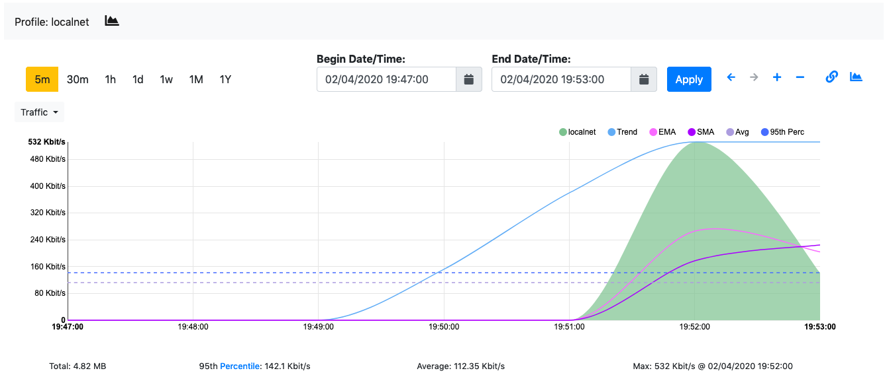

Traffic Profiles
################

Traffic profiles allow the user to define logical aggregations of traffic. Examples of logical aggregates of
traffic include ‘TCP traffic flowing from local network 192.160.1.0/24 to host 10.0.0.1’, ‘Facebook traffic
originating at host 192.168.10.20’, and so on.

Traffic Profiles are a feature that is only available in the Professional Version of ntopng.

Profiles can be set and configured via the dropdown |cog_icon| menu in the top toolbar.

  The Edit Traffic Profiles Page

In the screenshot above, ntopng has been configured with a profile that logically includes any kind of
traffic having source and/or destination hosts within the private network 192.168.2.0/24.

Profiles must be expressed using the Berkeley Packet Filter (BPF) syntax. Filters will be parsed and syntax
will be checked every time thew ‘Save Profile’ button is hit. Errors are raised when the syntax is not BPF
compliant. A thorough discussion of the BPF falls outside the scope of this work. The interested reader cat
refer to http://biot.com/capstats/bpf.html for a detailed description of the syntax.

Realtime Profiles
-----------------

Profiles are fine grained and potentially apply to every flow detected. Real time flows and their assigned
profiles can be seen using the ‘Flows’ menu entry in the top toolbar. Similarly, profiles can be seen on a
host basis by selecting the tab ‘Flows’ from the contextual Host Details menu.
A blue badge labelled with profile name will appear in the rightmost column ‘Info’ of every profiled flow.
In the example below are shown two currently active flows for host 192.168.2.130, that match the defined
localnet profile.

  Traffic Profiles in the Active Flows Page

Historical Profiles Statistics
------------------------------

Profiles are not only available in realtime. Their traffic statistics are sampled every minute and stored in
RRDs. Similarly, if ntopng was started with the -F modifier, flows will be exported to MySQL or ElasticSearch
together with their profiles. Historical charts and tables are available in the ‘Profile Details’ page,
reachable from the ‘Interface’ contextual toolbar. By clicking on the doctor ! icon, it is possible to see the
full list of profiles detected for the selected interface, together with their traffic and throughput trend. Profile
Details page can be opened for each profile simply by clicking on the |chart_icon| icon.

  The Traffic Profiles Summary Page

Profile Details page shows historical profile traffic. An optional table with historical flow details — for flows
matching the selected profile — is shown below the chart if ntopng was started with the -F modifier.

  The Traffic Profile Details Page

.. warning::
  Presently, no overlapping profiles are handled. This means that when a flow matches more than
  one traffic profile, it will be assigned to one profile only in a non-predictable way.

.. |cog_icon| image:: ../img/cog_icon.png
.. |chart_icon| image:: ../img/chart_icon.png
