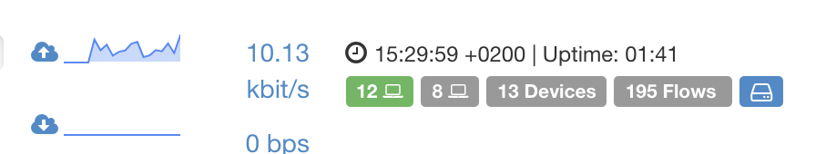
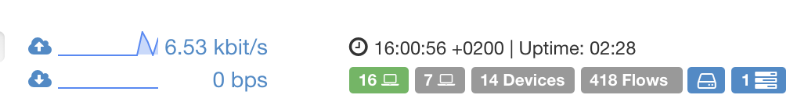

Continuous Traffic Recording
############################

When it comes to troubleshoot a network issue or analyse a security event,
going back in time and drilling down to the packet level could be crucial
to find the exact network activity that caused the problem.
Continuous traffic recording provides a window into network history, that
allows you to retrieve and analyse all the raw traffic in that period of time.

.. note::  *n2disk* needs to be installed together with *ntopng* on the box to enable this feature. 
           A *n2disk* license is also required, otherwise it will stop recording traffic after the demo limit.

Continuous traffic recording can be enabled in *ntopng* selecting an interface
through the "Interfaces" menu, and clicking on the disk icon. In order to start
recording you should:

1. Select "Continuous Traffic Recording"
2. Configure the "Max Disk Space" to control the maximum disk space to be used 
   for pcap files. This setting affects the data retention time, as when the 
   maximum disk space is exceeded, the oldest pcap file is overwritten.
   Please note that the data retention time also depends also on the traffic
   throughput of the networks being monitored.
3. Press the "Save Settings" button to start recording.

.. figure:: ../img/web_gui_interfaces_recording.png
  :align: center
  :alt: Continuous Traffic Recording

  The Continuous Traffic Recording Page

Continuous traffic recording is based on *n2disk*, an optimized traffic recording 
application. By enabling it a new *n2disk* instance is automatically configured 
and started on the selected interface, and a new badge appears on the right side 
of the footer. When the badge is blue, it means that traffic recording is running,
instead when it is red it means that there is a failure. It is possible to get
more information about the *n2disk* service status and the log trace by clicking 
on the badge.

  The Continuous Traffic Recording Bagde in the Footer

Packets are dumped to disk using the industry standard Pcap file format. The default 
folder for pcap files is the ntopng data directory, under the "pcap" folder of a 
specific network inteface id (e.g. `/var/lib/ntopng/0/pcap`), however it is possible to
replace the `/var/lib/ntopng` root folder with a different one adding *--pcap-dir <path>* 
to the configuration file.

Traffic extraction
------------------

All pcap files dumped to disk are indexed on-the-fly by *n2disk* to improve traffic 
extraction speed when recorded data need to be retrieved.
It is possible to extract traffic from multiple places in ntopng, including the historical 
traffic statistic. In order to enable the "Extract pcap" button in the historical traffic 
statistic page, traffic recording should be up and running.

.. figure:: ../img/web_gui_interfaces_extract_pcap.png
  :align: center
  :alt: Extract pcap button

  The Extract pcap button in the Statistics page

By clicking on the "Extract pcap" button a dialog box will let you run an extraction 
to retrieve the traffic matching the time interval selected on the historical traffic 
statistic chart. In addition to the time constraint, it is possible to configure a 
BPF-like filter to further reduce the extracted amount of data. The filter format is
described at `Packet Filtering <https://www.ntop.org/guides/n2disk/filters.html>`_.

.. figure:: ../img/web_gui_interfaces_extract_pcap_dialog.png
  :align: center
  :alt: Extract pcap dialog

  The Extract pcap dialog in the Statistics page

The "Start Extraction" button will schedule the extraction, that will be processed in background
(it usually requires a few seconds, depending on the time interval, amount of recorded data, and 
the filter). 

A reference for the extraction job (a link to the "Traffic Extraction Jobs" page with the list of 
scheduled extractions, and the extraction ID) is provided in order to control the status and 
download the pcap file(s) as soon as the extraction is completed.

.. figure:: ../img/web_gui_interfaces_extraction_jobs.png
  :align: center
  :alt: Traffic Extraction Jobs

  The Traffic Extraction Jobs page

It is possible to access the "Traffic Extraction Jobs" clicking on the badge that appears on the 
right side of the footer when there is at least one extraction job scheduled.

  The Traffic Extraction Jobs Bagde in the Footer

