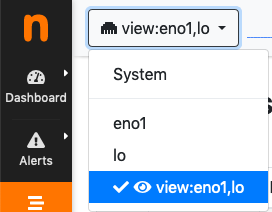

Physical Interfaces Aggregation: Interface Views
################################################

Ntopng can aggregate two or more physical interfaces into logical units, the so called Interface Views.
Interface views are seen and treated in the web GUI as if they were real interfaces. In the background,
ntopng collects statistics and traffic for every physical interface underlying an interface view, and reduce
these multi-source stream of information into a single logical aggregate.

Interface views are specified via command line (or configuration file), using the same -i modified that is
used for physical interfaces. An extra view: string must be added right after the -i modifier to tell ntopng
that it is going to read a view. Physical interfaces must be indicated in a comma separated list that follows
the view: string.

For example an interface view that merges physical interfaces en0 and en4 can be created using the
following syntax:

.. code:: bash

    ntopng -i en0 -i en4 -i view:en0,en4

.. warning::

    Interfaces that are part of a view must also be specified separately as physical interfaces. This
    means that you cannot omit the -i en0 -i en4 from the example above.

Upon successful startup, ntopng shows, in the top toolbar ‘Interfaces’ menu, the interface view together
with other physical interfaces. An eye is show next to each view, which can be clicked and selected as if it
was a physical interface.

  The Interfaces Dropdown Menu in the Top Toolbar
