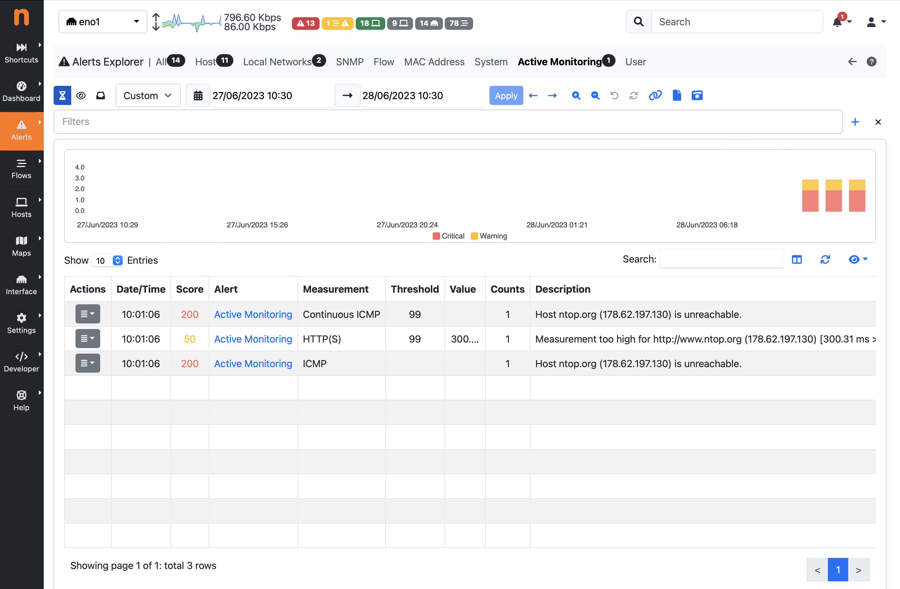

.. _AlertsExplorer:

Alerts Explorer
===============

Alerts triggered by ntopng are stored in a databased (SQLite or ClickHouse) and can be visualized 
and managed using the built-in Alerts Explorer, in addition to delivering them to external endpoints
by using :ref:`_DeliveringAlertsToRecipients`.

Alerts are organized in the Alerts Explorer according to the entity (subject for which the alert has 
been generated), whose list includes Host, Interface, Network, Flow, etc.

Alerts can be just triggered as one-shot, or can have a duration, that is, they are active for a 
certain period of time. This period of time starts then a condition is verified (e.g. a threshold is met)
and stops when the condition is no longer verified. For this reason, such alerts are said to be *engaged*
or *past*, depending on whether the triggering threshold is still met or not.

.. _Engaged Alerts:

Engaged Alerts
--------------

When the threshold is first met, ntopng puts the corresponding alert in an *engaged* state. The set of alerts that are currently engaged is available from the engaged alerts page identified by the hourglass icon.

  Engaged Alerts Page

.. _PastAlerts:

Past Alerts
-----------

When the triggering threshold of an engaged alert is no longer met, the alert becomes *past* an it will no longer be visible in the engaged alerts page. Alerts, once released, become available from the *all* alerts page identified by the inbox icon, and their duration is indicated in the corresponding column. 

.. figure:: ../img/basic_concepts_alerts_past_alerts.png
  :align: center
  :alt: All Past Alerts Page

  All Past Alerts Page

Alerts associated with events don't have a duration associated. They are triggered *at the time of the event* but any duration is not meaningful for them. For this reason, such alerts are never *engaged*  or *released*, they are just considered *past* as soon as they are detected, and they are placed under the *all* alerts page without any duration indicated.

.. _FlowAlerts:

Flow Alerts
-----------

During its execution, ntopng can detect anomalous or suspicious flows for which it triggers special *flow alerts*. Such alerts not only carry the event that caused the alert to be fired, they also carry all the flow details, including source and destination IP addresses, layer-7 application protocol, and ports.

*Flow alerts* are always associated with events and thus they are never *engaged*  or *released* and are placed in the past alerts directly. 

.. figure:: ../img/basic_concepts_alerts_flow_alerts.png
  :align: center
  :alt: Flow Alerts Page

  Flow Alerts Page

Alerts that require human attention and should be manually handled (e.g. related to security issues), are also placed in the page identified by the eye icon, until they are acknowledged.

.. figure:: ../img/basic_concepts_alerts_important_alerts.png
  :align: center
  :alt: Important Past Alerts Page

  Important Past Alerts Page

