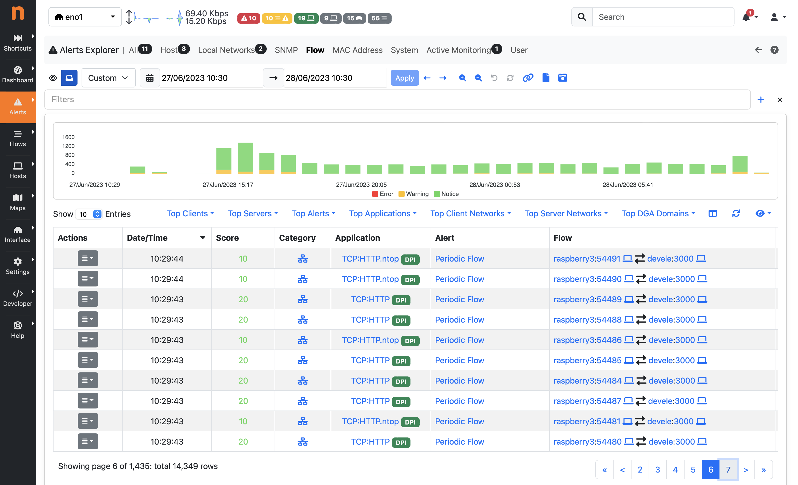
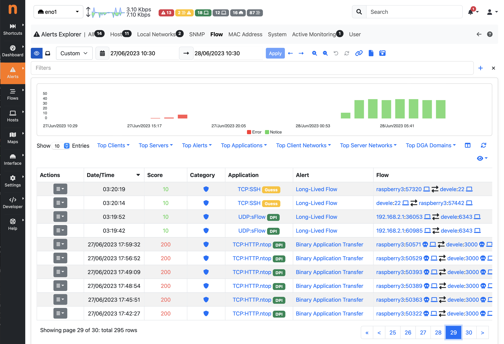

.. _AlertsExplorer:

Alerts Explorer
===============

Alerts triggered by ntopng are stored in a databased (SQLite or ClickHouse) and can be visualized 
and managed using the built-in Alerts Explorer, in addition to delivering them to external endpoints
by using :ref:`DeliveringAlertsToRecipients`.

Alerts are organized in the Alerts Explorer according to the entity (subject for which the alert has 
been generated), whose list includes Host, Interface, Network, Flow, etc. as described in :ref:`BasicConceptAlerts`.

Alerts can be just triggered as one-shot, or can have a duration, that is, they are active for a 
certain period of time (in the *engaged* state). This period of time starts when a condition is verified 
(e.g. a threshold is met) and stops when the condition is no longer verified (and alerts are moved in the
*past* state). For this reason, such alerts are said to be *engaged* or *past*, depending on whether the 
triggering threshold is still met or not. Alerts on flows are always one-shot.

.. _Engaged Alerts:

Engaged Alerts
--------------

When the threshold is first met, ntopng puts the corresponding alert in an *engaged* state. The set of alerts 
that are currently engaged is available from the engaged alerts page identified by the hourglass icon.
This applies to all alert families, with the only exception of Flow alerts.

.. figure:: ../img/basic_concepts_alerts_engaged_alerts.png
  :align: center
  :alt: Engaged Alerts Page

  Engaged Alerts Page

.. _PastAlerts:

Past Alerts
-----------

When the triggering threshold of an engaged alert is no longer met, the alert becomes *past* an it will no 
longer be visible in the engaged alerts page. Alerts, once released, become available from the *all* 
alerts page identified by the inbox icon, and their duration is indicated in the corresponding column. 

.. figure:: ../img/basic_concepts_alerts_past_alerts.png
  :align: center
  :alt: All Past Alerts Page

  All Past Alerts Page

Alerts associated with events don't have a duration associated. They are triggered *at the time of the event* 
but any duration is not meaningful for them. For this reason, such alerts are never *engaged*  or *released*, 
they are just considered *past* as soon as they are detected, and they are placed under the *all* alerts page
without any duration indicated.

.. _FlowAlerts:

Flow Alerts
-----------

During its execution, ntopng can detect anomalous or suspicious flows for which it triggers special *flow alerts*.

Flow alerts can be detected, by means of hooks/checks, at different times (let's call them *check points*) during the flow life cycle:

- When a flow is created
- When the layer-7 application protocol is detected
- With periodic checks (e.g. every minute)
- When a flow terminates

It may happen that multiple issues are detected (by different checks) at the same check point. In this case
only the *predominant* alert (with the highest score) is triggered and stored in the database, however 
information about "secondary" issues are also stored in the same alert and displayed in the user interface. 
This happens for every check point, thus at most one alert per check point is triggered.

In short:

- In case multiple issues are detected at time *t*, a single alert is emitted (notified through the Notification
  Endpoints and inserted into the database), this alert would report the *predominant* issue and the additional 
  "secondary" issues.
- In case additional issues are detected at a later check point at time *t+1*, a new alert is emitted only if
  an issue with an higher score is detected. Note: when using Clickhouse as database, a Flow alert will always 
  report (in addition to the predominant issue) *all* the additional issues detected during the whole flow lifecycle,
  as a consequence of the way flow alerts have been implemented on Clickhouse (as a view on historical flows).
  The same does not happen when using SQLite, where all alerts, up to the time the predominant alert has been detected,
  are stored in the database, as a consequence of the way alerts are emitted.

Flow alerts not only carry the (predominant and secondary) events that caused the alert to be fired, 
they also carry all the flow details, including source and destination IP addresses, layer-7 application protocol, 
and ports.

*Flow alerts* are always associated with events and thus they are never *engaged* or *released*, they are placed 
in the past alerts directly. 

  Flow Alerts Page

Alerts that require human attention and should be manually handled (e.g. related to security issues), are also placed in the page identified by the eye icon, until they are acknowledged.

  Important Past Alerts Page

Alerts Filters
--------------

Clicking on the `+` icon enables the specification of multiple filters in the alerts explorer page.

.. figure:: ../img/alert_explorer_add_filter.png
  :align: center
  :alt: Add Filter on Alert Explorer

  Add Filter on Alert Explorer

The filter types correspond to each column on the alerts explorer page. 

By adding two filters of the same type, they will be combined using OR operator. 
Otherwise, adding two filters of different types will combine them using AND operator.

.. figure:: ../img/alert_explorer_with_filters.png
  :align: center
  :alt: Alert Explorer with Multiple Filters

  (Severity `>=` Error AND Client Name = office AND (Alert Type = Binary Application Transfer OR Alert Type = ICMP Data Exfiltration))

For each alert entity (such as Host, Flow, Interface, etc.), it's possible that ntopng has emitted more than one issue. 
For instance, a single Flow could have issues like 'Susp Device Protocol,' 'Clear-Text Credentials,' and 'HTTP Susp User-Agent.'

Typically, the 'Alert Type' filter in ntopng searches for the main issue (the one with the highest score indicated in the 'Description' column of the Alerts Explorer page) emitted for a Flow, Host, or other alert entities. 
However, if ClickHouse is enabled and the 'Alert Type' filter is used, ntopng can search for the specified 'Alert Type' across all issues (also secondary) emitted for every Flow, Host, etc.

Custom Queries
--------------

In a system which analyses traffic of a large network, the amount of alerts
(in particular those which are about Network issues) can be high, also depending 
on the number of Behavioural Checks we enable, and how we tune them. Checking 
the health of the Network, by looking at those alerts one by one, may definitely 
be a challenging and time-consuming task. For this reason the Alerts Explorer
computates and display alerts statistics through dropdowns at the top of each page,
including Top Alert Types, Clients, Servers, etc, to summarize what are the main 
issues affecting our networks, and who are the main actors.

In order to analyze alerts when cardinality is high, ntopng also provides the ability
to build additional custom views that can be defined by means of custom queries, and
that can aggregate alerts according to some criteria, or manipulate them in any way 
allowed by SQL.

Custom queries can be defined using a simple JSON syntax, placed as .json files on 
the filesystem, and automatically appear in a dropdown under the Queries section in 
the Alerts Explorer. It is possible to build a query which groups alerts based on 
Client, Server and Alert Type for instance, and list all alerts matching a specific 
3-tuple from the table Actions.

The default view in the Alerts Explorer is "Alerts", which shows the full list of raw alerts.
In addition to the raw "Alerts", additional built-in views are available, which are
built on top of the Custom Queries engine and include:

  - Alert Type: group and count alerts by Alert Type
  - Cli / Srv: group and count alerts by Client and Server
  - Cli / Srv / Alert Type: group and count alerts by Client, Server and Type
  - Cli / Srv / Srv Port: group and count alerts by Client, Server and Server Port
  - Info: group and count alerts by domain or URL

  Alerts Explorer Queries

The above built-in Custom Queries can be extended by the user by creating
simple JSON files containing the query description. The query definitions corresponding
to the above built-in queries are available on the filesystem as JSON files under 

/usr/share/ntopng/scripts/historical/alerts/{alert entity}/{query name}.json

Example:

/usr/share/ntopng/scripts/historical/alerts/flow/alert_types.json

Adding a new alerts view is as simple as placing one more JSON file within the same folder.

Here is an example JSON file for the Clients flow view.

.. code:: json

   {
      "name" : "Alert Type",
      "i18n_name" : "alert_types",
      "select" : {
         "items" : [
            {
               "name" : "alert_id"
            },
            {
               "name" : "count",
               "func" : "COUNT",
               "param" : "*",
               "value_type" : "number"
            }
         ]
      },
      "filters" : {
         "items" : [
            {
               "name" : "alert_id"
            }
         ]
      },
      "groupby" : {
         "items" : [
            {
               "name" : "alert_id"
            }
         ]
      },
      "sortby" : {
         "items" : [
            {
               "name" : "count",
               "order" : "DESC"
            }
         ]
      }
   }

The JSON format is self-explanatory. It is possible to define the columns to be shown under the select tree, 
the columns on which the group-by is applied under the groupby tree, and the default column on which sorting is 
applied under the sortby tree. Aggregation functions can also be defined, such as the 'count' item, which is 
used in the example to display the number of alerts for each 3-tuple. 
For more complicated examples, it is recommended to take a look at the built-in query definitions available in the same folders.

The complete list of columns is available in the database schema located at /usr/share/ntopng/httpdocs/misc/alert_store_schema.sql

