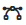

Available Alerts
================

ntopng alerts are evaluated with :ref:`WebUIUserScripts`. Checks are executed for hosts, interfaces, SNMP devices, and other network elements, and are configurable under Checks from the Settings left sidebar.

.. figure:: ../img/alerts_checks_management.png
  :align: center
  :alt: Checks Configuration
  
Checks are desiged to verify specific conditions and when they are not met, trigger an alert. 

Interface Types
~~~~~~~~~~~~~~~

Checks can be available on both, ZMQ Interfaces and Packets Interfaces, or just on one of them;

- Packet interface: |packet_interface|

- ZMQ interface: |zmq_interface|

Alerts List
~~~~~~~~~~~

Below you can find the list of check families and available alerts

.. toctree::
    :maxdepth: 2

    host_checks
    interface_checks
    local_network_checks
    snmp_checks
    flow_checks
    system_checks
    active_monitoring_checks
    syslog_checks
    host_rules
    

