Available Endpoints and Recipients
==================================

Currently available Endpoints and recipients are 

Email
-----

One can create the email endpoint as follows

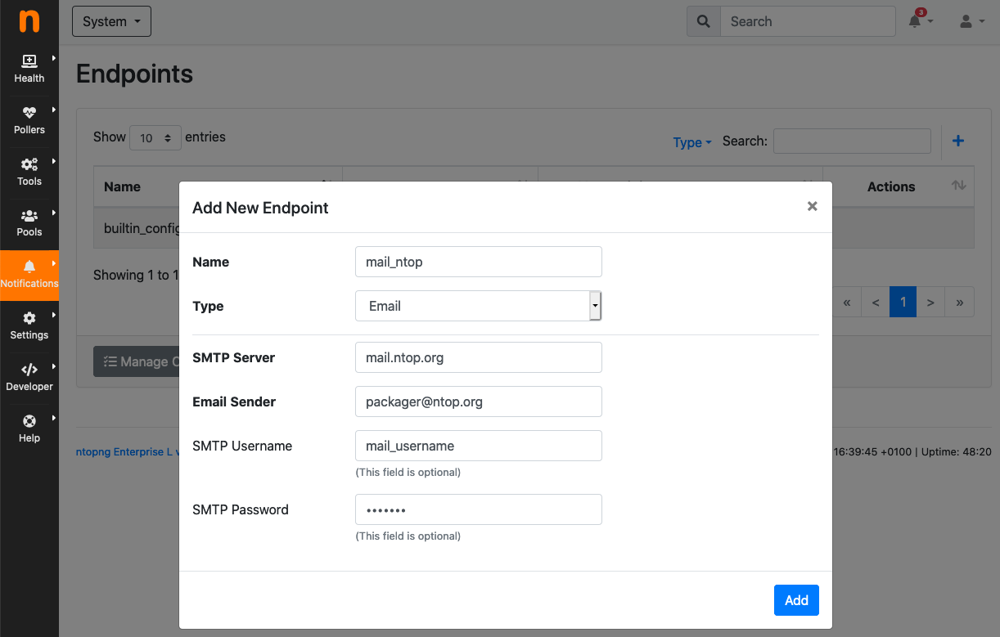

Then, one can create multiple email recipients sharing the same
endpoint but each one with a different destination email address:

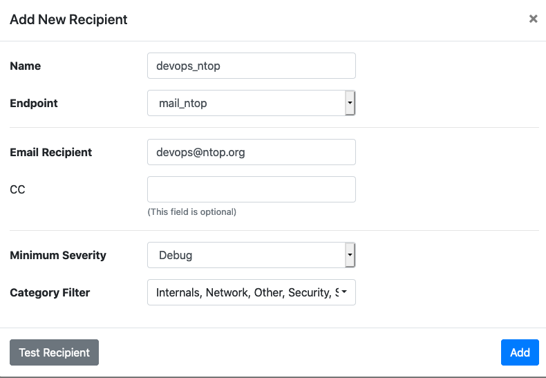

Discord
-------

Discord (https://discord.com) is a popular collaboration application that can be used by ntopng to deliver alerts to recipients. In order to deliver alerts you need to configure a new Discord server as described in this document https://support.discord.com/hc/en-us/articles/204849977-How-do-I-create-a-server- and the to create a webhook as decribed here https://support.discord.com/hc/en-us/articles/360045093012-Server-Integrations-Page

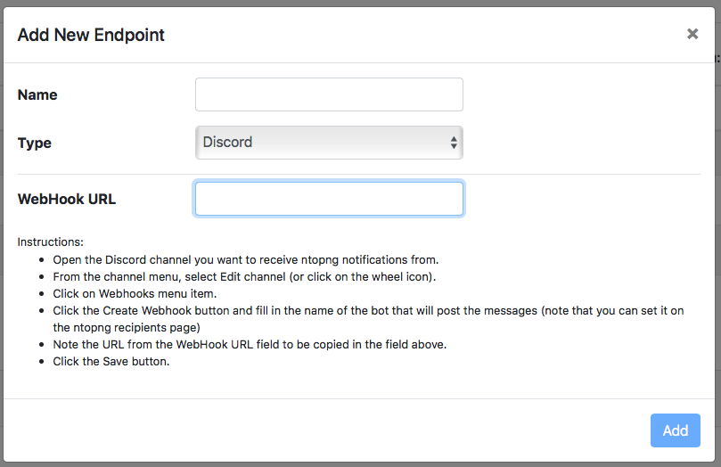

Once in the webhook click on the "Copy Webhook URL" button that will copy the URL into your clipboard. Done this we're ready to create a ntopng Discord Endpoint. On the System interface (upper menubar, dropdown menu) select Notifications -> Endpoints and click on the + icon. A new dialog windown will open: select Discord from the endpoint type menu and insert the Webhook URL you have previusly copied on your clipboard, pick a endpoint name you like and save it.

Done this you can create a recipient for this endpoint. You can optionally specify a Username in the recipient page that is used when messages are delivered to Discord. If you do not set a username the one used in the Discord Webhook page will be used (usually set to 'Captain Hook').

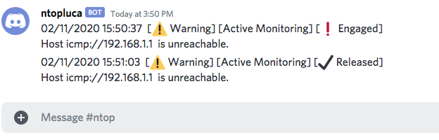

The above picture shows sample alerts delivered to a discord server.

Telegram
--------

First of all navigate from the Web GUI into the section Notification->Endpoints; after that, click on the `+` on the right corner of the Endpoint window, this way it will add a new Endpoint for the notification system. Select inside the `Type` window `Telegram`. Then open Telegram, search for `@BotFather` and start a new conversion with it.

After that, send the following messages in this order:
  - :code:`/newbot`
  - :code:`bot_name` (the name that's going to have the bot, e.g. `ntopng_telegram_plugin`)
  - :code:`bot_username` (the username that's going to have the bot, e.g. `ntopng_telegram_plugin_bot`)

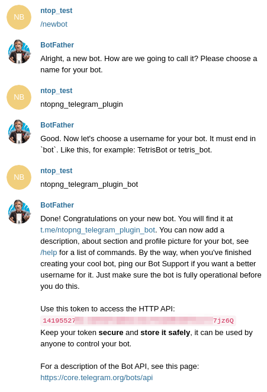

Now @BotFather will give a token, useful to enable ntopng to talk with the bot actually created; copy this token and paste it into the `Add New Endpoint` window of ntopng previously opened, name the Endpoint (e.g. `telegram_endpoint`) and click `Add`.

After that navigate to Notification->Recipients and, just like before, click on the `+` simbol on the right high corner of the Recipient window. Now select into the Endpoint section of `Add New Recipient` the endpoint previously created, name it (e.g. telegram_recipient_mychat), select the Minimum Severity of the notifications and the Category of the notification desired.

Then go back to Telegram. 
If the bot have to personally send the alarms directly into the private chat then follow these steps:
  - start a conversation with the ntopng bot in Telegram (a bot can't initiate conversation with a user!)
  - search for `@getidsbot` and start a conversation with it
  - copy the id `@getidsbot` gave to you

 Otherwise if you want to add the bot to a group chat and send messagges on that group, follow the following steps:
  - add the bot you previosly created (searching for his name) to your group chat
  - now add to that group chat `@getidsbot`
  - copy the id the bot sent on the group chat

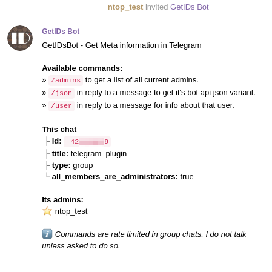

Now paste the id into the `Add New Recipient` window of ntopng and click `Add` (click `Test Recipient` to test if the bot is working correctly).

Now add to the relative Pool the Telegram recipient you just created and it's done!

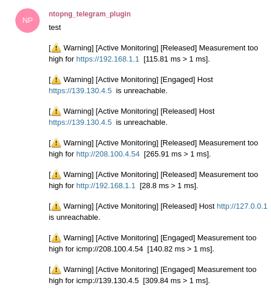

Shell Script
------

Create the script you want to execute each time the alert is triggered and put it inside the directory :code:`/usr/share/ntopng/scripts/shell/`.

.. note::

        The script must be a shell script (.sh extention) with execution permission.

The full alert information are provided to the script through the standard input in JSON format.

A new Endpoint should be created, by selecting the script that has been created.

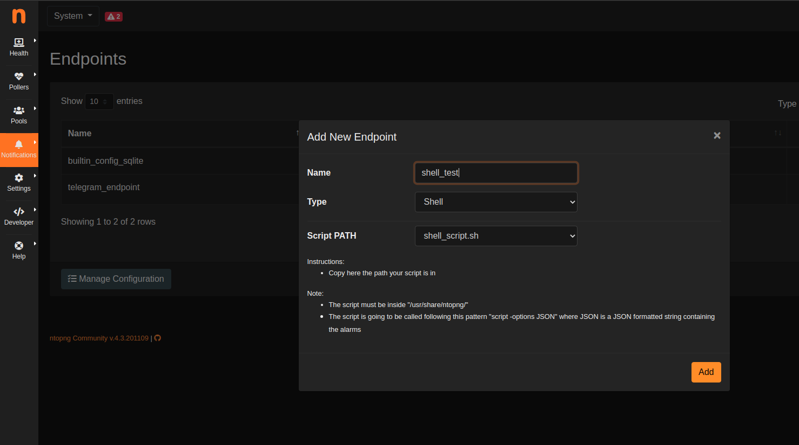

After that, a new recipient should be created, associated with the new endpoint just created.

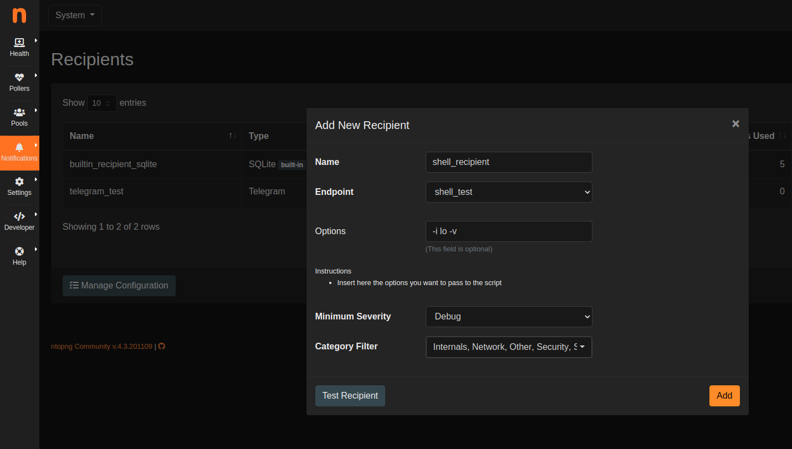

Example of simple shell script reading the alert information from the standard input and logging them to file:

.. code:: bash

   #!/bin/bash
   cat - >> /tmp/shell-script.log

Fail2Ban
------

First of all, install Fail2Ban, for infos about the download check `Fail2Ban <https://www.fail2ban.org/wiki/index.php/Downloads>`_.
After that you will be able to see the Fail2Ban Endpoint.

After creating the endpoint, create a new recipient to associate with the new endpoint just created and put inside the JAIL option the JAIL that's going to be used to ban the dangerous IP (to have more infos about the JAIL check `here <https://www.fail2ban.org/wiki/index.php/MANUAL_0_8#Jails>`_).

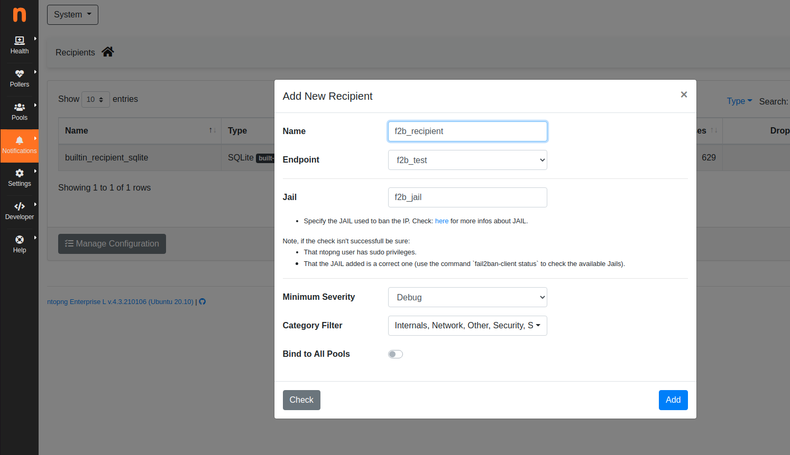

.. note::

        If the Recipient Check isn't succesfull, be sure that ntopng has sudo privileges and that the JAIL added is a correct one.

        Fail2Ban Endpoint isn't going to be called for each alert but only for those that supports it, in the specific case only those with the Attacker available; check the specific user guide section for more infos :ref:`Alert Summary`.

Webhook
-------

TODO

.. _ElasticsearchAlerts:
Elasticsearch
-------------

This recipient is designed to send alerts to `Elasticsearch <https://www.elastic.co/>`_.

.. note::

  Elasticsearch recipient is only available in ntopng Enterprise M or above.

The endpoint requires the Elasticsearch URL to be specified, along with (optional) parameters for the authentication.

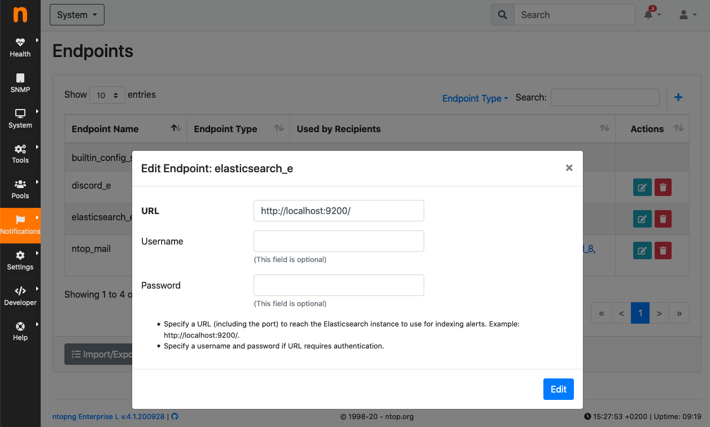

  Elasticsearch Endpoint

Multiple recipients can then be associated to the Elasticsearch endpoint. Any recipient can use a different prefix for the index names.

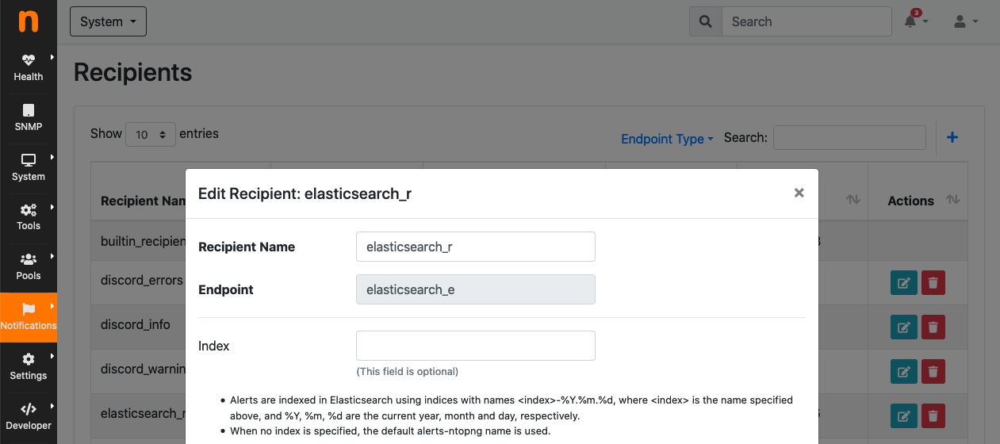

  Elasticsearch Recipient

By default, alerts are sent to Elasticsearch indexes :code:`alerts-ntopng-<year>.<month>.<day>`. A new index is created every day. For example, index names used for two consecutive days of April 17th and 18th 2020 are :code:`alerts-ntopng-2020-04-17` and :code:`alerts-ntopng-2020-04-18`. If an index prefix is specified in the endpoint, then the prefix is used in place of :code:`alerts-ntopng`.

The Elasticsearch connection can be tested by clicking the "Test Connection" button of the preferences.

.. note::

  Elasticsearch alert endpoint requires at least Elasticsearch version 7. Version can be tested by clicking the "Test Connection" button of the preferences.

Alerts are sent to Elasticsearch in JSON format, following the ECS format (more info at <https://www.elastic.co/guide/en/ecs/current/index.html>). The following keys are always present:

- :code:`@timestamp`: UTC/GMT alert detection date and time in ISO format yyyy-MM-dd'T'HH:mm:ss.SSSZ.
- :code:`message`: the message field containing the log message
- :code:`ecs.version`: ECS version this event conforms to. 
- :code:`event.category`: represent the category of the event, one of {`authentication`, `configuration`, `database`, ...}. `List of all the available types <https://www.elastic.co/guide/en/ecs/current/ecs-allowed-values-event-category.html>`
- :code:`event.created`: contains the date/time when the event was first read, in ISO format yyyy-MM-dd'T'HH:mm:ss.SSSZ.
- :code:`event.dataset`: name of the dataset.
- :code:`event.kind`: gives high-level information about what type of information the event contains, one of {`alert`, `event`, `metric`, `state`, `pipeline_error`, `signal`}.
- :code:`event.module`: name of the module this data is coming from.
- :code:`event.risk_score`: risk score or priority of the event.
- :code:`event.severity`: the numeric severity of the event according to your event source.
- :code:`event.severity_label`: the severity of the event written in human readable format, one of {`low`, `medium`, `high`, `critical`}.
- :code:`organization.name`: organization name.
- :code:`rule.name`: the name of the rule or signature generating the event.

:ref:`Flow Alerts` have the following additional fields:

- :code:`source.ip`: IP address of the source (IPv4 or IPv6).
- :code:`source.port`: port of the source.
- :code:`source.as.number`: unique number allocated to the autonomous system. The autonomous system number (ASN) uniquely identifies each network on the Internet.
- :code:`source.geo.city_name`: geolocalization of the source, city name (when available).
- :code:`source.geo.continent_name`: geolocalization of the source, continent name (when available).
- :code:`source.geo.country_name`: geolocalization of the source, country name (when available).
- :code:`source.geo.country_iso_code`: geolocalization of the source, country ISO code (when available).
- :code:`source.geo.location.lat`: latitude of the source.
- :code:`source.geo.location.lon`: longitude of the source.
- :code:`network.community_id`: a hash of source and destination IPs and ports, as well as the protocol used in a communication. This is a tool-agnostic standard to identify flows.
- :code:`network.protocol`: L7 Network protocol name. ex. http, lumberjack, tls.
- :code:`network.transport`: L4 Network protocol name. ex. tcp, udp.
- :code:`network.vlan.id`: VLAN ID.
- :code:`destination.ip`: IP address of the destination (IPv4 or IPv6).
- :code:`destination.port`: port of the destination.
- :code:`destination.as.number`: unique number allocated to the autonomous system. The autonomous system number (ASN) uniquely identifies each network on the Internet.
- :code:`destination.geo.city_name`: geolocalization of the destination, city name (when available).
- :code:`destination.geo.continent_name`: geolocalization of the destination, continent name (when available).
- :code:`destination.geo.country_name`: geolocalization of the destination, country name (when available).
- :code:`destination.geo.country_iso_code`: geolocalization of the destination, country ISO code (when available).
- :code:`destination.geo.location.lat`: latitude of the destination.
- :code:`destination.geo.location.lon`: longitude of the destination.

.. code:: lua

   json_format = {
     "organization": {
       "name": "ntop"
     },
     "rule": {
       "name": "Low Goodput Ratio"
     },
     "ecs": {
       "version": "1.6.0"
     },
     "event": {
       "severity_label": "low",
       "created": "2020-11-23T14:20:56.0Z",
       "category": "network",
       "module": "ntopng",
       "kind": "alert",
       "severity": 3,
       "dataset": "alerts",
       "risk_score": 10
     },
     "source": {
       "port": 60952,
       "ip": "192.168.1.29"
     },
     "destination": {
       "geo": {
         "continent_name": "NA",
         "country_iso_code": "US"
       },
       "ip": "23.206.251.35",
       "as": {
         "number": 16625
       },
       "port": 80
     },
     "network": {
       "community_id": "1:fUGQhJ6nxu/LILCAW+Lb8dF4sKU=",
       "transport": "tcp",
       "protocol": "http"
     },
     "message": "{\"cli_os\":\"Intel Mac OS X 10_13_6\",\"cli_continent_name\":\"\",\"flow_status\":12,\"cli_blacklisted\":false,\"alert_entity\":4,\"alert_entity_val\":\"flow\",\"proto.ndpi\":\"HTTP\",\"srv_localhost\":false,\"proto\":6,\"alert_tstamp\":1606141256,\"cli_addr\":\"192.168.1.29\",\"srv_addr\":\"23.206.251.35\",\"srv2cli_packets\":5,\"alert_severity\":3,\"srv_continent_name\":\"NA\",\"srv_os\":\"\",\"srv_asn\":16625,\"community_id\":\"1:fUGQhJ6nxu/LILCAW+Lb8dF4sKU=\",\"first_seen\":1606141240,\"score\":10,\"action\":\"store\",\"cli_localhost\":true,\"cli_port\":60952,\"cli_city_name\":\"\",\"srv2cli_bytes\":558,\"is_flow_alert\":true,\"alert_type\":72,\"cli2srv_bytes\":681,\"alert_json\":\"{\"info\":\"ocsp.int-x3.letsencrypt.org/MFgwVqADAgEAME8wTTBLMAkGBSsOAwIaBQAEFH7maudymrP8%2BKIgZGwWoS1gcQhdBBSoSmpjBH3duubRObemRWXv86jsoQISAz5JqGV%2B4ao1EMKq6MZy01gX\",\"status_info\":\"{\"goodput_ratio\":39.790153503418,\"ntopng.key\":3631703348,\"alert_generation\":{\"subdir\":\"flow\",\"script_key\":\"low_goodput\",\"confset_id\":0},\"hash_entry_id\":8210}\"}\",\"cli_country_name\":\"\",\"cli2srv_packets\":6,\"srv_country_name\":\"US\",\"cli_asn\":0,\"srv_port\":80,\"pool_id\":0,\"srv_city_name\":\"\",\"l7_master_proto\":7,\"ifid\":0,\"srv_blacklisted\":false,\"vlan_id\":0,\"l7_proto\":7}", 
     "@timestamp": "2020-11-23T14:20:56.0Z"
   }

Slack
-----

TODO

Syslog
------

Alerts are sent to syslog using standard syslog severities as per RFC 5424.

ntopng alert severities are mapped to standard syslog severities as follow:

- *Info*  becomes syslog :code:`LOG_INFO` equal to the integer 6
- *Warning* becomes syslog :code:`LOG_WARNING` equal to the integer 4
- *Error* becomes syslog :code:`LOG_ERR` equal to the integer 3

Two formats are available when sending alerts to syslog, namely plaintext and JSON. The format defaults to plaintext and can be toggled from the ntopng preferences page.

**Plaintext**

Plaintext alerts have the following format:

.. code:: bash

   [tstamp][severity][type][entity][entity value][action] ... and a plain text message...

Fields have the following meaning:

- :code:`[tstamp]` is the time at which ntopng detected the alert. This time
  is not necessarily equal to the time the alert has reached syslog.
- :code:`[severity]` is the severity of the alert. Severities are also
  used when dispatching messages to syslog. Severities are "Warning", "Error" of "Info".
- :code:`[type]` is a string that indicates the type of alert.
- :code:`[entity]` is a class that categorizes the originator of the
  alert. It can be an "host", an "interface" and so on.
- :code:`[entity value]` is an identifier that uniquely identifies the
  originator along with the :code:`[entity]`. For example, entity
  value for an "host" is its IP address, for an "interface" is its
  name, for a "device" is its MAC address, and so on.
- :code:`[action]` indicates whether this is an engaged alert, an
  alert that has been released or if it just an alert that has to be stored.

Alert types, entities, and actions are explained in detail in section :ref:`BasicConceptAlerts`.
  
Examples of alerts sent to syslog are

.. code:: bash

   devel ntopng: [<tstamp>][Info][Device Connection][Device][58:40:4E:CE:28:29] The device Apple_CE:28:29 has connected to the network.
   devel ntopng: [<tstamp>][Error][Threshold Cross][Interface][iface_0][Engaged] Minute traffic crossed by interface eno1 [1.08 MB > 2 Bytes]
   devel ntopng: [<tstamp>][Warning][Remote to Remote Flow][Flow] Remote client and remote server [Flow: 192.168.1.100:138 192.168.1.255:138] [L4 Protocol: UDP]

**JSON**

JSON alerts have the following keys that are in common with plaintext alerts, namely :code:`[entity]`, :code:`[entity value]`, :code:`[action]`, :code:`[tstamp]`, :code:`[severity]` and :code:`[type]`.

The additional keys are:

- :code:`message`: is a text message describing the alert.
- :code:`ifid`: the id of the monitored ntopng interface
- :code:`alert_key`: is a string that, for threshold-based alerts, represents the check interval (e.g., min, 5min, hour) and the type of threshold checked (e.g., bytes, packets).

Examples of JSON alerts sent to syslog are

.. code:: bash

   develv ntopng: {"entity_value":"ntopng","ifid":1,"action":"store","tstamp":1536245738,"type":"process_notification","entity_type":"host","message":"[<tstamp>]][Process] Stopped ntopng v.3.7.180906 (CentOS Linux release 7.5.1804 (Core) ) [pid: 4783][options: --interface \"eno1\" --interface \"lo\" --dump-flows \"[hidden]\" --https-port \"4433\" --dont-change-user ]","severity":"info"}
   devel ntopng: {"message":"[<tstamp>][Threshold Cross][Engaged] Minute traffic crossed by interface eno1 [891.58 KB > 1 Byte]","entity_value":"iface_0","ifid":0,"alert_key":"min_bytes","tstamp":1536247320,"type":"threshold_cross","action":"engage","severity":"error","entity_type":"interface"}
   

