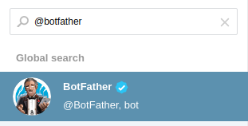

Available Endpoints and Recipients
==================================

Currently available Endpoints and recipients are 

Email
-----

One can create the email endpoint as follows

.. figure:: ../img/alerts_email_endpoint.png
  :align: center
  :alt: Email Endpoint Configuration

Then, one can create multiple email recipients sharing the same
endpoint but each one with a different destination email address:

.. figure:: ../img/alerts_email_recipient.png
  :align: center
  :alt: Email Endpoint Configuration

Discord
-------

Telegram
--------

First of all navigate from your Web GUI into the section Notification->Endpoints; after that, click on the `+` on the right corner of the Endpoint window, in this way you are going to add a new Endpoint for the notification system. Select inside the `Type` window `Telegram`. Then open Telegram, search for `@BotFather` and start a new conversion with it.

After that, send the following messages in this order:
  - :code:`/newbot`
  - :code:`bot_name` (the name you want to give to your bot, e.g. `ntopng_telegram_plugin`)
  - :code:`bot_username` (the username you want to give to your bot, e.g. `ntopng_telegram_plugin_bot`)

Now @BotFather will give you a token, useful to enable ntopng to talk with the bot you actually created; copy this token and paste it into the `Add New Endpoint` window of ntopng you where previously, name your Endpoint (e.g. `telegram_endpoint`) and click `Add`.

After that navigate to Notification->Recipients and, just like before, click on the `+` simbol on the right high corner of the Recipient window. Now select into the Endpoint section of `Add New Recipient` the endpoint you previously created, name it (e.g. telegram_recipient_mychat), select the Minimum Severity of the notifications and the Category of the notification you want to receive.

Then go back to Telegram. 
If you want the bot to personally send the alarms directly into the private chat with your bot the follow these steps:
  - search for `@getidsbot` and start a conversation with it;

.. figure:: ../img/telegram_getidsbot_search.png

  - copy the id the bot gave to you;

Otherwise if you want to add the bot to a group chat and send messagges on that group, follow the following steps:
  - add to your group chat the bot you previosly created (searching for his name);
  - now add to that group chat `@getidsbot`;

  - copy the id the bot sent on the group chat;

.. figure:: ../img/telegram_getidsbot_copy_id_group.png

Now paste the id into the `Add New Recipient` window of ntopng and click `Add` (if you want to test if the bot is correctly configured, click `Test Recipient`).

Now you just need to add to the relative Pool the Telegram recipient you just created and now you will receive the notifications even on Telegram!

Webhook
-------

Elasticsearch
-------------

Slack
-----

Syslog
------

