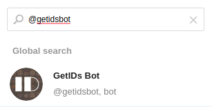

Available Endpoints and Recipients
==================================

Currently available Endpoints and recipients are 

Email
-----

One can create the email endpoint as follows

.. figure:: ../img/alerts_email_endpoint.png
  :align: center
  :alt: Email Endpoint Configuration

Then, one can create multiple email recipients sharing the same
endpoint but each one with a different destination email address:

.. figure:: ../img/alerts_email_recipient.png
  :align: center
  :alt: Email Endpoint Configuration

Discord
-------

Discord (https://discord.com) is a popular collaboration application that can be used by ntopng to deliver alerts to recipients. In order to deliver alerts you need to configure a new Discord server as described in this document https://support.discord.com/hc/en-us/articles/204849977-How-do-I-create-a-server- and the to create a webhook as decribed here https://support.discord.com/hc/en-us/articles/360045093012-Server-Integrations-Page

Once in the webhook click on the "Copy Webhook URL" button that will copy the URL into your clipboard. Done this we're ready to create a ntopng Discord Endpoint. On the System interface (upper menubar, dropdown menu) select Notifications -> Endpoints and click on the + icon. A new dialog windown will open: select Discord from the endpoint type menu and insert the Webhook URL you have previusly copied on your clipboard, pick a endpoint name you like and save it.

Done this you can create a recipient for this endpoint. You can optionally specify a Username in the recipient page that is used when messages are delivered to Discord. If you do not set a username the one used in the Discord Webhook page will be used (usually set to 'Captain Hook').

The above picture shows sample alerts delivered to a discord server.

Telegram
--------

First of all navigate from the Web GUI into the section Notification->Endpoints; after that, click on the `+` on the right corner of the Endpoint window, this way it will add a new Endpoint for the notification system. Select inside the `Type` window `Telegram`. Then open Telegram, search for `@BotFather` and start a new conversion with it.

.. figure:: ../img/telegram_new_conversation_botfather.png

After that, send the following messages in this order:
  - :code:`/newbot`
  - :code:`bot_name` (the name that's going to have the bot, e.g. `ntopng_telegram_plugin`)
  - :code:`bot_username` (the username that's going to have the bot, e.g. `ntopng_telegram_plugin_bot`)

.. figure:: ../img/telegram_full_conversation_botfather.png

Now @BotFather will give a token, useful to enable ntopng to talk with the bot actually created; copy this token and paste it into the `Add New Endpoint` window of ntopng previously opened, name the Endpoint (e.g. `telegram_endpoint`) and click `Add`.

After that navigate to Notification->Recipients and, just like before, click on the `+` simbol on the right high corner of the Recipient window. Now select into the Endpoint section of `Add New Recipient` the endpoint previously created, name it (e.g. telegram_recipient_mychat), select the Minimum Severity of the notifications and the Category of the notification desired.

Then go back to Telegram. 
If the bot have to personally send the alarms directly into the private chat then follow these steps:
  - search for `@getidsbot` and start a conversation with it;
  - copy the id the bot gave to you;

Otherwise if you want to add the bot to a group chat and send messagges on that group, follow the following steps:
  - add to your group chat the bot you previosly created (searching for his name);
  - now add to that group chat `@getidsbot`;
  - copy the id the bot sent on the group chat;

.. figure:: ../img/getidsbot_group_add.png

Now paste the id into the `Add New Recipient` window of ntopng and click `Add` (click `Test Recipient` to test if the bot is working correctly).

Now add to the relative Pool the Telegram recipient you just created and it's done!

.. figure:: ../img/telegram_alerts.png

Webhook
-------

Elasticsearch
-------------

Slack
-----

Syslog
------

